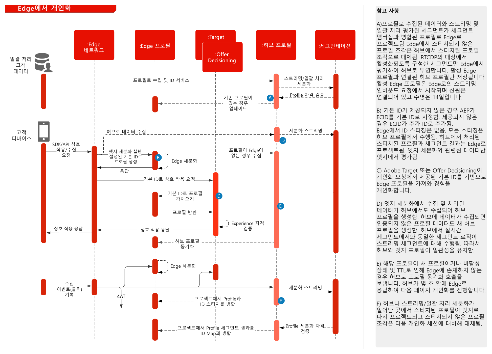

# 개요

웹 및 모바일 SDK 및 Edge Network Server API에 대한 개요 및 세부 정보는 다음을 참조하십시오.
* [WebSDK 개요](https://experienceleague.adobe.com/docs/web-sdk.html?lang=ko)
* [MobileSDK 개요](https://aep-sdks.gitbook.io/docs/)
* [Edge Network Server API](https://experienceleague.adobe.com/docs/experience-platform/edge-network-server-api/overview.html)

WebSDK에서 지원되는 응용 프로그램 기능에 대한 자세한 개요를 보려면 다음 설명서를 참조하십시오.
* [WebSDK 애플리케이션 기능 지원](https://github.com/orgs/adobe/projects/18/views/1)

애플리케이션별 SDK에서 웹 및 Mobile SDK로 마이그레이션과 관련된 자세한 내용은 다음 설명서를 참조하십시오.
* [ID 서비스](https://experienceleague.adobe.com/docs/experience-platform/edge/identity/overview.html)
* [Analytics](https://experienceleague.adobe.com/docs/experience-platform/edge/data-collection/adobe-analytics/analytics-overview.html)
* [Target](https://experienceleague.adobe.com/docs/experience-platform/edge/personalization/adobe-target/target-overview.html)
* [Target 분석](https://experienceleague.adobe.com/docs/experience-platform/edge/personalization/adobe-target/a4t/overview.html)

## Experience Platform 웹/모바일 SDK 또는 Edge Network Server API 배포

아래 아키텍처 다이어그램은 Experience Platform 웹 SDK를 활용하는 배포 및 데이터 수집을 보여줍니다.

Experience Edge, Experience Platform 서비스 및 응용 프로그램의 시퀀스 다이어그램

## 참조 설명서

* [웹 SDK를 사용하여 Adobe Experience Cloud 구현하기 튜토리얼](https://experienceleague.adobe.com/docs/platform-learn/implement-web-sdk/overview.html?lang=ko)
* [모바일 앱에서 Adobe Experience Cloud 구현 튜토리얼](https://experienceleague.adobe.com/docs/platform-learn/implement-mobile-sdk/overview.html?lang=ko)