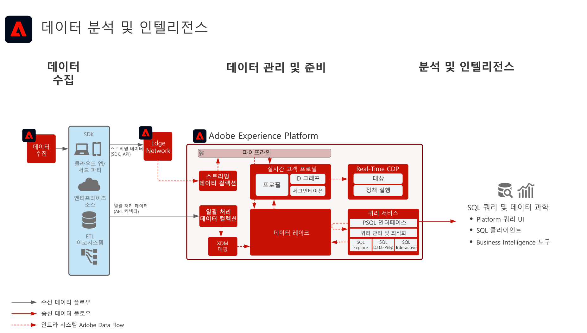

# 데이터 분석 및 인텔리전스 블루프린트

데이터 분석 및 인텔리전스는 Adobe Experience Platform 내에서 데이터 레이크에 존재하는 데이터에 대해 탐색 쿼리와 분석을 수행하는 기능으로 구성되어 있습니다.

Experience Platform의 [!UICONTROL 쿼리 서비스]를 통해 데이터에 대해 SQL 쿼리를 수행할 수 있습니다. [!UICONTROL Data Science Workspace]에서는 데이터 탐색, 데이터 과학 및 데이터에 대한 머신 러닝 워크로드를 수행할 수 있습니다.

또한 Experience Platform은 서드파티 SQL 클라이언트, 인터페이스 및 BI(Business Intelligence) 도구에 연결할 수 있으므로 [!DNL PostgreSQL] 프로토콜을 사용하여 Experience Platform 내에서 데이터에 직접 연결, 액세스 및 쿼리할 수 있습니다.

블루프린트 세부 정보에서 확인할 수 있는 바와 같이, 쿼리 타임아웃 및 쿼리 결과에 포함되는 데이터에 양에 대해 특정 가드레일이 적용됩니다.

## 사용 사례

* 데이터에 인터랙티브한 쿼리 및 병합 적용
* 수집한 데이터에 행과 열로 액세스하여 탐색 및 유효성 검사
* Business Intelligence 도구를 통한 데이터 대시보드화 및 시각화

## 애플리케이션

* Adobe Experience Platform     

## 아키텍처

## 가드레일

모범 사례 및 가드레일에 대한 자세한 설명은 Query Service 제품 설명서를 참조하세요.
[Query Service 안내](https://experienceleague.adobe.com/docs/experience-platform/query/best-practices/writing-queries.html?lang=ko#best-practices)

## 구현 단계

1. 수집할 데이터를 위한 [스키마를 만듭니다.](https://experienceleague.adobe.com/?recommended=ExperiencePlatform-D-1-2021.1.xdm)
1. 수집할 데이터를 위한 [데이터 세트를 만듭니다.](https://experienceleague.adobe.com/docs/platform-learn/tutorials/data-ingestion/create-datasets-and-ingest-data.html?lang=ko)
1. 데이터를 Experience Platform으로 [수집합니다.](https://experienceleague.adobe.com/?recommended=ExperiencePlatform-D-1-2020.1.dataingestion&amp;lang=ko)
1. [[!UICONTROL 쿼리 서비스]](https://experienceleague.adobe.com/docs/platform-learn/tutorials/queries/explore-data.html?lang=ko) 및 [[!UICONTROL Data Science Workspace]](https://experienceleague.adobe.com/docs/platform-learn/tutorials/data-science-workspace/load-data-in-jupyterlab-notebooks.html?lang=ko)에서 데이터에 원시 액세스 및 쿼리가 가능한지 확인합니다.
1. [시각화, 데이터 쿼리 및 탐색을 위해 Business Intelligence 도구 및 SQL 클라이언트를 [!UICONTROL 쿼리 서비스]](https://experienceleague.adobe.com/?recommended=ExperiencePlatform-D-1-2021.1.qsvc.dash)에 연결합니다.

## 관련 설명서

* [Adobe Experience Platform Intelligence 제품 설명](https://helpx.adobe.com/kr/legal/product-descriptions/adobe-experience-platform-intelligence---product-description.html)
* [[!UICONTROL 쿼리 서비스] 설명서](https://experienceleague.adobe.com/docs/experience-platform/query/home.html?lang=ko)
