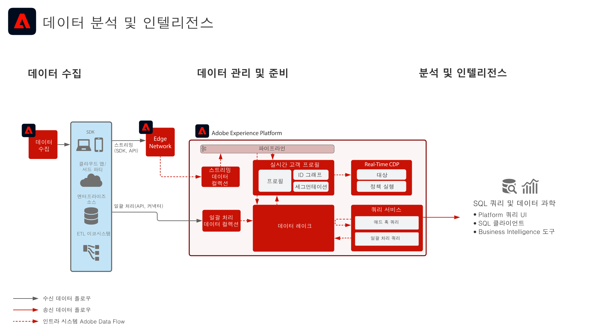

# 데이터 분석 및 인텔리전스 블루프린트

Data Analysis and Intelligence는 Adobe Experience Platform 내에서 데이터 호수에 있는 데이터의 탐구적 쿼리와 분석을 수행하는 기능으로 구성됩니다.

Experience Platform [!UICONTROL 쿼리 서비스]에서는 데이터에 대해 SQL 쿼리를 수행할 수 있습니다. [!UICONTROL Data Science ] Workspaces를 사용하면 데이터에 대한 데이터 분석, 데이터 과학 및 머신 러닝 워크로드를 수행할 수 있습니다.

또한 Experience Platform을 사용하면 타사 SQL 클라이언트, 인터페이스 및 Business Intelligence(BI) 도구에 연결하여 [!DNL PostgreSQL] 프로토콜을 사용하여 Experience Platform 내의 데이터에 직접 연결하고 액세스 및 쿼리할 수 있습니다.

블루프린트 세부 정보에 설명된 대로 쿼리 시간 초과와 쿼리 결과에 포함된 데이터의 양에 대해 특정 단속이 적용됩니다.

## 사용 사례

* 데이터에 인터랙티브한 쿼리 및 병합 적용
* 수집한 데이터에 행과 열로 액세스하여 탐색 및 유효성 검사
* Business Intelligence 도구를 통한 데이터 대시보드화 및 시각화

## 애플리케이션

* Adobe Experience Platform

## 아키텍처

## 가드레일

우수 사례 및 보증에 대한 자세한 내용은 쿼리 서비스 제품 설명서를 참조하십시오.
[쿼리 서비스 지침](https://experienceleague.adobe.com/docs/experience-platform/query/best-practices/writing-queries.html?lang=en#best-practices)

## 구현 단계

1. [데이터](https://experienceleague.adobe.com/docs/platform-learn/tutorials/schemas/create-a-schema.html) 를 인제스트할 구성 요소를 만듭니다.
1. [데이터](https://experienceleague.adobe.com/docs/platform-learn/tutorials/data-ingestion/create-datasets-and-ingest-data.html) 를 인제스트할 데이터세트를 만듭니다.
1. [데이터를 Experience Platform으로 수집합니다.](https://experienceleague.adobe.com/?recommended=ExperiencePlatform-D-1-2020.1.dataingestion)
1. 원시 액세스 및 쿼리를 위해 [!UICONTROL 쿼리 서비스] 및 [!UICONTROL 데이터 과학 작업 공간]에 데이터를 사용할 수 있는지 확인합니다.
1. 시각화, 데이터 쿼리 및 탐색을 위해 Business Intelligence 도구 및 SQL 클라이언트를 [!UICONTROL 쿼리 서비스]에 연결합니다.

## 관련 설명서

* [Adobe Experience Platform Intelligence 제품 설명](https://helpx.adobe.com/kr/legal/product-descriptions/adobe-experience-platform-intelligence---product-description.html)
* [쿼리 서비스 설명서](https://experienceleague.adobe.com/docs/experience-platform/query/home.html?lang=ko)
