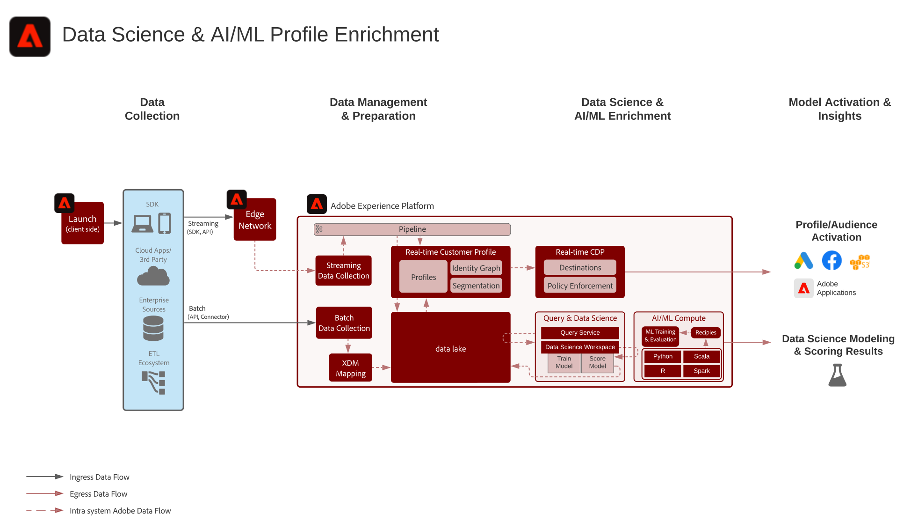

# 프로파일 데이터 활용 청사진을 위한 맞춤형 데이터 과학

프로파일 데이터 연계 청사진을 위한 사용자 정의 데이터 과학은 기계 학습 통찰력을 제공하기 위해 Adobe Experience Platform의 데이터를 [!UICONTROL 데이터 과학 작업 공간]에서 교육, 배포 및 점수 모델을 사용하여 사용하는 방법을 보여줍니다. 이러한 모델은 [!UICONTROL 실시간 고객 프로필]에 대해 활성화된 데이터 세트에 직접 출력하여 고객 프로파일을 추가로 강화할 수 있습니다. 이러한 인사이트를 개인화에 활용할 수 있습니다. 머신 러닝 인사이트의 예로는 라이프타임 가치 점수, 제품 및 카테고리 관련성, 전환율 또는 이탈률 등이 있습니다.

## 사용 사례

* Experience Platform의 고객 데이터에서 인사이트를 추출하고 패턴을 발견합니다. 이 데이터에서 모델을 트레이닝하고 점수를 매길 수 있습니다.
* 보다 세분화된 개인화 및 최적화된 여정을 위해 모델 기반의 통찰력과 특성을 갖춘 [!UICONTROL 실시간 고객 프로필]을 보강합니다.
* 고객 라이프타임 가치, 전환율 또는 이탈률, 제품 및 컨텐츠 친화성, 참여 점수 등 고객 인사이트를 도출할 수 있는 트레이닝 및 점수 모델을 제공합니다.

## 아키텍처

## 구현 단계

1. 스키마 및 데이터 세트를 만듭니다.
1. 데이터를 Experience Platform으로 인제스트
1. DSW 전자 필기장을 만듭니다.
1. 언어를 선택합니다. Python 및 PySpark가 지원됩니다.
1. 노트북의 작성자 모델.
1. 모델 트레이닝
1. 모델을 점수를 매겨 대상 데이터로 예측을 생성합니다.
1. 모델 결과를 [!UICONTROL 실시간 고객 프로필]으로 푸시하는 경우 프로필에 대한 모델 결과 데이터 집합을 활성화합니다.

## 관련 설명서

* [Adobe Experience Platform Intelligence 제품 설명](https://helpx.adobe.com/legal/product-descriptions/adobe-experience-platform-intelligence---product-description.html)
* [[!UICONTROL 데이터 과학 ] 작업 영역 설명서](https://experienceleague.adobe.com/docs/experience-platform/data-science-workspace/home.html?lang=en)
* [[!UICONTROL 데이터 과학 작업 ] 공간 자습서](https://experienceleague.adobe.com/docs/platform-learn/tutorials/data-science-workspace/understanding-data-science-workspace.html)

## 관련 블로그 게시물

* [[!DNL Simplifying the Data Science Lifecycle with Adobe Platform Experience]](https://medium.com/adobetech/simplifying-the-data-science-lifecycle-with-adobe-platform-experience-8ea4f056d82f)
* [[!DNL Content and Commerce AI: Personalizing Your Interactions with Customers Through Content Intelligence]](https://medium.com/adobetech/content-and-commerce-ai-personalizing-your-interactions-with-customers-through-content-intelligence-dc182601deab)
* [[!DNL Gaining a Deeper Understanding of Churn Using Data Science Workspace]](https://medium.com/adobetech/gaining-a-deeper-understanding-of-churn-using-data-science-workspace-18a2190e0cf3)
* [[!DNL Understanding Data Science In Adobe Experience Platform]](https://medium.com/adobetech/understanding-data-science-in-adobe-experience-platform-5bce5a17b42)
* [[!DNL An Introductory Look at Exploratory Data Analysis on Adobe Experience Platform]](https://medium.com/adobetech/an-introductory-look-at-exploratory-data-analysis-on-adobe-experience-platform-1bfce7501d9a)
* [[!DNL Cutting Across Adobe Experience Products with Machine Learning to Elevated User Experience]](https://medium.com/adobetech/cutting-across-adobe-experience-products-with-machine-learning-to-elevated-user-experience-7c85000510d1)
* [[!DNL Modeling XDM Data for Data Science at Scale on Adobe Experience Platform]](https://medium.com/adobetech/modeling-xdm-data-for-data-science-at-scale-on-adobe-experience-platform-222bb2a6dbf7)
* [[!DNL Segmentation.AI: Automated Audience-Clustering-as-a-Service in Adobe Experience Platform]](https://medium.com/adobetech/segmentation-ai-automated-audience-clustering-as-a-service-in-adobe-experience-platform-261f4099462c)
* [[!DNL Reimagining Jupyter Notebooks for Enterprise Scale]](https://medium.com/adobetech/reimagining-jupyter-notebooks-for-enterprise-scale-8bc6340d504a)
* [[!DNL Accelerate Intelligent Insights with Adobe Experience Platform Data Science Workspace]](https://medium.com/adobetech/accelerate-intelligent-insights-with-adobe-experience-platform-data-science-workspace-89538bacbbea)
* [[!DNL A Preview of Time Series Forecasting with Adobe Experience Platform]](https://medium.com/adobetech/preview-of-time-series-forecasting-with-adobe-experience-platform-38a2fc778e89)
* [[!DNL Cutting Across Adobe Experience Products with Machine Learning to Elevated User Experience]](https://medium.com/adobetech/cutting-across-adobe-experience-products-with-machine-learning-to-elevated-user-experience-7c85000510d1)
