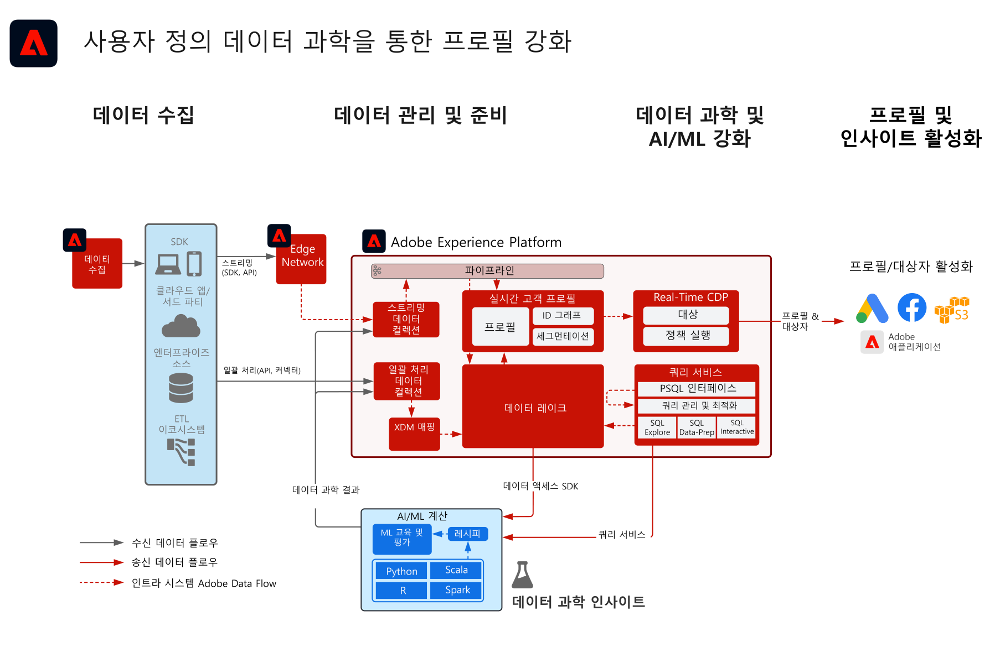

# 프로필 강화를 위한 맞춤형 데이터 과학 블루프린트

프로필 강화를 위한 사용자 정의 데이터 과학 블루프린트는 데이터를 사용하여 모델을 교육하고 배포하고 평가하여 머신 러닝 통찰력을 제공하는 방법을 보여줍니다. [!DNL Experience Platform] 및 [!DNL Real-Time Customer Data Platform] 데이터 과학 및 머신 러닝 도구에서.

모델링된 인사이트를 수집할 수 있습니다. [!DNL Experience Platform] 실시간 고객 프로필을 보강합니다. 머신 러닝 인사이트의 예로는 생애 가치 평가, 제품 및 카테고리 관심도, 전환 경향 또는 이탈 경향 등이 있습니다.

## 사용 사례

* 고객 데이터에서 인사이트를 끌어내고 패턴을 발견하며, 이 데이터로 모델을 교육하고 평가합니다.
* 모델 기반 인사이트와 특성으로 [!UICONTROL Real-time Customer Profile]을 강화하여 개인화를 개선하고 여정을 최적화합니다.
* 모델을 훈련 및 사용하여 고객 생애 가치, 전환 또는 이탈 경향, 제품과 콘텐츠 관련성 및 참여도 점수를 확인합니다.

## 아키텍처

## 가드레일

* 데이터 과학 결과를으로 수집하는 데 세부적인 보호 기능 및 종단 간 지연 시간 [!DNL Experience Platform] 및 실시간 고객 프로필은에서 참조한 데이터 수집 보호 및 지연 다이어그램을 참조합니다. [배포 보호 문서](../experience-platform/deployment/guardrails.md).

## 구현 단계

1. 수집할 데이터를 위한 [스키마를 만듭니다.](https://experienceleague.adobe.com/?recommended=ExperiencePlatform-D-1-2021.1.xdm&amp;lang=ko)
1. 수집할 데이터를 위한 [데이터 세트를 만듭니다.](https://experienceleague.adobe.com/docs/platform-learn/tutorials/data-ingestion/create-datasets-and-ingest-data.html?lang=ko)
1. [데이터 수집](https://experienceleague.adobe.com/?recommended=ExperiencePlatform-D-1-2020.1.dataingestion&amp;lang=ko) 대상 [!DNL Experience Platform].

모델의 결과를 실시간 고객 프로필에 수집하려면 데이터를 수집하기 전에 다음 작업을 수행해야 합니다.

1. 수집한 데이터를 통합 프로필로 결합할 수 있도록 스키마에 [올바른 ID와 ID 네임스페이스를 구성합니다](https://experienceleague.adobe.com/docs/platform-learn/tutorials/identities/label-ingest-and-verify-identity-data.html?lang=ko).
1. [프로필에 대해 스키마와 데이터 세트를 활성화합니다](https://experienceleague.adobe.com/docs/platform-learn/tutorials/profiles/bring-data-into-the-real-time-customer-profile.html?lang=ko).

## 구현 시 고려 사항

* 대부분의 경우 모델 결과는 경험 이벤트가 아니라 프로필 속성으로 수집해야 합니다. 모델 결과는 단순한 속성 문자열일 수 있습니다. 수집할 모델 결과가 여러 개 있는 경우 배열이나 맵 유형 필드를 사용하면 좋습니다.
* 통합 프로필 속성 데이터를 일 단위로 내보낸 일별 프로필 스냅샷 데이터 세트를 활용하여 프로필 속성 데이터에 대한 모델을 교육할 수 있습니다. 프로필 스냅샷 데이터 세트 설명서는 [여기](https://experienceleague.adobe.com/docs/experience-platform/dashboards/query.html?lang=ko#profile-attribute-datasets)에서 확인할 수 있습니다.
* 에서 데이터 추출용 [!DNL Experience Platform] 다음과 같은 방법을 사용할 수 있습니다
   * 데이터 액세스 SDK
      * 데이터는 원시 파일 형태
      * 프로필 경험 이벤트 데이터는 통합되지 않은 원시 상태로 유지됩니다.
   * RTCDP 대상
      * 프로필 속성 및 세그먼트 멤버십을 내보낼 수 있습니다.

## 관련 설명서

* [Adobe [!DNL Experience Platform] 인텔리전스 제품 설명](https://helpx.adobe.com/kr/legal/product-descriptions/adobe-experience-platform-intelligence---product-description.html)
* [Adobe [!DNL Experience Platform] 쿼리 서비스](https://experienceleague.adobe.com/docs/experience-platform/query/home.html?lang=ko)

## 관련 블로그 게시물

* [콘텐츠와 커머스 AI: 콘텐츠 인텔리전스로 고객과의 상호 작용 개인화하기](https://medium.com/adobetech/content-and-commerce-ai-personalizing-your-interactions-with-customers-through-content-intelligence-dc182601deab)
* [Adobe에 대한 탐색적 데이터 분석에 관한 소개 [!DNL Experience Platform]](https://medium.com/adobetech/an-introductory-look-at-exploratory-data-analysis-on-adobe-experience-platform-1bfce7501d9a)
* [Adobe Experience 제품에 머신 러닝을 활용하여 사용자 경험 향상](https://medium.com/adobetech/cutting-across-adobe-experience-products-with-machine-learning-to-elevated-user-experience-7c85000510d1)
* [Segmentation.AI: Adobe의 Automated Audience-Clustering-as-a-Service [!DNL Experience Platform]](https://medium.com/adobetech/segmentation-ai-automated-audience-clustering-as-a-service-in-adobe-experience-platform-261f4099462c)