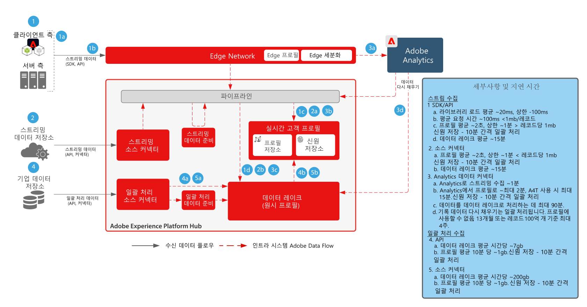
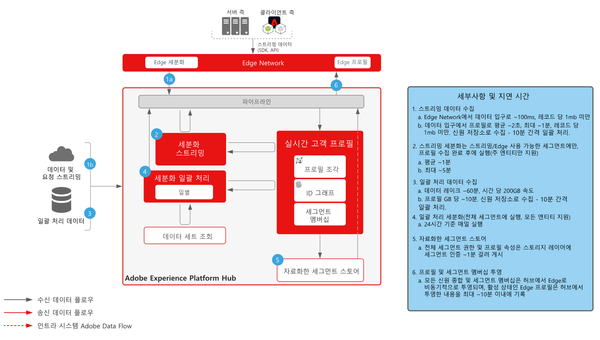
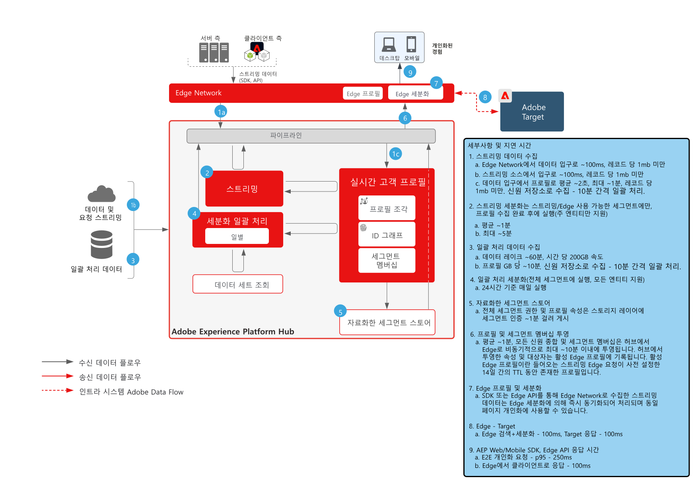
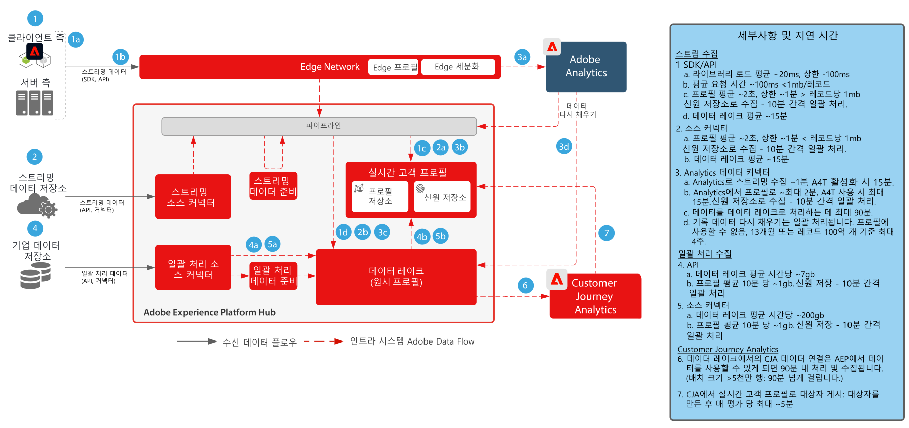
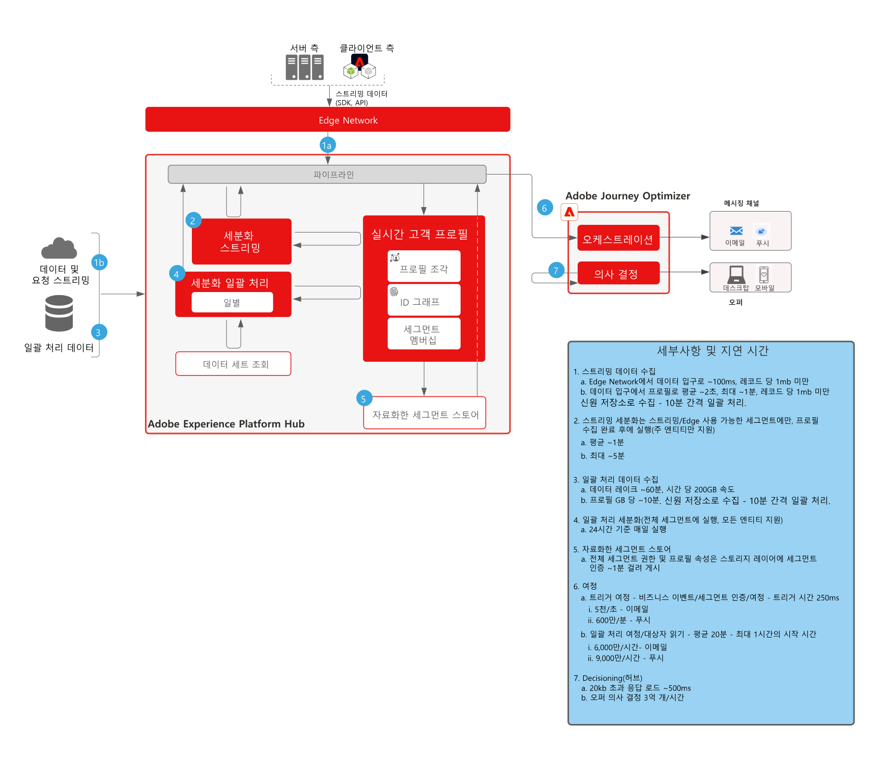

# 가드레일

가드레일은 Adobe Experience Platform 및 애플리케이션에서의 데이터 및 시스템 사용, 성능 최적화, 오류 또는 예기치 못한 결과 방지를 위한 지침을 제공하는 추천 임계값입니다. 가드레일의 설정 목적은 시스템의 제한과 성능 기대치를 반영하여 고객 아키텍처와 사용 사례 성능 최적화를 용이하게 하는 것입니다. 가드레일은 서비스 수준 계약 용도로 설정한 것이 아닙니다. 제품별 서비스 수준 계약에 대한 내용은 아래 링크의 제품 설명서를 참조하세요.

## Adobe Experience Platform 및 애플리케이션 가드레일 참조 설명서

[데이터 수집 가드레일](https://experienceleague.adobe.com/docs/experience-platform/ingestion/guardrails.html?lang=ko)

[Edge Network API 가드레일](https://experienceleague.adobe.com/docs/experience-platform/edge-network-server-api/guardrails.html?lang=ko)

[Real-time Customer Profile 가드레일](https://experienceleague.adobe.com/docs/experience-platform/profile/guardrails.html?lang=ko)

[신원 가드레일](https://experienceleague.adobe.com/docs/experience-platform/identity/guardrails.html?lang=ko)

[보호 기능 공유 Customer Journey Analytics 대상](https://experienceleague.adobe.com/docs/analytics-platform/using/cja-components/audiences/publish.html?lang=ko-KR#latency)

[Customer Journey Analytics 데이터 수집 보호 기능](https://experienceleague.adobe.com/docs/experience-platform/sources/connectors/adobe-applications/analytics.html?lang=ko-KR#what-is-the-expected-latency-for-analytics-data-on-platform%3F)

[쿼리 서비스 가드레일](https://experienceleague.adobe.com/docs/experience-platform/query/guardrails.html?lang=ko)

[대상 활성화 가드레일](https://experienceleague.adobe.com/docs/experience-platform/destinations/guardrails.html?lang=ko)

[Journey Optimizer 가드레일](https://experienceleague.adobe.com/docs/journey-optimizer/using/get-started/guardrails.html?lang=ko)

 

## 엔드투엔드 지연 다이어그램

### 데이터 수집

 

### 세분화

 

### Real-time Customer Data Platform 및 Adobe Target

 

### Customer Journey Analytics

 

### Journey Optimizer

 

## 제품 설명

[Experience Platform 컬렉션 기업용](https://helpx.adobe.com/kr/legal/product-descriptions/adobe-experience-platform-collection-enterprise.html)

[Real-time Customer Data Platform](https://helpx.adobe.com/kr/legal/product-descriptions/real-time-customer-data-platform.html)

[B2B Customer Data Platform](https://helpx.adobe.com/kr/legal/product-descriptions/adobe-experience-platform-b2b.html)

[Experience Platform Activation](https://helpx.adobe.com/kr/legal/product-descriptions/adobe-experience-platform0.html)

[Experience Platform Intelligence](https://helpx.adobe.com/kr/legal/product-descriptions/adobe-experience-platform-intelligence---product-description.html)

[인텔리전트 서비스](https://helpx.adobe.com/kr/legal/product-descriptions/intelligent-services.html)

[Data Distiller](https://helpx.adobe.com/kr/legal/product-descriptions/data-distiller.html)

[Customer Journey Analytics](https://helpx.adobe.com/kr/legal/product-descriptions/customer-journey-analytics.html)

[Journey Optimizer](https://helpx.adobe.com/kr/legal/product-descriptions/adobe-journey-optimizer.html)

[Journey Orchestration](https://helpx.adobe.com/kr/legal/product-descriptions/journey-orchestration.html)

[Offer Decisioning](https://helpx.adobe.com/kr/legal/product-descriptions/offer-decisioning-app-service.html)
