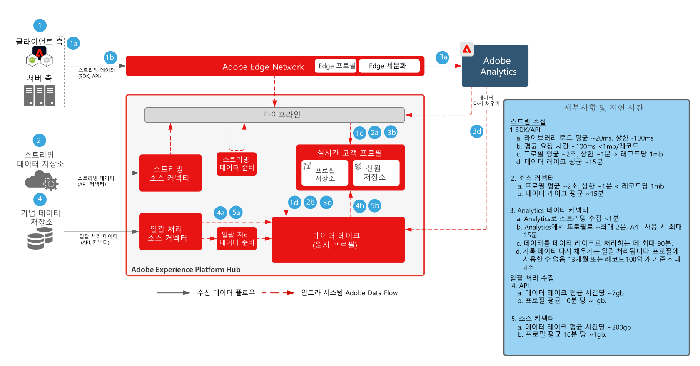
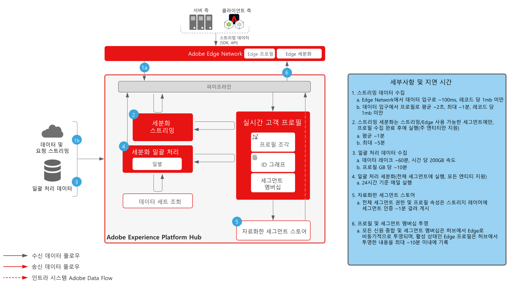
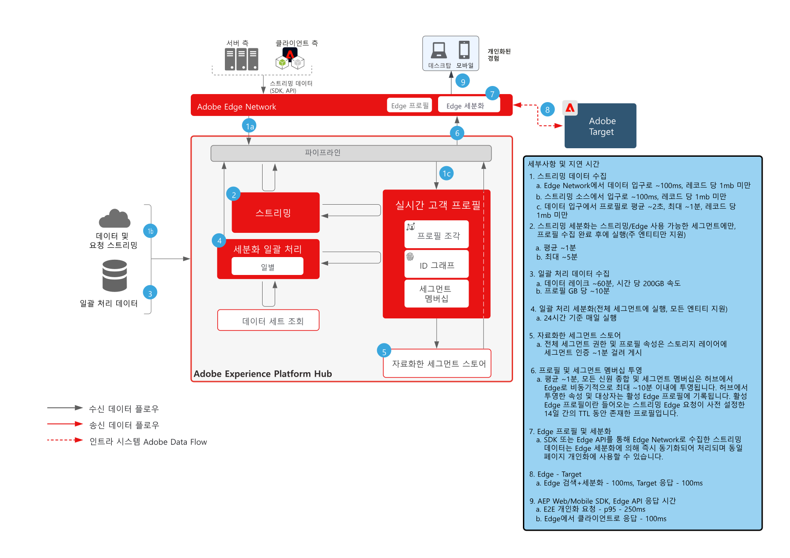
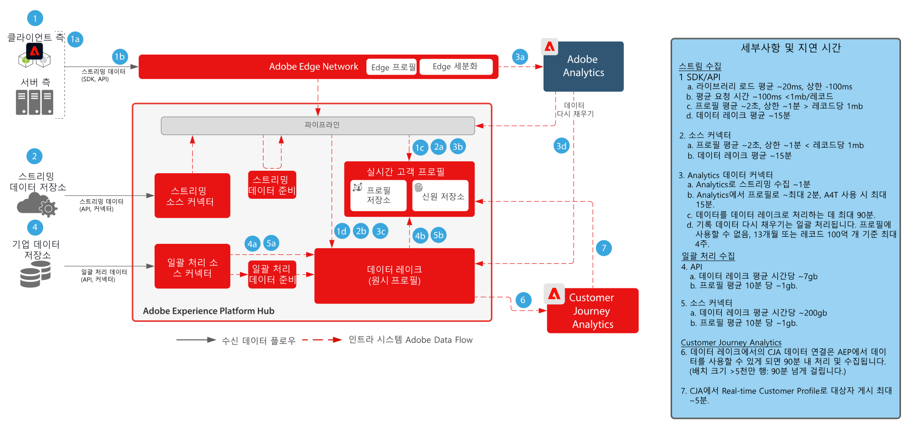
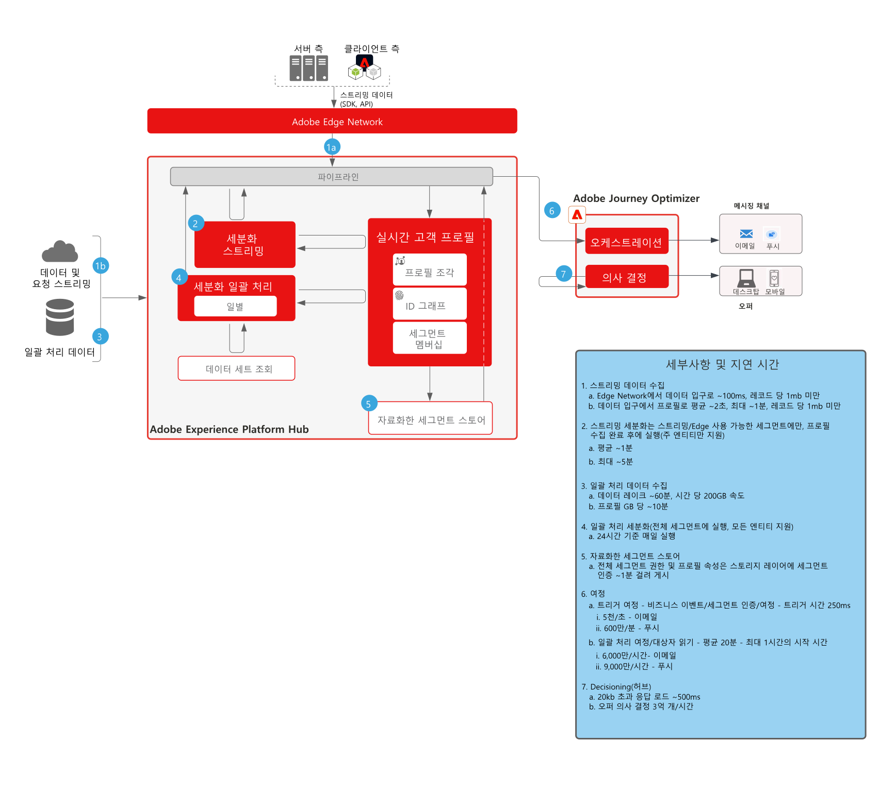

# 가드레일

보호 기능은 데이터 및 시스템 사용에 대한 지침을 제공하고, 성능을 최적화하고, Adobe Experience Platform 및 애플리케이션에서 오류나 예기치 않은 결과를 방지하는 데 권장되는 임계값입니다. 보호 기능은 고객 아키텍처와 사용 사례 성능 최적화를 위해 시스템 제한 및 성능 기대치를 반영하기 위한 것입니다. 제품별 서비스 수준 계약에 대한 자세한 내용은 아래에 링크된 제품 설명 설명서를 참조하십시오.

## Adobe Experience Platform 및 애플리케이션에 대한 보호 기능

[데이터 수집 가드레일](https://experienceleague.adobe.com/docs/experience-platform/ingestion/guardrails.html?lang=en)

[Edge Network API 보호 기능](https://experienceleague.adobe.com/docs/experience-platform/edge-network-server-api/guardrails.html?lang=en)

[실시간 고객 프로필 가드 레일](https://experienceleague.adobe.com/docs/experience-platform/profile/guardrails.html?lang=en)

[ID 보호 기능](https://experienceleague.adobe.com/docs/experience-platform/identity/guardrails.html?lang=en)

[쿼리 서비스 보호 기능](https://experienceleague.adobe.com/docs/experience-platform/query/guardrails.html?lang=en)

[대상 활성화 보호 기능](https://experienceleague.adobe.com/docs/experience-platform/destinations/guardrails.html)

[Journey Optimizer 보호 기능](https://experienceleague.adobe.com/docs/journey-optimizer/using/get-started/guardrails.html?lang=en)

 

## 종료 지연 다이어그램

### 데이터 수집

 

### 세그먼테이션

 

### Real-time Customer Data Platform 및 Adobe Target

 

### Customer Journey Analytics

 

### Journey Optimizer

 

## 제품 설명

[Experience Platform 컬렉션 엔터프라이즈](https://helpx.adobe.com/legal/product-descriptions/adobe-experience-platform-collection-enterprise.html)

[Real-time Customer Data Platform](https://helpx.adobe.com/kr/legal/product-descriptions/real-time-customer-data-platform.html)

[B2B 고객 데이터 플랫폼](https://helpx.adobe.com/legal/product-descriptions/adobe-experience-platform-b2b.html)

[Experience Platform Activation](https://helpx.adobe.com/kr/legal/product-descriptions/adobe-experience-platform0.html)

[Experience Platform Intelligence](https://helpx.adobe.com/legal/product-descriptions/adobe-experience-platform-intelligence---product-description.html)

[Intelligent Services](https://helpx.adobe.com/legal/product-descriptions/intelligent-services.html)

[Customer Journey Analytics](https://helpx.adobe.com/kr/legal/product-descriptions/customer-journey-analytics.html)

[Journey Optimizer](https://helpx.adobe.com/legal/product-descriptions/adobe-journey-optimizer.html)

[Journey Orchestration](https://helpx.adobe.com/legal/product-descriptions/journey-orchestration.html)

[Offer Decisioning](https://helpx.adobe.com/legal/product-descriptions/offer-decisioning-app-service.html)
