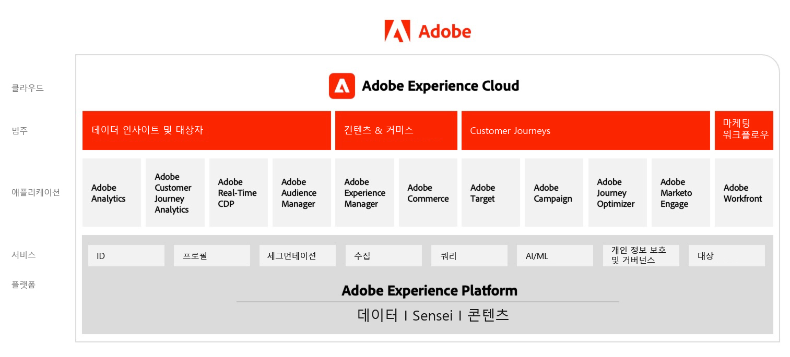
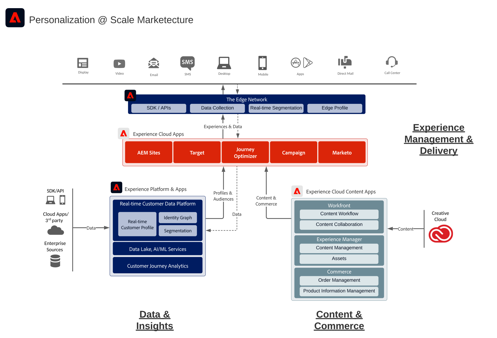

# Adobe Experience Cloud 아키텍처 다이어그램

## Adobe Experience Cloud 마케팅

다음 다이어그램은 Adobe Experience Cloud의 다양한 구성 요소를 보여 줍니다. Adobe Experience Platform을 기반으로 데이터 인사이트 및 대상자, 콘텐츠 및 커머스, 고객 여정, 마케팅 워크플로우에 걸쳐 다양한 구성 요소가 작성 및 통합됩니다.

## 데이터 및 통찰력, 콘텐츠 및 상거래, 경험 전달의 통합 아키텍처

아래 아키텍처 다이어그램은 Adobe Experience Cloud의 다양한 구성 요소가 어떻게 연결 및 통합되어 데이터, 콘텐츠, 경험 게재 과정에 걸쳐 적절한 규모의 개인화를 실현하는지 보여 줍니다.

## 엔터프라이즈 환경의 Adobe Experience Cloud

아래 아키텍처 다이어그램은 Adobe Experience Cloud 애플리케이션과 Adobe Experience Platform이 기업 고객 경험 아키텍처에 어떻게 안착하는지 데이터, 인사이트, 오케스트레이션, 참여라는 네 범주에 걸쳐 보여 줍니다.

