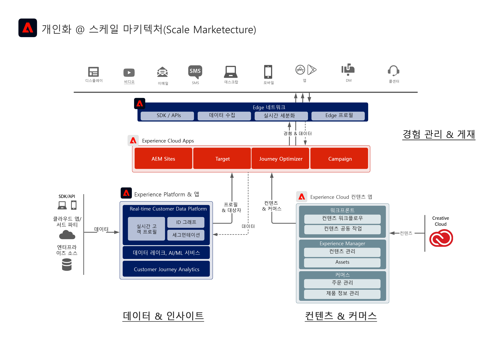
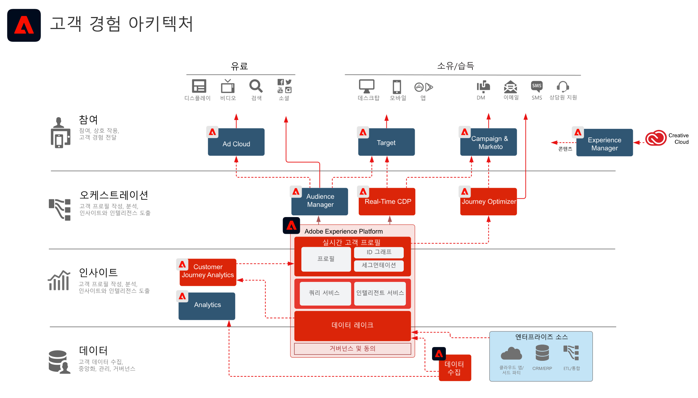

# Adobe Experience Cloud 아키텍처 다이어그램

Adobe Experience Platform이 Adobe Experience Cloud 애플리케이션에 연결 및 통합되어 데이터, 컨텐츠, 경험 전달에서 규모에 맞게 개인화를 구현하는 방법을 아래 아키텍처 다이어그램을 통해 확인해 보세요.

 
아래 아키텍처 다이어그램은 엔터프라이즈 고객 경험 아키텍처에서 Adobe Experience Cloud 애플리케이션과 Adobe Experience Platform이 어떤 식으로 적용되는지를 설명합니다.

