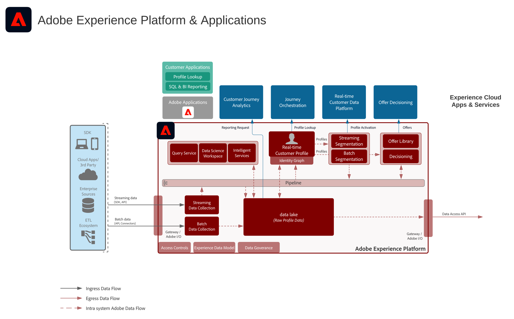
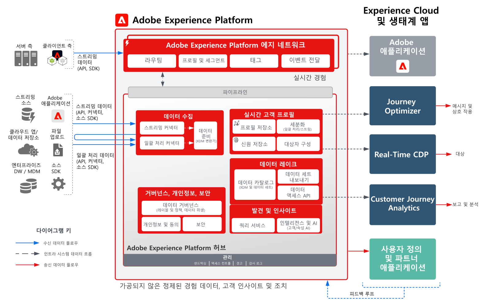
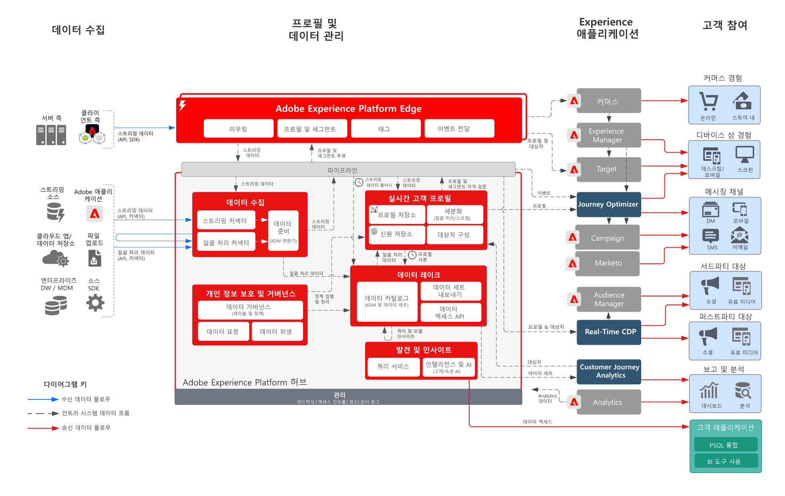

# Adobe Experience Platform 및 애플리케이션 아키텍처 다이어그램

이 아키텍처 다이어그램은 Experience Platform(AEP)가 다른 Experience Cloud 애플리케이션 및 애플리케이션 서비스와 어떻게 관련되는지를 보여 줍니다.

>[!MORELIKETHIS]
>
>[Experience Cloud 응용 프로그램 통합을 위한 통합 구성](https://experienceleague.adobe.com/docs/integrations-learn/experience-cloud/overview.html?lang=ko).

## 아키텍처 다이어그램

이 아키텍처 다이어그램은 Adobe Experience Platform과 Adobe Experience Cloud 애플리케이션 및 애플리케이션 서비스 간의 관계를 보여 줍니다.

## 개요 다이어그램

## 자세한 아키텍처 다이어그램

>[!VIDEO](https://video.tv.adobe.com/v/3422784/?quality=12&learn=on&captions=kor)

## AEP 및 Experience Cloud 애플리케이션 통합

| 애플리케이션 | Experience Platform에서 애플리케이션으로 통합 | 애플리케이션에서 Experience Platform으로 통합 |
|------------------------------|-----------------------------------|-----------------------------------|
| **Ad Cloud** | - Real-time Customer Data Platform에 정의된 대상은 Audience Manager을 통해 타깃팅을 위해 Ad Cloud에 공유할 수 있습니다. | - 현재 통합 없음 |
| **Analytics** | - 웹/모바일 SDK을 통해 수집된 데이터는 Adobe Analytics으로 전달될 수 있습니다. | - Analytics에서 수집한 데이터는 Experience Platform 데이터 레이크 및 프로필 스토어로 전송할 수 있습니다. [Analytics 데이터 커넥터](https://experienceleague.adobe.com/docs/experience-platform/sources/connectors/adobe-applications/analytics.html?lang=ko) |
| **Audience Manager** | - Real-time Customer Data Platform에 정의된 대상을 Audience Manager에 공유하여 서드파티 쿠키 대상으로 활성화할 수 있습니다. | - Audience Manager에서 대상 멤버십과 함께 수집 및 평가된 데이터를 Experience Platform 데이터 레이크 및 프로필 스토어에 공유할 수 있습니다. [Audience Manager 소스 커넥터](https://experienceleague.adobe.com/docs/experience-platform/sources/connectors/adobe-applications/audience-manager.html?lang=ko) |
| **Adobe Campaign** | - Real-time Customer Data Platform에 정의된 대상을 Campaign Classic에 공유하여 캠페인을 시작할 수 있습니다. | - Campaign에서 수집한 상호 작용 및 캠페인 데이터를 Experience Platform에 수집하여 대상 구축, Customer Journey Analytics 및 쿼리 서비스에서 사용할 수 있습니다. |
| **Campaign Standard** | - Real-time Customer Data Platform에 정의된 대상을 Campaign Standard에 공유하여 캠페인을 시작할 수 있습니다. | - Campaign에서 수집한 상호 작용 및 캠페인 데이터를 Experience Platform에 수집하여 추가로 사용할 수 있습니다. |
| **Customer Journey Analytics** | - Experience Platform 데이터 레이크로 수집 및 수집된 데이터는 Customer Journey Analytics에서 처리할 수 있습니다.   - Real-time Customer Data Platform의 프로필 및 대상 데이터를 CJA에 수집할 수 있습니다. [RTCDP-CJA 통합](https://experienceleague.adobe.com/docs/analytics-platform/using/cja-usecases/ingest-aep-segments.html?lang=ko) | - CJA에서 대상을 작성하고 대상 결과를 Real-time Customer Data Platform에 공유합니다. [CJA 대상자 게시](https://experienceleague.adobe.com/docs/analytics-platform/using/cja-components/audiences/publish.html?lang=ko) |
| **Experience Manager** | - 서버측에서 Experience Platform 프로필에 액세스하여 Experience Manager의 개인화된 환경을 제공할 수 있습니다. | - 현재 통합이 없으며, Experience Manager 사이트에서 수행된 상호 작용은 Experience Platform 웹 및 모바일 SDK을 통해 수집됩니다. |
| **Journey Optimizer** | - Experience Platform에 수집된 데이터 이벤트 및 프로필을 Journey Optimizer에서 사용할 수 있습니다. | - Journey Optimizer에서 생성한 상호 작용 및 캠페인 데이터는 추가 사용을 위해 Experience Platform에 수집됩니다. |
| **Adobe Commerce** | - Real-time Customer Data Platform에 내장된 프로필 및 대상은 Adobe Commerce의 개인화에 사용할 수 있습니다. | - Adobe Commerce의 기본 데이터는 Adobe Commerce 소스 커넥터를 통해 Experience Platform으로 전송할 수 있습니다. |
| **Marketo** | - Real-time Customer Data Platform에 정의된 대상을 Marketo에 공유하여 캠페인을 시작하고 개체를 업데이트할 수 있습니다. | - Marketo 계정, 연락처 및 캠페인 데이터는 추가 분석을 위해 Experience Platform에 수집됩니다. [Marketo Engage 커넥터](https://experienceleague.adobe.com/docs/experience-platform/sources/connectors/adobe-applications/marketo/marketo.html?lang=ko) |
| **Real-Time CDP** | - Experience Platform에 수집된 데이터는 실시간 고객 데이터 플랫폼을 제공하는 실시간 고객 프로필의 소스입니다. | - 대상 및 프로필 지표가 인사이트를 위해 Experience Platform 데이터 레이크로 전송됩니다. |
| **Target** | - Real-Time Customer Data Platform의 대상자 및 프로필 속성을 Target에 공유하여 개인화할 수 있습니다. | - Target 경험을 위해 수집된 데이터는 대상 구축 및 분석을 위해 Experience Platform으로 전송할 수 있습니다. |
