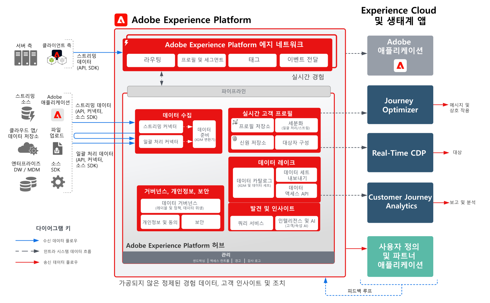
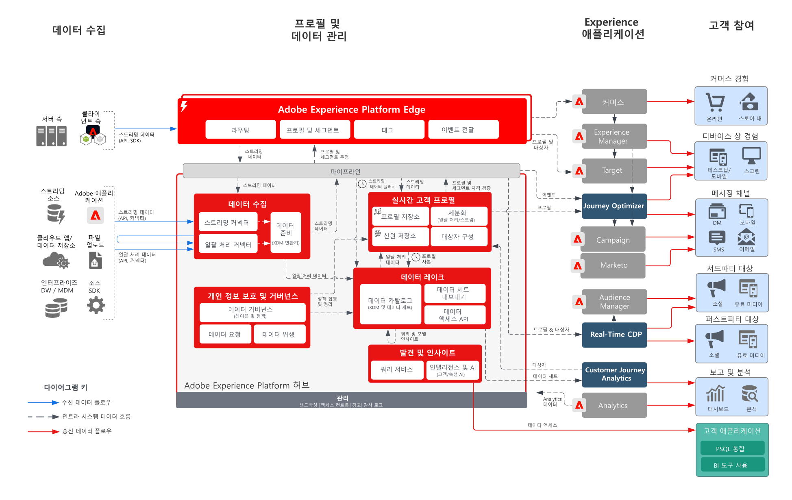

# Adobe Experience Platform 및 애플리케이션 아키텍처 다이어그램

이 아키텍처 다이어그램은 Experience Platform(AEP)가 다른 Experience Cloud 애플리케이션 및 애플리케이션 서비스와 어떻게 관련되는지를 보여 줍니다.

>[!MORELIKETHIS]
>
>[Experience Cloud 응용 프로그램 통합을 위한 통합 구성](https://experienceleague.adobe.com/docs/integrations-learn/experience-cloud/overview.html?lang=ko).

## 아키텍처 다이어그램

이 아키텍처 다이어그램은 Adobe Experience Platform과 Adobe Experience Cloud 애플리케이션 및 애플리케이션 서비스 간의 관계를 보여 줍니다.

## 자세한 아키텍처 다이어그램

