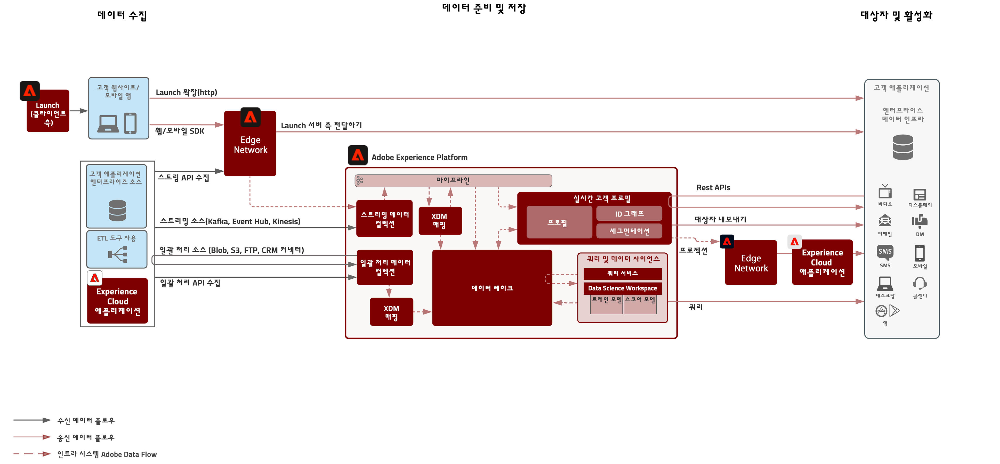
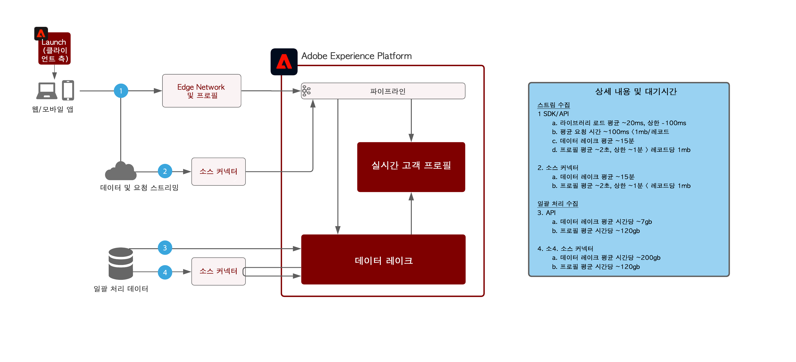

# Adobe Experience Platform 데이터 흐름 아키텍처

## 데이터 흐름 다이어그램

아래 다이어그램은 Adobe Experience Platform에서 데이터를 수집하고 내보내기 위한 다양한 경로를 보여줍니다.

## 데이터 수집 가드 레일

아래 다이어그램은 Adobe Experience Platform에 데이터를 수집하기 위한 평균 성능 보호 기능 및 지연을 보여줍니다.

