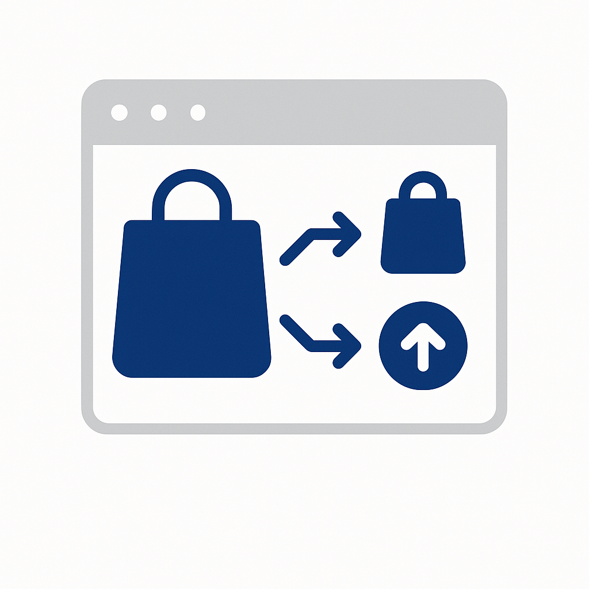

# 사용 사례 카탈로그

업계 사용 사례는 특정 분야의 조직이 Adobe Experience Platform 및 애플리케이션을 적용하여 측정 가능한 비즈니스 성과를 달성하는 방법을 보여 줍니다. 각 사용 사례에서는 구체적인 비즈니스 시나리오, 예상되는 영향 및 자세한 구현 지침을 제공하는 [사용 사례 패턴](/help/blueprints/use-case-patterns/overview.md)에 대한 링크를 설명합니다.

산업별로 탐색하여 조직과 관련된 사용 사례를 찾은 다음, 의사 결정 지침, 함수 체인 및 Experience League 설명서를 포함한 구현 참조에 대한 패턴 링크를 따르십시오.

| 업계 | 주요 테마 |
| --- | --- |
| [자동차](automotive/automotive-overview.md) | 차량 구매 여정, 서비스 라이프사이클, 커넥티드 카 경험, 소유자 충성도 |
| [B2B](b2b/b2b-overview.md) | 계정 기반 마케팅, 리드 점수, 파이프라인 가속, 고객 확장 |
| [금융 서비스](financial-services/financial-services-overview.md) | 제품 권장 사항, 이탈 방지, 수명 단계 오퍼, 사기 개인화 |
| [의료 서비스](healthcare/healthcare-overview.md) | 약속 관리, 복약 준수, 환자 온보딩, 진료 조정 |
| [보험](insurance/insurance-overview.md) | 정책 갱신, 청구 경험, 위험 방지, 교차 판매 최적화 |
| [미디어 및 엔터테인먼트](media-entertainment/media-entertainment-overview.md) | 콘텐츠 권장 사항, 구독 유지, 평가판 전환, 교차 플랫폼 참여 |
| [소매](retail/retail-overview.md) | 제품 개인화, 장바구니 복구, 교차 판매 최적화, 충성도 참여 |
| [통신](telecommunications/telecommunications-overview.md) | 장치 업그레이드, 이탈 방지, 계획 최적화, 네트워크 참여 |
| [여행 및 접대](travel-hospitality/travel-hospitality-overview.md) | 예약 개인화, 포기 복구, 충성도 프로그램, 시즌 캠페인 |

## 사용 사례가 구현 지침에 연결되는 방법

각 사용 사례는 **사용 사례 패턴**&#x200B;에 연결됩니다. 이는 사용 사례를 실행하는 데 필요한 함수 체인, 의사 결정 지점 및 구성 단계를 설명하는 반복 가능한 구현 접근 방식입니다. 사용 사례 패턴을 차례로 [주요 비즈니스 목표](/help/blueprints/business-objectives/overview.md)에 연결하여 구현 작업을 전략적 결과에 맞게 조정할 수 있습니다.

```
Industry Use Case → Use Case Pattern → Key Business Objective
```

## 업종별 찾아보기

>[!BEGINTABS]

>[!TAB 소매]

| | 사용 사례 | 설명 | 완성도 | 패턴 |
| --- | --- | --- | --- | --- |
|  | [포기한 장바구니 전자 메일 복구](retail/retail-overview.md#abandoned-cart-email-recovery) | 포기한 장바구니에 대해 개인화된 미리 알림 보내기 | [!BADGE 기본]{type=Neutral} | [이벤트 트리거된 메시징](/help/blueprints/use-case-patterns/campaign-management-orchestration/event-triggered-messaging.md) |
|  | [인벤토리 기반 긴급도 캠페인](retail/retail-overview.md#inventory-based-urgency-campaigns) | 제품 재고가 낮을 때 실시간 경고 트리거 | [!BADGE 기본]{type=Neutral} | [이벤트 트리거된 메시징](/help/blueprints/use-case-patterns/campaign-management-orchestration/event-triggered-messaging.md) |
|  | [가격 하락 경고](retail/retail-overview.md#price-drop-alerts) | 위시리스트 또는 조회한 항목의 가격이 하락하면 고객에게 알림 | [!BADGE 기본]{type=Neutral} | [이벤트 트리거된 메시징](/help/blueprints/use-case-patterns/campaign-management-orchestration/event-triggered-messaging.md) |
| | [재고 부족 알림](retail/retail-overview.md#out-of-stock-notifications) | 품절된 제품을 사용할 수 있게 되면 고객에게 알림 | [!BADGE 기본]{type=Neutral} | [이벤트 트리거된 메시징](/help/blueprints/use-case-patterns/campaign-management-orchestration/event-triggered-messaging.md) |
|  | [개인 맞춤화된 제품 추천](retail/retail-overview.md#personalized-product-recommendations) | 검색 및 구매 내역을 기반으로 개인화된 제품 표시 | [!BADGE 표시]{type=Informative} | [동작 권장 사항](/help/blueprints/use-case-patterns/personalization/behavioral-recommendation.md) |
|  | [개인 설정된 범주 페이지](retail/retail-overview.md#personalized-category-pages) | 고객 환경 설정에 따라 동적으로 카테고리 페이지 재정렬 | [!BADGE 표시]{type=Informative} | [동작 권장 사항](/help/blueprints/use-case-patterns/personalization/behavioral-recommendation.md) |
|  | [새 고객 환영 시리즈](retail/retail-overview.md#new-customer-welcome-series) | 개인화된 추천을 통해 다중 이메일 환영 시리즈 자동화 | [!BADGE 표시]{type=Informative} | [여러 단계로 조정된 여정](/help/blueprints/use-case-patterns/campaign-management-orchestration/multi-step-orchestrated-journey.md) |
|  | [보충 알림](retail/retail-overview.md#replenishment-reminders) | 정기적으로 구매하는 소모성 제품에 대한 자동 미리 알림 보내기 | [!BADGE 표시]{type=Informative} | [여러 단계로 조정된 여정](/help/blueprints/use-case-patterns/campaign-management-orchestration/multi-step-orchestrated-journey.md) |
|  | [구매 후 후속 캠페인](retail/retail-overview.md#post-purchase-follow-up-campaigns) | 관리 팁 보내기, 검토 요청 및 관련 제품 제안 | [!BADGE 표시]{type=Informative} | [여러 단계로 조정된 여정](/help/blueprints/use-case-patterns/campaign-management-orchestration/multi-step-orchestrated-journey.md) |
| | [소셜 증명 Personalization](retail/retail-overview.md#social-proof-personalization) | 고객 프로필을 기반으로 개인화된 리뷰 및 등급 표시 | [!BADGE 표시]{type=Informative} | [알려진 방문자 웹/앱 Personalization](/help/blueprints/use-case-patterns/personalization/known-visitor-web-app-personalization.md) |
|  | [교차 판매 및 상향 판매 권장 사항](retail/retail-overview.md#cross-sell-and-upsell-recommendations) | 체크아웃 시 및 이메일에서 관련 크로스셀 및 업셀 제품 표시 | [!BADGE 고급]{type=Caution} | [Offer Decisioning](/help/blueprints/use-case-patterns/personalization/offer-decisioning.md) |
| | [VIP Customer Exclusive Offers](retail/retail-overview.md#vip-customer-exclusive-offers) | 독점 제공 및 고부가가치 고객에 대한 조기 액세스 제공 | [!BADGE 고급]{type=Caution} | [Decisioning을 사용한 크로스 채널 여정](/help/blueprints/use-case-patterns/campaign-management-orchestration/cross-channel-journey-with-decisioning.md) |

>[!TAB 자동차]

| | 사용 사례 | 설명 | 완성도 | 패턴 |
| --- | --- | --- | --- | --- |
|  | [서비스 약속 미리 알림](automotive/automotive-overview.md#service-appointment-reminders) | 차량 마일리지 및 서비스 기록에 따라 개인화된 서비스 알림 보내기 | [!BADGE 기본]{type=Neutral} | [이벤트 트리거된 메시징](/help/blueprints/use-case-patterns/campaign-management-orchestration/event-triggered-messaging.md) |
|  | [차량 회수 알림](automotive/automotive-overview.md#vehicle-recall-notifications) | 서비스 예약 옵션을 사용하여 개인화된 리콜 알림 보내기 | [!BADGE 기본]{type=Neutral} | [이벤트 트리거된 메시징](/help/blueprints/use-case-patterns/campaign-management-orchestration/event-triggered-messaging.md) |
|  | [드라이브 예약 테스트](automotive/automotive-overview.md#test-drive-scheduling) | 판매자 추천을 통해 개인화된 테스트 드라이브 예약 활성화 | [!BADGE 기본]{type=Neutral} | [이벤트 트리거된 메시징](/help/blueprints/use-case-patterns/campaign-management-orchestration/event-triggered-messaging.md) |
|  | [새 모델 실행 캠페인](automotive/automotive-overview.md#new-model-launch-campaigns) | 현재 차량 및 선호도에 따라 새로운 모델에 관심이 있는 고객을 타깃팅합니다 | [!BADGE 기본]{type=Neutral} | [아웃바운드 메시지 일괄 활성화](/help/blueprints/use-case-patterns/campaign-management-orchestration/batch-outbound-message-activation.md) |
|  | [거래 값 캠페인](automotive/automotive-overview.md#trade-in-value-campaigns) | 업그레이드 준비가 완료된 고객에게 트레이드 인 가치 평가를 사전에 제공 | [!BADGE 표시]{type=Informative} | [여러 단계로 조정된 여정](/help/blueprints/use-case-patterns/campaign-management-orchestration/multi-step-orchestrated-journey.md) |
|  | [부품 및 액세서리 권장 사항](automotive/automotive-overview.md#parts-and-accessories-recommendations) | 차량 모델 및 소유권 기간에 따라 부품 및 액세서리 추천 | [!BADGE 표시]{type=Informative} | [동작 권장 사항](/help/blueprints/use-case-patterns/personalization/behavioral-recommendation.md) |
|  | [무상수리 및 연장 서비스 플랜](automotive/automotive-overview.md#warranty-and-extended-service-plans) | 차량 연령을 기준으로 최적의 시기에 보증 및 서비스 계획 추천 | [!BADGE 표시]{type=Informative} | [여러 단계로 조정된 여정](/help/blueprints/use-case-patterns/campaign-management-orchestration/multi-step-orchestrated-journey.md) |
|  | [연결된 자동차 기능 활성화](automotive/automotive-overview.md#connected-car-feature-activation) | 차량 기능을 기반으로 커넥티드카 기능 추천 개인화 | [!BADGE 표시]{type=Informative} | [여러 단계로 조정된 여정](/help/blueprints/use-case-patterns/campaign-management-orchestration/multi-step-orchestrated-journey.md) |
|  | [대리점 네트워크 조정](automotive/automotive-overview.md#dealer-network-coordination) | 위치 및 환경 설정에 따라 개인화된 판매자 추천 활성화 | [!BADGE 표시]{type=Informative} | [알려진 방문자 웹/앱 Personalization](/help/blueprints/use-case-patterns/personalization/known-visitor-web-app-personalization.md) |
|  | [차량 구매 여정 Personalization](automotive/automotive-overview.md#vehicle-purchase-journey-personalization) | 조사부터 구매까지 차량 구매 여정 개인화 | [!BADGE 고급]{type=Caution} | [Decisioning을 사용한 크로스 채널 여정](/help/blueprints/use-case-patterns/campaign-management-orchestration/cross-channel-journey-with-decisioning.md) |
|  | [금융 및 보험 혜택](automotive/automotive-overview.md#financing-and-insurance-offers) | 크레딧 프로필에 따라 개인화된 금융 및 보험 제안을 제시합니다. | [!BADGE 고급]{type=Caution} | [Offer Decisioning](/help/blueprints/use-case-patterns/personalization/offer-decisioning.md) |
|  | [소유자 충성도 프로그램](automotive/automotive-overview.md#owner-loyalty-programs) | 소유권 내역별로 충성도 커뮤니케이션, 보상 및 독점 오퍼 개인화 | [!BADGE 고급]{type=Caution} | [Decisioning을 사용한 크로스 채널 여정](/help/blueprints/use-case-patterns/campaign-management-orchestration/cross-channel-journey-with-decisioning.md) |

>[!TAB 금융 서비스]

| | 사용 사례 | 설명 | 완성도 | 패턴 |
| --- | --- | --- | --- | --- |
| | [트랜잭션 기반 알림 및 권장 사항](financial-services/financial-services-overview.md#transaction-based-alerts-and-recommendations) | 트랜잭션 및 개인화된 권장 사항에 대한 실시간 경고 보내기 | [!BADGE 기본]{type=Neutral} | [이벤트 트리거된 메시징](/help/blueprints/use-case-patterns/campaign-management-orchestration/event-triggered-messaging.md) |
| | [신용 카드 응용 프로그램 포기 복구](financial-services/financial-services-overview.md#credit-card-application-abandonment-recovery) | 신용카드 신청을 시작했지만 완료하지 않은 고객 재참여 | [!BADGE 기본]{type=Neutral} | [이벤트 트리거된 메시징](/help/blueprints/use-case-patterns/campaign-management-orchestration/event-triggered-messaging.md) |
| | [사기 행위 경고 Personalization](financial-services/financial-services-overview.md#fraud-alert-personalization) | 고객 환경 설정에 따라 사기 경고 및 보안 커뮤니케이션 개인화 | [!BADGE 기본]{type=Neutral} | [이벤트 트리거된 메시징](/help/blueprints/use-case-patterns/campaign-management-orchestration/event-triggered-messaging.md) |
|  | [높은 가치의 잠재 고객 양성](financial-services/financial-services-overview.md#high-value-lead-nurturing) | 개인화된 컨텐츠 및 오퍼를 통해 고가치 잠재 고객 파악 및 육성 | [!BADGE 표시]{type=Informative} | [여러 단계로 조정된 여정](/help/blueprints/use-case-patterns/campaign-management-orchestration/multi-step-orchestrated-journey.md) |
|  | [개인화된 계정 대시보드](financial-services/financial-services-overview.md#personalized-account-dashboard) | 계정 활동 및 재무 목표를 기반으로 온라인 뱅킹 대시보드 개인화 | [!BADGE 표시]{type=Informative} | [알려진 방문자 웹/앱 Personalization](/help/blueprints/use-case-patterns/personalization/known-visitor-web-app-personalization.md) |
| | [투자 Portfolio 권장 사항](financial-services/financial-services-overview.md#investment-portfolio-recommendations) | 위험 프로필 및 목표에 따라 개인화된 투자 권장 사항 제공 | [!BADGE 표시]{type=Informative} | [동작 권장 사항](/help/blueprints/use-case-patterns/personalization/behavioral-recommendation.md) |
| | [담보 대출 사전 승인 캠페인](financial-services/financial-services-overview.md#mortgage-pre-approval-campaigns) | 프로필 및 수명 단계에 따라 담보 대출 시장에서 고객을 타깃팅합니다. | [!BADGE 표시]{type=Informative} | [여러 단계로 조정된 여정](/help/blueprints/use-case-patterns/campaign-management-orchestration/multi-step-orchestrated-journey.md) |
|  | [기존 고객을 위한 제품 추천](financial-services/financial-services-overview.md#product-recommendation-for-existing-customers) | 프로필, 거래 및 생활 단계에 따라 관련 금융 상품 추천 | [!BADGE 고급]{type=Caution} | [Offer Decisioning](/help/blueprints/use-case-patterns/personalization/offer-decisioning.md) |
|  | [이탈 방지 캠페인](financial-services/financial-services-overview.md#churn-prevention-campaigns) | AI 기반 예측으로 위험 상황에서 고객을 식별하고 유지 오퍼에 참여 | [!BADGE 고급]{type=Caution} | [Decisioning을 사용한 크로스 채널 여정](/help/blueprints/use-case-patterns/campaign-management-orchestration/cross-channel-journey-with-decisioning.md) |
|  | [수명 단계 기반 제품 오퍼](financial-services/financial-services-overview.md#life-stage-based-product-offers) | 새로운 생활 단계에 접어드는 고객을 식별하고 관련 금융 상품을 제공합니다. | [!BADGE 고급]{type=Caution} | [Decisioning을 사용한 크로스 채널 여정](/help/blueprints/use-case-patterns/campaign-management-orchestration/cross-channel-journey-with-decisioning.md) |
| | [충성도 프로그램 참여](financial-services/financial-services-overview.md#loyalty-program-engagement) | 계층 및 내역별로 충성도 커뮤니케이션, 보상 및 오퍼 개인화 | [!BADGE 고급]{type=Caution} | [Decisioning을 사용한 크로스 채널 여정](/help/blueprints/use-case-patterns/campaign-management-orchestration/cross-channel-journey-with-decisioning.md) |
| | [개인 맞춤화된 금융 교육 콘텐츠](financial-services/financial-services-overview.md#personalized-financial-education-content) | 고객 프로필과 관심사를 기반으로 개인화된 금융 교육 제공 | [!BADGE 고급]{type=Caution} | [Decisioning을 사용한 크로스 채널 여정](/help/blueprints/use-case-patterns/campaign-management-orchestration/cross-channel-journey-with-decisioning.md) |

>[!TAB 의료 서비스]

| | 사용 사례 | 설명 | 완성도 | 패턴 |
| --- | --- | --- | --- | --- |
|  | [약속 미리 알림 자동화](healthcare/healthcare-overview.md#appointment-reminder-automation) | 선호하는 통신 채널을 통해 개인화된 약속 미리 알림 보내기 | [!BADGE 기본]{type=Neutral} | [이벤트 트리거된 메시징](/help/blueprints/use-case-patterns/campaign-management-orchestration/event-triggered-messaging.md) |
|  | [방문 후 후속 캠페인](healthcare/healthcare-overview.md#post-visit-follow-up-campaigns) | 방문 후 설문 조사, 진료 지침 및 후속 약속 미리 알림 보내기 | [!BADGE 기본]{type=Neutral} | [이벤트 트리거된 메시징](/help/blueprints/use-case-patterns/campaign-management-orchestration/event-triggered-messaging.md) |
| | [랩 결과 알림](healthcare/healthcare-overview.md#lab-results-notification) | 선호하는 채널을 통해 실험실 결과를 이용할 수 있을 때 환자에게 알림 | [!BADGE 기본]{type=Neutral} | [이벤트 트리거된 메시징](/help/blueprints/use-case-patterns/campaign-management-orchestration/event-triggered-messaging.md) |
| | [보험 적용 범위 확인](healthcare/healthcare-overview.md#insurance-coverage-verification) | 약속 전에 보험 적용 범위를 사전에 확인하고 전달합니다. | [!BADGE 기본]{type=Neutral} | [이벤트 트리거된 메시징](/help/blueprints/use-case-patterns/campaign-management-orchestration/event-triggered-messaging.md) |
| | [원격 약속 알림](healthcare/healthcare-overview.md#telehealth-appointment-reminders) | 연결 지침과 함께 텔레헬스 약속에 대한 개인화된 미리 알림 보내기 | [!BADGE 기본]{type=Neutral} | [이벤트 트리거된 메시징](/help/blueprints/use-case-patterns/campaign-management-orchestration/event-triggered-messaging.md) |
|  | [예방 관리 알림](healthcare/healthcare-overview.md#preventive-care-reminders) | 연령 및 병력에 따라 권장 예방 관리에 대해 환자들에게 상기시킵니다. | [!BADGE 기본]{type=Neutral} | [아웃바운드 메시지 일괄 활성화](/help/blueprints/use-case-patterns/campaign-management-orchestration/batch-outbound-message-activation.md) |
|  | [약물 준수 캠페인](healthcare/healthcare-overview.md#medication-adherence-campaigns) | 환자가 약물을 제대로 복용할 수 있도록 개인화된 알림 메시지 보내기 | [!BADGE 표시]{type=Informative} | [여러 단계로 조정된 여정](/help/blueprints/use-case-patterns/campaign-management-orchestration/multi-step-orchestrated-journey.md) |
| | [만성 질환 관리 프로그램](healthcare/healthcare-overview.md#chronic-disease-management-programs) | 만성 질환 관리 커뮤니케이션 및 모니터링 알림 개인화 | [!BADGE 표시]{type=Informative} | [여러 단계로 조정된 여정](/help/blueprints/use-case-patterns/campaign-management-orchestration/multi-step-orchestrated-journey.md) |
| | [새 환자 온보딩 여정](healthcare/healthcare-overview.md#new-patient-onboarding-journey) | 시작 정보, 포털 액세스 및 일정을 사용하여 여러 단계 온보딩 자동화 | [!BADGE 표시]{type=Informative} | [여러 단계로 조정된 여정](/help/blueprints/use-case-patterns/campaign-management-orchestration/multi-step-orchestrated-journey.md) |
| | [Wellness 프로그램 참여](healthcare/healthcare-overview.md#wellness-program-engagement) | 웰니스 프로그램 커뮤니케이션, 과제 및 보상 개인화 | [!BADGE 표시]{type=Informative} | [여러 단계로 조정된 여정](/help/blueprints/use-case-patterns/campaign-management-orchestration/multi-step-orchestrated-journey.md) |
| | [관리 팀 조정](healthcare/healthcare-overview.md#care-team-coordination) | 환자와 진료 팀 간의 개인화된 커뮤니케이션 활성화 | [!BADGE 표시]{type=Informative} | [여러 단계로 조정된 여정](/help/blueprints/use-case-patterns/campaign-management-orchestration/multi-step-orchestrated-journey.md) |
| | [개인 맞춤화된 상태 콘텐츠 배달](healthcare/healthcare-overview.md#personalized-health-content-delivery) | 환자 상태에 맞는 개인화된 건강 교육 콘텐츠 제공 | [!BADGE 고급]{type=Caution} | [Decisioning을 사용한 크로스 채널 여정](/help/blueprints/use-case-patterns/campaign-management-orchestration/cross-channel-journey-with-decisioning.md) |

>[!TAB 보험]

| | 사용 사례 | 설명 | 완성도 | 패턴 |
| --- | --- | --- | --- | --- |
|  | [정책 갱신 캠페인](insurance/insurance-overview.md#policy-renewal-campaigns) | 개인화된 정책 갱신 알림 및 오퍼 보내기 | [!BADGE 기본]{type=Neutral} | [이벤트 트리거된 메시징](/help/blueprints/use-case-patterns/campaign-management-orchestration/event-triggered-messaging.md) |
| | [정책 변경 알림](insurance/insurance-overview.md#policy-change-notifications) | 정책 변경 및 적용 범위 업데이트에 대한 개인화된 알림 보내기 | [!BADGE 기본]{type=Neutral} | [이벤트 트리거된 메시징](/help/blueprints/use-case-patterns/campaign-management-orchestration/event-triggered-messaging.md) |
| | [견적 포기 복구](insurance/insurance-overview.md#quote-abandonment-recovery) | 보험 견적을 작성하지 않은 고객의 재참여 | [!BADGE 기본]{type=Neutral} | [이벤트 트리거된 메시징](/help/blueprints/use-case-patterns/campaign-management-orchestration/event-triggered-messaging.md) |
| | [클레임 사기 방지](insurance/insurance-overview.md#claims-fraud-prevention) | 지능적인 부정 행위 감지를 사용하여 의심스러운 청구 패턴을 식별 | [!BADGE 기본]{type=Neutral} | [이벤트 트리거된 메시징](/help/blueprints/use-case-patterns/campaign-management-orchestration/event-triggered-messaging.md) |
| | [재해 이벤트 응답](insurance/insurance-overview.md#catastrophic-event-response) | 자연 재해 발생 시 영향을 받는 지역의 고객과 사전 예방적으로 의사 소통 | [!BADGE 기본]{type=Neutral} | [이벤트 트리거된 메시징](/help/blueprints/use-case-patterns/campaign-management-orchestration/event-triggered-messaging.md) |
| | [에이전트 및 브로커 조정](insurance/insurance-overview.md#agent-and-broker-coordination) | 고객과 할당된 에이전트 간에 개인화된 커뮤니케이션 활성화 | [!BADGE 기본]{type=Neutral} | [아웃바운드 메시지 일괄 활성화](/help/blueprints/use-case-patterns/campaign-management-orchestration/batch-outbound-message-activation.md) |
|  | [클레임 처리 Personalization](insurance/insurance-overview.md#claims-process-personalization) | 청구 프로세스 커뮤니케이션, 상태 업데이트 및 지원 리소스 개인화 | [!BADGE 표시]{type=Informative} | [여러 단계로 조정된 여정](/help/blueprints/use-case-patterns/campaign-management-orchestration/multi-step-orchestrated-journey.md) |
| | [위험 평가 및 예방](insurance/insurance-overview.md#risk-assessment-and-prevention) | 개인화된 위험 평가 정보 및 예방 팁 제공 | [!BADGE 표시]{type=Informative} | [여러 단계로 조정된 여정](/help/blueprints/use-case-patterns/campaign-management-orchestration/multi-step-orchestrated-journey.md) |
| | [건강 및 예방 프로그램](insurance/insurance-overview.md#wellness-and-prevention-programs) | 보험 고객을 위한 웰니스 프로그램 커뮤니케이션 및 보상 개인화 | [!BADGE 표시]{type=Informative} | [여러 단계로 조정된 여정](/help/blueprints/use-case-patterns/campaign-management-orchestration/multi-step-orchestrated-journey.md) |
|  | [교차 판매 제품 권장 사항](insurance/insurance-overview.md#cross-sell-product-recommendations) | 기존 보험 및 생활 단계에 따른 추가 보험 상품 추천 | [!BADGE 고급]{type=Caution} | [Offer Decisioning](/help/blueprints/use-case-patterns/personalization/offer-decisioning.md) |
| | [수명 단계 기반 제품 오퍼](insurance/insurance-overview.md#life-stage-based-product-offers) | 새로운 생명 단계에 접어드는 고객을 식별하고 관련 보험 상품을 제공합니다. | [!BADGE 고급]{type=Caution} | [Decisioning을 사용한 크로스 채널 여정](/help/blueprints/use-case-patterns/campaign-management-orchestration/cross-channel-journey-with-decisioning.md) |
| | [할인 및 절감 기회](insurance/insurance-overview.md#discount-and-savings-opportunities) | 개인화된 할인 기회 식별 및 전달 | [!BADGE 고급]{type=Caution} | [Offer Decisioning](/help/blueprints/use-case-patterns/personalization/offer-decisioning.md) |

>[!TAB 미디어 및 엔터테인먼트]

| | 사용 사례 | 설명 | 완성도 | 패턴 |
| --- | --- | --- | --- | --- |
|  | [새 콘텐츠 릴리스 알림](media-entertainment/media-entertainment-overview.md#new-content-release-notifications) | 구독자에게 환경 설정과 일치하는 새 콘텐츠 알림 | [!BADGE 기본]{type=Neutral} | [이벤트 트리거된 메시징](/help/blueprints/use-case-patterns/campaign-management-orchestration/event-triggered-messaging.md) |
| | [관심 목록 및 즐겨찾기 미리 알림](media-entertainment/media-entertainment-overview.md#watchlist-and-favorites-reminders) | 감시 목록의 감시되지 않은 콘텐츠에 대한 미리 알림 보내기 | [!BADGE 기본]{type=Neutral} | [이벤트 트리거된 메시징](/help/blueprints/use-case-patterns/campaign-management-orchestration/event-triggered-messaging.md) |
| | [실시간 이벤트 미리 알림 보기](media-entertainment/media-entertainment-overview.md#live-event-viewing-reminders) | 사용자에게 관심사와 일치하는 예정된 라이브 이벤트에 대해 알림 | [!BADGE 기본]{type=Neutral} | [이벤트 트리거된 메시징](/help/blueprints/use-case-patterns/campaign-management-orchestration/event-triggered-messaging.md) |
| | [콘텐츠 완료 캠페인](media-entertainment/media-entertainment-overview.md#content-completion-campaigns) | 시작했지만 완료하지 않은 콘텐츠를 완료하도록 사용자에게 알림 | [!BADGE 기본]{type=Neutral} | [이벤트 트리거된 메시징](/help/blueprints/use-case-patterns/campaign-management-orchestration/event-triggered-messaging.md) |
|  | [콘텐츠 추천 엔진](media-entertainment/media-entertainment-overview.md#content-recommendation-engine) | 시청 기록을 기반으로 개인화된 콘텐츠 추천 제공 | [!BADGE 표시]{type=Informative} | [동작 권장 사항](/help/blueprints/use-case-patterns/personalization/behavioral-recommendation.md) |
| | [개인 맞춤화된 홈 페이지 환경](media-entertainment/media-entertainment-overview.md#personalized-homepage-experience) | 가장 관련성이 높은 콘텐츠를 먼저 표시하도록 홈 페이지를 동적으로 개인화 | [!BADGE 표시]{type=Informative} | [동작 권장 사항](/help/blueprints/use-case-patterns/personalization/behavioral-recommendation.md) |
| | [개인화된 재생 목록 생성](media-entertainment/media-entertainment-overview.md#personalized-playlist-generation) | 수신 기록 및 환경 설정에 따라 재생 목록 자동 생성 | [!BADGE 표시]{type=Informative} | [동작 권장 사항](/help/blueprints/use-case-patterns/personalization/behavioral-recommendation.md) |
| | [무료 평가판 전환 캠페인](media-entertainment/media-entertainment-overview.md#free-trial-conversion-campaigns) | 개인화된 콘텐츠로 무료 평가판 사용자를 참여시켜 전환을 유도하십시오 | [!BADGE 표시]{type=Informative} | [여러 단계로 조정된 여정](/help/blueprints/use-case-patterns/campaign-management-orchestration/multi-step-orchestrated-journey.md) |
| | [크로스 플랫폼 콘텐츠 동기화](media-entertainment/media-entertainment-overview.md#cross-platform-content-sync) | 동기화된 환경 설정을 통해 장치 간에 원활한 콘텐츠 경험 제공 | [!BADGE 표시]{type=Informative} | [알려진 방문자 웹/앱 Personalization](/help/blueprints/use-case-patterns/personalization/known-visitor-web-app-personalization.md) |
| | [소셜 공유 Personalization](media-entertainment/media-entertainment-overview.md#social-sharing-personalization) | 콘텐츠 환경 설정을 기반으로 소셜 공유 프롬프트 개인화 | [!BADGE 표시]{type=Informative} | [알려진 방문자 웹/앱 Personalization](/help/blueprints/use-case-patterns/personalization/known-visitor-web-app-personalization.md) |
|  | [구독 이탈 방지](media-entertainment/media-entertainment-overview.md#subscription-churn-prevention) | 위험 상태의 구독자를 식별하고 유지 오퍼에 참여 | [!BADGE 고급]{type=Caution} | [Decisioning을 사용한 크로스 채널 여정](/help/blueprints/use-case-patterns/campaign-management-orchestration/cross-channel-journey-with-decisioning.md) |
| | [프리미엄 기능 상향 판매](media-entertainment/media-entertainment-overview.md#premium-feature-upsell) | 개인화된 오퍼로 프리미엄 기능을 사용할 사용자 식별 | [!BADGE 고급]{type=Caution} | [Offer Decisioning](/help/blueprints/use-case-patterns/personalization/offer-decisioning.md) |

>[!TAB 통신]

| | 사용 사례 | 설명 | 완성도 | 패턴 |
| --- | --- | --- | --- | --- |
| | [데이터 사용 알림 및 권장 사항](telecommunications/telecommunications-overview.md#data-usage-alerts-and-recommendations) | 고객이 데이터 제한에 근접하면 개인화된 경고 전송 | [!BADGE 기본]{type=Neutral} | [이벤트 트리거된 메시징](/help/blueprints/use-case-patterns/campaign-management-orchestration/event-triggered-messaging.md) |
| | [서비스 중단 알림](telecommunications/telecommunications-overview.md#service-outage-notifications) | 고객이 해당 지역의 서비스 중단에 대해 사전에 알림 | [!BADGE 기본]{type=Neutral} | [이벤트 트리거된 메시징](/help/blueprints/use-case-patterns/campaign-management-orchestration/event-triggered-messaging.md) |
| | [결제 알림](telecommunications/telecommunications-overview.md#bill-payment-reminders) | 결제 옵션과 함께 개인화된 청구서 결제 미리 알림 보내기 | [!BADGE 기본]{type=Neutral} | [이벤트 트리거된 메시징](/help/blueprints/use-case-patterns/campaign-management-orchestration/event-triggered-messaging.md) |
| | [5G 업그레이드 캠페인](telecommunications/telecommunications-overview.md#5g-upgrade-campaigns) | 맞춤형 오퍼를 통해 5G 업그레이드 대상 고객 타기팅 | [!BADGE 기본]{type=Neutral} | [아웃바운드 메시지 일괄 활성화](/help/blueprints/use-case-patterns/campaign-management-orchestration/batch-outbound-message-activation.md) |
|  | [계획 최적화 캠페인](telecommunications/telecommunications-overview.md#plan-optimization-campaigns) | 사용 패턴을 분석하고 최적의 계획 변경 권장 | [!BADGE 표시]{type=Informative} | [여러 단계로 조정된 여정](/help/blueprints/use-case-patterns/campaign-management-orchestration/multi-step-orchestrated-journey.md) |
| | [새 고객 온보딩 여정](telecommunications/telecommunications-overview.md#new-customer-onboarding-journey) | 시작 정보 및 기능 튜토리얼을 통해 개인화된 온보딩 자동화 | [!BADGE 표시]{type=Informative} | [여러 단계로 조정된 여정](/help/blueprints/use-case-patterns/campaign-management-orchestration/multi-step-orchestrated-journey.md) |
| | [네트워크 성능 Personalization](telecommunications/telecommunications-overview.md#network-performance-personalization) | 위치 및 장치를 기반으로 네트워크 성능 정보 개인화 | [!BADGE 표시]{type=Informative} | [알려진 방문자 웹/앱 Personalization](/help/blueprints/use-case-patterns/personalization/known-visitor-web-app-personalization.md) |
|  | [장치 업그레이드 권장 사항](telecommunications/telecommunications-overview.md#device-upgrade-recommendations) | 적합한 고객을 식별하고 개인화된 장치 추천을 제공합니다. | [!BADGE 고급]{type=Caution} | [Decisioning을 사용한 크로스 채널 여정](/help/blueprints/use-case-patterns/campaign-management-orchestration/cross-channel-journey-with-decisioning.md) |
|  | [가치가 높은 고객을 위한 이탈 방지](telecommunications/telecommunications-overview.md#churn-prevention-for-high-value-customers) | 고가치 위험 고객 파악 및 유지 보수 서비스 제공 | [!BADGE 고급]{type=Caution} | [Decisioning을 사용한 크로스 채널 여정](/help/blueprints/use-case-patterns/campaign-management-orchestration/cross-channel-journey-with-decisioning.md) |
| | [가족 계획 관리](telecommunications/telecommunications-overview.md#family-plan-management) | 가족 용도별 가족 계획 관리자를 위한 커뮤니케이션 개인화 | [!BADGE 고급]{type=Caution} | [Decisioning을 사용한 크로스 채널 여정](/help/blueprints/use-case-patterns/campaign-management-orchestration/cross-channel-journey-with-decisioning.md) |
| | [추가 기능 서비스 권장 사항](telecommunications/telecommunications-overview.md#add-on-service-recommendations) | 계획, 사용량 및 환경 설정에 따라 관련 추가 기능 서비스 추천 | [!BADGE 고급]{type=Caution} | [Offer Decisioning](/help/blueprints/use-case-patterns/personalization/offer-decisioning.md) |
| | [충성도 프로그램 참여](telecommunications/telecommunications-overview.md#loyalty-program-engagement) | 계층 및 내역별로 충성도 커뮤니케이션, 보상 및 오퍼 개인화 | [!BADGE 고급]{type=Caution} | [Decisioning을 사용한 크로스 채널 여정](/help/blueprints/use-case-patterns/campaign-management-orchestration/cross-channel-journey-with-decisioning.md) |

>[!TAB 여행 및 접대]

| | 사용 사례 | 설명 | 완성도 | 패턴 |
| --- | --- | --- | --- | --- |
|  | [장바구니 포기 복구 여정](travel-hospitality/travel-hospitality-overview.md#cart-abandonment-recovery-journey) | 포기한 예약 장바구니 감지 및 개인화된 이메일 여정 트리거 | [!BADGE 기본]{type=Neutral} | [이벤트 트리거된 메시징](/help/blueprints/use-case-patterns/campaign-management-orchestration/event-triggered-messaging.md) |
|  | [다중 채널 예약 알림](travel-hospitality/travel-hospitality-overview.md#multi-channel-booking-reminders) | 이메일, 텍스트 및 푸시를 통해 개인화된 예약 알림 보내기 | [!BADGE 기본]{type=Neutral} | [이벤트 트리거된 메시징](/help/blueprints/use-case-patterns/campaign-management-orchestration/event-triggered-messaging.md) |
|  | [시즌 캠페인 Personalization](travel-hospitality/travel-hospitality-overview.md#seasonal-campaign-personalization) | 시즌 환경 설정 및 이전 예약을 기반으로 캠페인 개인화 | [!BADGE 기본]{type=Neutral} | [아웃바운드 메시지 일괄 활성화](/help/blueprints/use-case-patterns/campaign-management-orchestration/batch-outbound-message-activation.md) |
|  | [새 방문자를 위한 개인 맞춤화된 홈 페이지](travel-hospitality/travel-hospitality-overview.md#personalized-homepage-for-new-visitors) | 위치 및 탐색 동작을 기반으로 개인화된 권장 사항 표시 | [!BADGE 표시]{type=Informative} | [익명 방문자 웹 Personalization](/help/blueprints/use-case-patterns/personalization/anonymous-visitor-web-personalization.md) |
|  | [높은 의도의 방문자 타깃팅](travel-hospitality/travel-hospitality-overview.md#high-intent-visitor-targeting) | AI 점수를 통해 고의도의 방문자를 식별하고 개인화된 오퍼를 사용하여 타깃팅합니다 | [!BADGE 표시]{type=Informative} | [알려진 방문자 웹/앱 Personalization](/help/blueprints/use-case-patterns/personalization/known-visitor-web-app-personalization.md) |
|  | [예약 후 상향 판매 캠페인](travel-hospitality/travel-hospitality-overview.md#post-booking-upsell-campaigns) | 예약 후 업그레이드, 여행 및 패키지에 대한 상향 판매 캠페인 트리거 | [!BADGE 표시]{type=Informative} | [여러 단계로 조정된 여정](/help/blueprints/use-case-patterns/campaign-management-orchestration/multi-step-orchestrated-journey.md) |
|  | 종료된 고객을 위한 [Win-Back 캠페인](travel-hospitality/travel-hospitality-overview.md#win-back-campaigns-for-lapsed-customers) | 개인화된 윈백 오퍼를 통해 기존 고객 참여 | [!BADGE 표시]{type=Informative} | [여러 단계로 조정된 여정](/help/blueprints/use-case-patterns/campaign-management-orchestration/multi-step-orchestrated-journey.md) |
|  | [동적 일정 권장 사항](travel-hospitality/travel-hospitality-overview.md#dynamic-itinerary-recommendations) | 이전 예약 및 환경 설정에 따라 개인화된 일정 표시 | [!BADGE 표시]{type=Informative} | [알려진 방문자 웹/앱 Personalization](/help/blueprints/use-case-patterns/personalization/known-visitor-web-app-personalization.md) |
|  | [홈 페이지에서 최근에 검색한 제품](travel-hospitality/travel-hospitality-overview.md#recently-browsed-products-on-homepage) | 재방문을 장려하기 위해 최근에 본 대상을 표시합니다. | [!BADGE 표시]{type=Informative} | [알려진 방문자 웹/앱 Personalization](/help/blueprints/use-case-patterns/personalization/known-visitor-web-app-personalization.md) |
|  | [그룹 예약 권장 사항](travel-hospitality/travel-hospitality-overview.md#group-booking-recommendations) | 빈번한 그룹 예약자에게 그룹 패키지 및 가족 친화적 옵션 추천 | [!BADGE 표시]{type=Informative} | [동작 권장 사항](/help/blueprints/use-case-patterns/personalization/behavioral-recommendation.md) |
|  | [타깃팅된 오퍼가 있는 Exit Intent 양식](travel-hospitality/travel-hospitality-overview.md#exit-intent-modal-with-targeted-offers) | 방문자가 종료 의도를 표시할 때 관련 오퍼와 함께 개인화된 양식 표시 | [!BADGE 고급]{type=Caution} | [Offer Decisioning](/help/blueprints/use-case-patterns/personalization/offer-decisioning.md) |
|  | [충성도 프로그램 Personalization](travel-hospitality/travel-hospitality-overview.md#loyalty-program-personalization) | 충성도 계층 및 포인트 균형을 통해 웹 사이트, 오퍼 및 커뮤니케이션 개인화 | [!BADGE 고급]{type=Caution} | [Decisioning을 사용한 크로스 채널 여정](/help/blueprints/use-case-patterns/campaign-management-orchestration/cross-channel-journey-with-decisioning.md) |

>[!TAB B2B]

| | 사용 사례 | 설명 | 완성도 | 패턴 |
| --- | --- | --- | --- | --- |
|  | [웨비나 및 데모 예약](b2b/b2b-overview.md#webinar-and-demo-scheduling) | 잠재 고객 관심사를 기반으로 웨비나 초대 및 데모 일정 개인화 | [!BADGE 기본]{type=Neutral} | [이벤트 트리거된 메시징](/help/blueprints/use-case-patterns/campaign-management-orchestration/event-triggered-messaging.md) |
|  | [Account-Based Marketing Personalization](b2b/b2b-overview.md#account-based-marketing-personalization) | 구매 신호를 기반으로 대상 계정에 대한 마케팅 커뮤니케이션 개인화 | [!BADGE 표시]{type=Informative} | [B2B 대상자 활성화](/help/blueprints/use-case-patterns/audience-building-activation/b2b-audience-activation.md) |
|  | [잠재 고객 점수 및 양성](b2b/b2b-overview.md#lead-scoring-and-nurturing) | 리드에 자동으로 점수를 매기고 점수가 높은 리드를 육성 캠페인을 통해 판매로 라우팅합니다. | [!BADGE 표시]{type=Informative} | [여러 단계로 조정된 여정](/help/blueprints/use-case-patterns/campaign-management-orchestration/multi-step-orchestrated-journey.md) |
|  | [잠재 고객을 위한 컨텐츠 Personalization](b2b/b2b-overview.md#content-personalization-for-prospects) | 잠재 고객 업계, 역할 및 참여를 기반으로 웹 사이트 콘텐츠 및 리소스 개인화 | [!BADGE 표시]{type=Informative} | [알려진 방문자 웹/앱 Personalization](/help/blueprints/use-case-patterns/personalization/known-visitor-web-app-personalization.md) |
|  | [이벤트 등록 및 추가 작업](b2b/b2b-overview.md#event-registration-and-follow-up) | 개인화된 이벤트 등록 확인, 미리 알림 및 후속 작업 자동화 | [!BADGE 표시]{type=Informative} | [여러 단계로 조정된 여정](/help/blueprints/use-case-patterns/campaign-management-orchestration/multi-step-orchestrated-journey.md) |
|  | [제품 평가판 전환 캠페인](b2b/b2b-overview.md#product-trial-conversion-campaigns) | 개인화된 추천을 통해 체험판 사용자를 참여시켜 유료 전환을 장려합니다. | [!BADGE 표시]{type=Informative} | [여러 단계로 조정된 여정](/help/blueprints/use-case-patterns/campaign-management-orchestration/multi-step-orchestrated-journey.md) |
|  | [고객 성공 및 온보딩](b2b/b2b-overview.md#customer-success-and-onboarding) | 관련 교육 및 리소스를 통해 온보딩 여정 개인화 | [!BADGE 표시]{type=Informative} | [여러 단계로 조정된 여정](/help/blueprints/use-case-patterns/campaign-management-orchestration/multi-step-orchestrated-journey.md) |
|  | [경쟁사 교체 캠페인](b2b/b2b-overview.md#competitive-replacement-campaigns) | 개인화된 마이그레이션 오퍼와 함께 경쟁업체 제품을 사용하여 잠재 고객 타기팅 | [!BADGE 표시]{type=Informative} | [여러 단계로 조정된 여정](/help/blueprints/use-case-patterns/campaign-management-orchestration/multi-step-orchestrated-journey.md) |
|  | [사례 연구 및 ROI Personalization](b2b/b2b-overview.md#case-study-and-roi-personalization) | 잠재 고객의 업계를 기반으로 개인화된 사례 연구 및 ROI 계산기 제공 | [!BADGE 표시]{type=Informative} | [알려진 방문자 웹/앱 Personalization](/help/blueprints/use-case-patterns/personalization/known-visitor-web-app-personalization.md) |
| | [고객 지원 프로그램](b2b/b2b-overview.md#customer-advocacy-programs) | 참조 및 추천에 대해 만족도가 높은 고객을 식별하고 참여시킵니다. | [!BADGE 표시]{type=Informative} | [여러 단계로 조정된 여정](/help/blueprints/use-case-patterns/campaign-management-orchestration/multi-step-orchestrated-journey.md) |
|  | [계약 갱신 캠페인](b2b/b2b-overview.md#contract-renewal-campaigns) | 개인화된 오퍼를 통해 재계약을 추진하는 고객의 적극적인 참여 | [!BADGE 고급]{type=Caution} | [Decisioning을 사용한 크로스 채널 여정](/help/blueprints/use-case-patterns/campaign-management-orchestration/cross-channel-journey-with-decisioning.md) |
|  | [업셀 및 확장 기회](b2b/b2b-overview.md#upsell-and-expansion-opportunities) | 사용 패턴 및 증가 지표를 기반으로 업그레이드 준비가 된 고객 식별 | [!BADGE 고급]{type=Caution} | [Decisioning을 사용한 크로스 채널 여정](/help/blueprints/use-case-patterns/campaign-management-orchestration/cross-channel-journey-with-decisioning.md) |

>[!ENDTABS]
