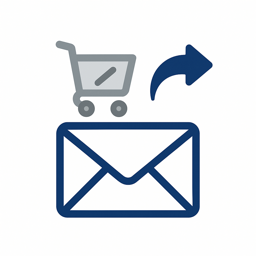
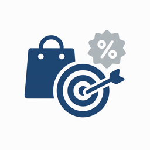
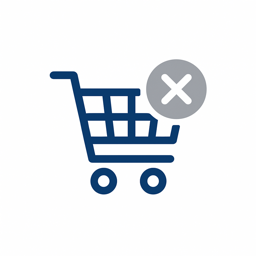
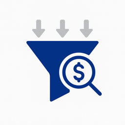
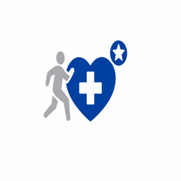
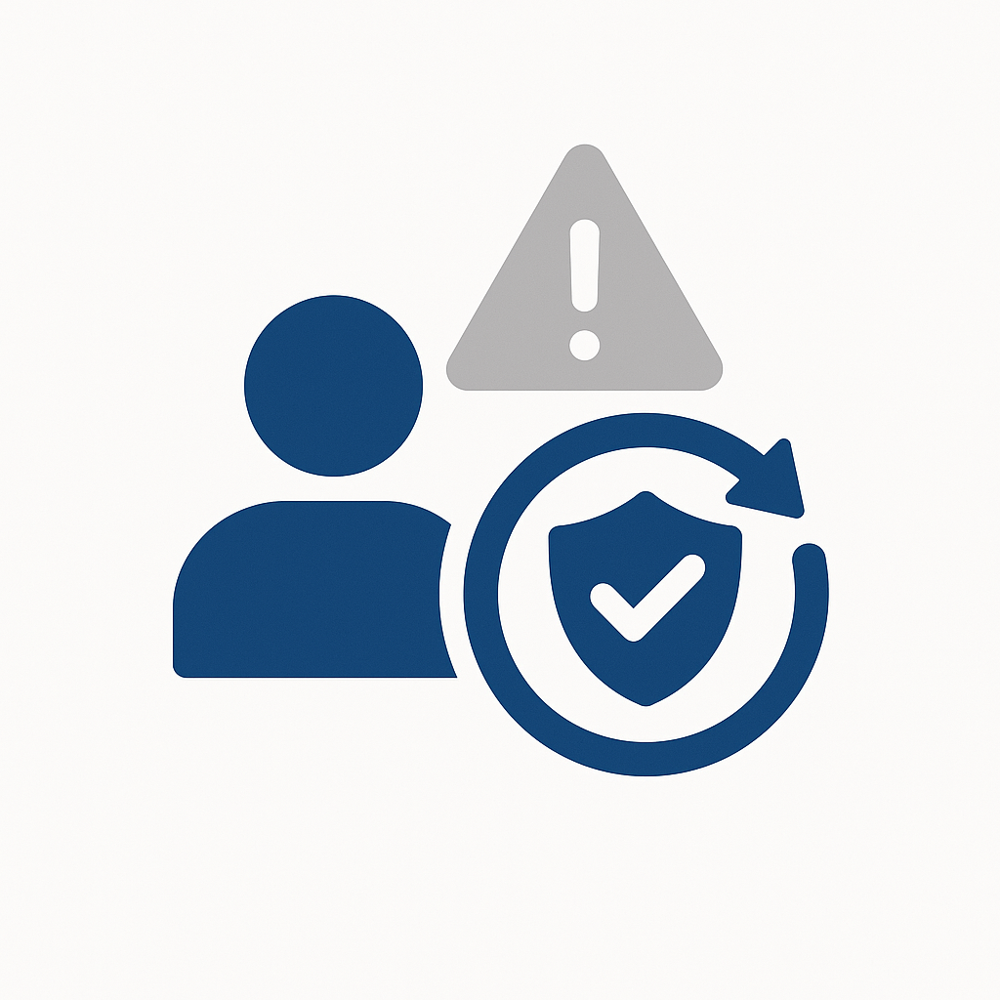
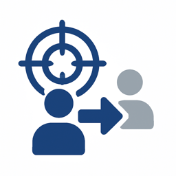
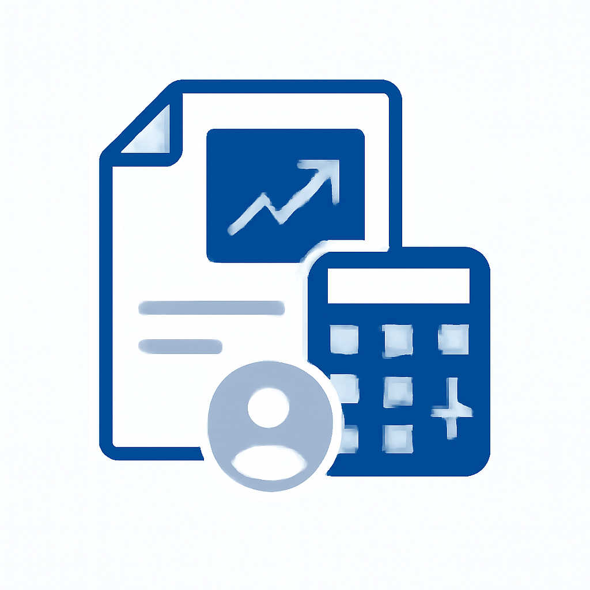
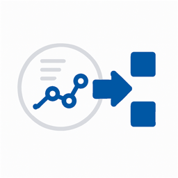

# 사용 사례 카탈로그

업계 사용 사례는 특정 분야의 조직이 Adobe Experience Platform 및 애플리케이션을 적용하여 측정 가능한 비즈니스 성과를 달성하는 방법을 보여 줍니다. 각 사용 사례에서는 구체적인 비즈니스 시나리오, 예상되는 영향 및 자세한 구현 지침을 제공하는 [사용 사례 패턴](/help/blueprints/use-case-patterns/overview.md)에 대한 링크를 설명합니다.

산업별로 탐색하여 조직과 관련된 사용 사례를 찾은 다음, 의사 결정 지침, 함수 체인 및 Experience League 설명서를 포함한 구현 참조에 대한 패턴 링크를 따르십시오.

| 업계 | 주요 테마 |
| --- | --- |
| [자동차](automotive/automotive-overview.md) | 차량 구매 여정, 서비스 라이프사이클, 커넥티드 카 경험, 소유자 충성도 |
| [B2B](b2b/b2b-overview.md) | 계정 기반 마케팅, 리드 점수, 파이프라인 가속, 고객 확장 |
| [금융 서비스](financial-services/financial-services-overview.md) | 제품 권장 사항, 이탈 방지, 수명 단계 오퍼, 사기 개인화 |
| [의료 서비스](healthcare/healthcare-overview.md) | 약속 관리, 복약 준수, 환자 온보딩, 진료 조정 |
| [보험](insurance/insurance-overview.md) | 정책 갱신, 청구 경험, 위험 방지, 교차 판매 최적화 |
| [미디어 및 엔터테인먼트](media-entertainment/media-entertainment-overview.md) | 콘텐츠 권장 사항, 구독 유지, 평가판 전환, 교차 플랫폼 참여 |
| [소매](retail/retail-overview.md) | 제품 개인화, 장바구니 복구, 교차 판매 최적화, 충성도 참여 |
| [통신](telecommunications/telecommunications-overview.md) | 장치 업그레이드, 이탈 방지, 계획 최적화, 네트워크 참여 |
| [여행 및 접대](travel-hospitality/travel-hospitality-overview.md) | 예약 개인화, 포기 복구, 충성도 프로그램, 시즌 캠페인 |
| [기술](technology/technology-overview.md) | 이벤트 수집, 실시간 데이터 전달, 분석 통합, Edge 배포 |

## 사용 사례가 구현 지침에 연결되는 방법

각 사용 사례는 **사용 사례 패턴**&#x200B;에 연결됩니다. 이는 사용 사례를 실행하는 데 필요한 함수 체인, 의사 결정 지점 및 구성 단계를 설명하는 반복 가능한 구현 접근 방식입니다. 사용 사례 패턴을 차례로 [주요 비즈니스 목표](/help/blueprints/business-objectives/overview.md)에 연결하여 구현 작업을 전략적 결과에 맞게 조정할 수 있습니다.

```
Industry Use Case → Use Case Pattern → Key Business Objective
```

## 업종별 찾아보기

>[!BEGINTABS]

>[!TAB 소매]

| | 사용 사례 | 설명 | 완성도 | 패턴 |
| --- | --- | --- | --- | --- |
|  | [포기한 장바구니 전자 메일 복구](retail/retail-overview.md#abandoned-cart-email-recovery) | 장바구니 콘텐츠 및 관련 오퍼를 포함하여 장바구니를 포기한 고객에게 개인화된 이메일 미리 알림을 자동으로 보냅니다. | [!BADGE 기본]{type=Neutral} | [이벤트 트리거된 메시징](/help/blueprints/use-case-patterns/campaign-management-orchestration/event-triggered-messaging.md) |
|  | [인벤토리 기반 긴급도 캠페인](retail/retail-overview.md#inventory-based-urgency-campaigns) | 제품 재고가 낮을 때 실시간 경고 및 캠페인을 트리거하여 긴급성을 만들고 즉시 구매를 유도합니다. | [!BADGE 기본]{type=Neutral} | [이벤트 트리거된 메시징](/help/blueprints/use-case-patterns/campaign-management-orchestration/event-triggered-messaging.md) |
|  | [가격 하락 경고](retail/retail-overview.md#price-drop-alerts) | 위시리스트에 있는 제품이나 이전에 본 항목의 가격이 하락하면 이메일 또는 푸시를 통해 고객에게 알립니다. | [!BADGE 기본]{type=Neutral} | [이벤트 트리거된 메시징](/help/blueprints/use-case-patterns/campaign-management-orchestration/event-triggered-messaging.md) |
|  | [재고 부족 알림](retail/retail-overview.md#out-of-stock-notifications) | 품절 제품을 사용할 수 있게 되면 고객이 알림에 등록할 수 있도록 허용한 다음 이메일 또는 SMS를 통해 자동으로 알립니다. | [!BADGE 기본]{type=Neutral} | [이벤트 트리거된 메시징](/help/blueprints/use-case-patterns/campaign-management-orchestration/event-triggered-messaging.md) |
|  | [획득 캠페인에 대한 고객 억제](retail/retail-overview.md#customer-suppression-for-acquisition-campaigns) | 제외 대상을 유료 미디어 대상으로 활성화하여 기존 고객 및 최근 변환기의 획득 및 지출을 억제함으로써 낭비되는 지출을 줄입니다. | [!BADGE 기본]{type=Neutral} | 대상에 대한 [Audience Activation](/help/blueprints/use-case-patterns/audience-building-activation/audience-activation-to-destinations.md) |
|  | [앱 다운로드를 통한 체크인 알림 메시지](retail/retail-overview.md#check-in-reminder-with-app-download-cta) | 체크인을 알려 주고 정보에 쉽게 액세스할 수 있도록 앱을 다운로드하도록 안내합니다. | [!BADGE 기본]{type=Neutral} | [이벤트 트리거된 메시징](/help/blueprints/use-case-patterns/campaign-management-orchestration/event-triggered-messaging.md) |
|  | [개인 맞춤화된 제품 추천](retail/retail-overview.md#personalized-product-recommendations) | 검색 기록, 구매 기록 및 유사한 고객 행동을 기반으로 홈페이지, 카테고리 페이지 및 제품 세부 정보 페이지에 개인화된 제품 권장 사항을 표시합니다. | [!BADGE 표시]{type=Informative} | [동작 권장 사항](/help/blueprints/use-case-patterns/personalization/behavioral-recommendation.md) |
|  | [개인 설정된 범주 페이지](retail/retail-overview.md#personalized-category-pages) | 동적으로 카테고리 페이지를 개인화하여 고객 선호도, 과거 구매 및 탐색 행동을 기반으로 가장 관련성이 높은 제품을 먼저 표시할 수 있습니다. | [!BADGE 표시]{type=Informative} | [동작 권장 사항](/help/blueprints/use-case-patterns/personalization/behavioral-recommendation.md) |
|  | [새 고객 환영 시리즈](retail/retail-overview.md#new-customer-welcome-series) | 개인화된 제품 추천, 브랜드 스토리 및 특별 오퍼를 통해 신규 고객을 위한 다중 이메일 환영 시리즈를 자동화합니다. | [!BADGE 표시]{type=Informative} | [여러 단계로 조정된 여정](/help/blueprints/use-case-patterns/campaign-management-orchestration/multi-step-orchestrated-journey.md) |
|  | [보충 알림](retail/retail-overview.md#replenishment-reminders) | 정기적으로 구매하는 제품(구독 항목, 소모품)에 대한 자동 미리 알림을 고객에게 보내 반복 구매를 유도합니다. | [!BADGE 표시]{type=Informative} | [여러 단계로 조정된 여정](/help/blueprints/use-case-patterns/campaign-management-orchestration/multi-step-orchestrated-journey.md) |
|  | [구매 후 후속 캠페인](retail/retail-overview.md#post-purchase-follow-up-campaigns) | 제품 관리 팁, 관련 제품, 검토 요청 및 충성도 프로그램 정보가 포함된 구매 후 이메일을 보내십시오. | [!BADGE 표시]{type=Informative} | [여러 단계로 조정된 여정](/help/blueprints/use-case-patterns/campaign-management-orchestration/multi-step-orchestrated-journey.md) |
|  | [소셜 증명 Personalization](retail/retail-overview.md#social-proof-personalization) | 고객 프로필 및 환경 설정에 따라 개인화된 소셜 증명을 표시합니다. | [!BADGE 표시]{type=Informative} | [알려진 방문자 웹/앱 Personalization](/help/blueprints/use-case-patterns/personalization/known-visitor-web-app-personalization.md) |
|  | [유료 미디어에 대한 대상 세분화 및 활성화](retail/retail-overview.md#audience-segmentation--activation-for-paid-media) | 통합 고객 프로필에서 고부가가치 대상 세그먼트를 작성하고 Google 광고, Meta 및 The Trade Desk와 같은 유료 미디어 대상에서 획득 및 재타겟팅 캠페인을 위해 활성화합니다. | [!BADGE 표시]{type=Informative} | 대상에 대한 [Audience Activation](/help/blueprints/use-case-patterns/audience-building-activation/audience-activation-to-destinations.md) |
|  | [익명 방문자 웹 Personalization](retail/retail-overview.md#anonymous-visitor-web-personalization) | 본 페이지, 검색한 제품 범주 및 조회 소스와 같은 세션 내 행동 신호를 사용하여 미확인된 웹 사이트 방문자를 위한 컨텐츠를 개인화합니다. | [!BADGE 표시]{type=Informative} | [익명 방문자 웹 Personalization](/help/blueprints/use-case-patterns/personalization/anonymous-visitor-web-personalization.md) |
|  | [시작 시리즈 여정](retail/retail-overview.md#welcome-series-journey) | 새로 등록된 고객을 위한 여러 단계의 시작 여정을 오케스트레이션하여 이메일 및 푸시 채널 전반에 온보딩 콘텐츠, 제품 교육 및 첫 번째 구매 인센티브를 제공합니다. | [!BADGE 표시]{type=Informative} | [여러 단계로 조정된 여정](/help/blueprints/use-case-patterns/campaign-management-orchestration/multi-step-orchestrated-journey.md) |
|  | [장바구니 포기 복구](retail/retail-overview.md#cart-abandonment-recovery) | 고객이 장바구니를 중단하면 실시간 이메일 및 푸시 알림을 트리거하여 개인화된 제품 미리 알림과 구매 완료를 위한 시간 제한 인센티브를 제공합니다. | [!BADGE 표시]{type=Informative} | [이벤트 트리거된 메시징](/help/blueprints/use-case-patterns/campaign-management-orchestration/event-triggered-messaging.md) |
|  | [구매 후 참여 여정](retail/retail-overview.md#post-purchase-engagement-journey) | 조정된 여러 단계 여정을 통해 주문 확인, 배송 업데이트, 교차 판매 권장 사항, 검토 요청 등 구매 후 커뮤니케이션 제공. | [!BADGE 표시]{type=Informative} | [여러 단계로 조정된 여정](/help/blueprints/use-case-patterns/campaign-management-orchestration/multi-step-orchestrated-journey.md) |
|  | [팬들을 위한 생일 캠페인](retail/retail-overview.md#birthday-campaigns-for-fans) | 개인화된 생일 메시지와 독점 오퍼를 통해 생일을 맞은 팬을 타겟팅합니다. | [!BADGE 표시]{type=Informative} | [이벤트 트리거된 메시징](/help/blueprints/use-case-patterns/campaign-management-orchestration/event-triggered-messaging.md) |
|  | [쇼핑객을 위한 생일 캠페인](retail/retail-overview.md#birthday-campaigns-for-shoppers) | 개인화된 생일 메시지와 독점 오퍼를 통해 생일을 맞은 쇼핑객을 타겟팅합니다. | [!BADGE 표시]{type=Informative} | [이벤트 트리거된 메시징](/help/blueprints/use-case-patterns/campaign-management-orchestration/event-triggered-messaging.md) |
|  | [게임 데이 프로모션 캠페인](retail/retail-overview.md#game-day-promotion-campaigns) | 개인화된 프로모션 및 오퍼와 함께 예정된 게임의 티켓을 구매하도록 팬들을 타겟팅하십시오. | [!BADGE 표시]{type=Informative} | [아웃바운드 메시지 일괄 활성화](/help/blueprints/use-case-patterns/campaign-management-orchestration/batch-outbound-message-activation.md) |
|  | [제품 홍보 캠페인](retail/retail-overview.md#product-promotion-campaigns) | 지속적인 제품 홍보 캠페인 중에 구매자를 대상으로 제품을 구매하십시오. | [!BADGE 표시]{type=Informative} | [아웃바운드 메시지 일괄 활성화](/help/blueprints/use-case-patterns/campaign-management-orchestration/batch-outbound-message-activation.md) |
|  | [장바구니 중단](retail/retail-overview.md#shopping-cart-abandon) | 개인화된 미리 알림과 인센티브로 장바구니를 포기한 고객을 다시 참여시켜 구매를 완료합니다. | [!BADGE 표시]{type=Informative} | [이벤트 트리거된 메시징](/help/blueprints/use-case-patterns/campaign-management-orchestration/event-triggered-messaging.md) |
|  | [교차 판매 및 상향 판매 권장 사항](retail/retail-overview.md#cross-sell-and-upsell-recommendations) | 구매 패턴 및 제품 관계를 기반으로 체크아웃 시, 이메일 시, 제품 페이지에 관련 크로스셀 및 업셀 제품을 표시합니다. | [!BADGE 고급]{type=Caution} | [Offer Decisioning](/help/blueprints/use-case-patterns/personalization/offer-decisioning.md) |
|  | [VIP Customer Exclusive Offers](retail/retail-overview.md#vip-customer-exclusive-offers) | 가치가 높은 고객을 식별하고 독점 오퍼, 판매 조기 액세스 및 개인화된 쇼핑 경험을 제공합니다. | [!BADGE 고급]{type=Caution} | [Decisioning을 사용한 크로스 채널 여정](/help/blueprints/use-case-patterns/campaign-management-orchestration/cross-channel-journey-with-decisioning.md) |
|  | [AI 제품 관리자](retail/retail-overview.md#ai-product-advisor) | 자연스러운 대화, 실시간 인벤토리 및 개인화된 프로필 데이터를 사용하여 제품 검색을 안내하는 대화형 AI 어드바이저를 배포하십시오. | [!BADGE 고급]{type=Caution} | [Brand Concierge 대화 경험](/help/blueprints/use-case-patterns/conversational-experience/brand-concierge-conversational-experience.md) |
|  | [크로스 채널 속성 분석](retail/retail-overview.md#cross-channel-attribution-analysis) | 멀티 터치 속성 모델을 사용하여 이메일, 유료 및 매장 내 터치포인트가 구매 전환에 기여하는 방식을 측정합니다. | [!BADGE 고급]{type=Caution} | [Customer Analytics 및 Insight 생성](/help/blueprints/use-case-patterns/analysis/customer-analytics-insight-generation.md) |
|  | [알려진 방문자를 위한 개인화된 웹 환경](retail/retail-overview.md#personalized-web-experiences-for-known-visitors) | 실시간 프로필, 세그먼트 멤버십 및 행동 기록을 기반으로 인증된 웹 사이트 방문자에게 개인화된 영웅 배너, 제품 추천 및 홍보 콘텐츠를 제공합니다. | [!BADGE 고급]{type=Caution} | [알려진 방문자 웹/앱 Personalization](/help/blueprints/use-case-patterns/personalization/known-visitor-web-app-personalization.md) |
|  | [충성도 계층 업그레이드 캠페인](retail/retail-overview.md#loyalty-tier-upgrade-campaign) | 충성도 계층 임계값에 접근하는 고객을 식별하고 구매 내역과 선호도에 따라 개인화된 오퍼를 통해 다음 계층에 도달하도록 유도하는 타깃팅된 캠페인을 제공합니다. | [!BADGE 고급]{type=Caution} | [여러 단계로 조정된 여정](/help/blueprints/use-case-patterns/campaign-management-orchestration/multi-step-orchestrated-journey.md) |
|  | [크로스 채널 캠페인 오케스트레이션](retail/retail-overview.md#cross-channel-campaign-orchestration) | 여정 분기, 대기 단계 및 빈도 제한을 사용하여 이메일, SMS, 푸시 및 웹 채널 전반에서 조정된 마케팅 캠페인을 오케스트레이션하여 피로 없이 참여를 극대화합니다. | [!BADGE 고급]{type=Caution} | [Decisioning을 사용한 크로스 채널 여정](/help/blueprints/use-case-patterns/campaign-management-orchestration/cross-channel-journey-with-decisioning.md) |
|  | [Brand Concierge 대화 경험](retail/retail-overview.md#brand-concierge-conversational-experience) | 디지털 속성 전반에 AI 기반의 브랜드 안전 대화 에이전트를 배포하여 라이브 에이전트에 개인화된 제품 안내, 사이트 탐색 도움말 및 원활한 핸드오프를 제공합니다. | [!BADGE 고급]{type=Caution} | [Brand Concierge 대화 경험](/help/blueprints/use-case-patterns/conversational-experience/brand-concierge-conversational-experience.md) |

>[!TAB 자동차]

| | 사용 사례 | 설명 | 완성도 | 패턴 |
| --- | --- | --- | --- | --- |
|  | [서비스 약속 미리 알림](automotive/automotive-overview.md#service-appointment-reminders) | 차량 마일리지, 서비스 내역 및 고객 선호도에 따라 개인화된 서비스 약속 미리 알림을 보냅니다. | [!BADGE 기본]{type=Neutral} | [이벤트 트리거된 메시징](/help/blueprints/use-case-patterns/campaign-management-orchestration/event-triggered-messaging.md) |
|  | [차량 회수 알림](automotive/automotive-overview.md#vehicle-recall-notifications) | 고객 차량 및 위치에 따라 서비스 예약 옵션 및 안전 정보와 함께 개인화된 리콜 알림을 보냅니다. | [!BADGE 기본]{type=Neutral} | [이벤트 트리거된 메시징](/help/blueprints/use-case-patterns/campaign-management-orchestration/event-triggered-messaging.md) |
|  | [드라이브 예약 테스트](automotive/automotive-overview.md#test-drive-scheduling) | 고객 선호도 및 위치를 기반으로 딜러 추천 및 차량 가용성을 통해 개인화된 테스트 드라이브 일정을 활성화합니다. | [!BADGE 기본]{type=Neutral} | [이벤트 트리거된 메시징](/help/blueprints/use-case-patterns/campaign-management-orchestration/event-triggered-messaging.md) |
|  | [새 모델 실행 캠페인](automotive/automotive-overview.md#new-model-launch-campaigns) | 현재 차량, 환경 설정 및 구매 내역을 기반으로 새로운 모델 출시에 관심이 있을 수 있는 고객을 타깃팅합니다. | [!BADGE 기본]{type=Neutral} | [아웃바운드 메시지 일괄 활성화](/help/blueprints/use-case-patterns/campaign-management-orchestration/batch-outbound-message-activation.md) |
|  | [거래 값 캠페인](automotive/automotive-overview.md#trade-in-value-campaigns) | 차량을 업그레이드할 준비가 된 고객에게 거래 가치 평가 및 캠페인을 사전에 제공합니다. | [!BADGE 표시]{type=Informative} | [여러 단계로 조정된 여정](/help/blueprints/use-case-patterns/campaign-management-orchestration/multi-step-orchestrated-journey.md) |
|  | [부품 및 액세서리 권장 사항](automotive/automotive-overview.md#parts-and-accessories-recommendations) | 차량 모델, 소유권 기간 및 고객 선호도에 따라 관련 부품, 액세서리 및 업그레이드를 추천합니다. | [!BADGE 표시]{type=Informative} | [동작 권장 사항](/help/blueprints/use-case-patterns/personalization/behavioral-recommendation.md) |
|  | [무상수리 및 연장 서비스 플랜](automotive/automotive-overview.md#warranty-and-extended-service-plans) | 차량 수명, 마일리지 및 고객 구매 패턴에 따라 최적의 시간에 보증 및 연장 서비스 플랜을 추천합니다. | [!BADGE 표시]{type=Informative} | [여러 단계로 조정된 여정](/help/blueprints/use-case-patterns/campaign-management-orchestration/multi-step-orchestrated-journey.md) |
|  | [연결된 자동차 기능 활성화](automotive/automotive-overview.md#connected-car-feature-activation) | 차량 기능과 고객 기술 선호도를 기반으로 커넥티드카 기능 권장 사항 및 활성화 캠페인을 개인화할 수 있습니다. | [!BADGE 표시]{type=Informative} | [여러 단계로 조정된 여정](/help/blueprints/use-case-patterns/campaign-management-orchestration/multi-step-orchestrated-journey.md) |
|  | [대리점 네트워크 조정](automotive/automotive-overview.md#dealer-network-coordination) | 고객 위치, 환경 설정 및 딜러 인벤토리를 기반으로 개인화된 딜러 추천 및 조정을 활성화합니다. | [!BADGE 표시]{type=Informative} | [알려진 방문자 웹/앱 Personalization](/help/blueprints/use-case-patterns/personalization/known-visitor-web-app-personalization.md) |
|  | [차량 구매 여정 Personalization](automotive/automotive-overview.md#vehicle-purchase-journey-personalization) | 관련 차량 권장 사항, 금융 옵션 및 판매자 정보를 사용하여 조사부터 구매까지 차량 구매 여정을 개인화합니다. | [!BADGE 고급]{type=Caution} | [Decisioning을 사용한 크로스 채널 여정](/help/blueprints/use-case-patterns/campaign-management-orchestration/cross-channel-journey-with-decisioning.md) |
|  | [금융 및 보험 혜택](automotive/automotive-overview.md#financing-and-insurance-offers) | 고객 신용 프로필, 차량 선택 및 구매 타임라인을 기반으로 개인화된 금융 및 보험 혜택을 제공합니다. | [!BADGE 고급]{type=Caution} | [Offer Decisioning](/help/blueprints/use-case-patterns/personalization/offer-decisioning.md) |
|  | [소유자 충성도 프로그램](automotive/automotive-overview.md#owner-loyalty-programs) | 소유권 내역 및 충성도 계층을 기반으로 소유자 충성도 프로그램 커뮤니케이션, 보상 및 독점 오퍼를 개인화할 수 있습니다. | [!BADGE 고급]{type=Caution} | [Decisioning을 사용한 크로스 채널 여정](/help/blueprints/use-case-patterns/campaign-management-orchestration/cross-channel-journey-with-decisioning.md) |

>[!TAB 금융 서비스]

| | 사용 사례 | 설명 | 완성도 | 패턴 |
| --- | --- | --- | --- | --- |
|  | [트랜잭션 기반 알림 및 권장 사항](financial-services/financial-services-overview.md#transaction-based-alerts-and-recommendations) | 거래에 대한 실시간 경고를 보내고 지출 패턴 및 계정 활동에 따라 개인화된 추천을 제공합니다. | [!BADGE 기본]{type=Neutral} | [이벤트 트리거된 메시징](/help/blueprints/use-case-patterns/campaign-management-orchestration/event-triggered-messaging.md) |
|  | [신용 카드 응용 프로그램 포기 복구](financial-services/financial-services-overview.md#credit-card-application-abandonment-recovery) | 신용카드 신청을 시작했지만 완료하지 않은 고객을 식별하고 개인화된 메시징 및 오퍼를 통해 다시 참여합니다. | [!BADGE 기본]{type=Neutral} | [이벤트 트리거된 메시징](/help/blueprints/use-case-patterns/campaign-management-orchestration/event-triggered-messaging.md) |
|  | [사기 행위 경고 Personalization](financial-services/financial-services-overview.md#fraud-alert-personalization) | 고객 커뮤니케이션 환경 설정 및 과거 상호 작용 기록을 기반으로 사기 경고 및 보안 커뮤니케이션을 개인화합니다. | [!BADGE 기본]{type=Neutral} | [이벤트 트리거된 메시징](/help/blueprints/use-case-patterns/campaign-management-orchestration/event-triggered-messaging.md) |
|  | [높은 가치의 잠재 고객 양성](financial-services/financial-services-overview.md#high-value-lead-nurturing) | 프로필 데이터 및 행동을 기반으로 가치가 높은 잠재 고객을 식별한 다음 자동화된 여정을 통해 개인화된 콘텐츠 및 오퍼로 육성합니다. | [!BADGE 표시]{type=Informative} | [여러 단계로 조정된 여정](/help/blueprints/use-case-patterns/campaign-management-orchestration/multi-step-orchestrated-journey.md) |
|  | [개인화된 계정 대시보드](financial-services/financial-services-overview.md#personalized-account-dashboard) | 고객 계정 활동, 환경 설정 및 재무 목표를 기반으로 온라인 뱅킹 대시보드 및 모바일 앱 경험을 개인화할 수 있습니다. | [!BADGE 표시]{type=Informative} | [알려진 방문자 웹/앱 Personalization](/help/blueprints/use-case-patterns/personalization/known-visitor-web-app-personalization.md) |
|  | [투자 Portfolio 권장 사항](financial-services/financial-services-overview.md#investment-portfolio-recommendations) | 고객 위험 프로필, 투자 내역 및 재무 목표를 기반으로 개인화된 투자 권장 사항을 제공합니다. | [!BADGE 표시]{type=Informative} | [동작 권장 사항](/help/blueprints/use-case-patterns/personalization/behavioral-recommendation.md) |
|  | [담보 대출 사전 승인 캠페인](financial-services/financial-services-overview.md#mortgage-pre-approval-campaigns) | 프로필 데이터, 행동 및 생활 단계 지표를 기반으로 담보 대출 시장에 나올 가능성이 있는 고객을 타깃팅합니다. | [!BADGE 표시]{type=Informative} | [여러 단계로 조정된 여정](/help/blueprints/use-case-patterns/campaign-management-orchestration/multi-step-orchestrated-journey.md) |
|  | [Customer Journey Analytics 대시보드](financial-services/financial-services-overview.md#customer-journey-analytics-dashboard) | 웹, 앱, 이메일 및 콜 센터 데이터를 결합하여 크로스 채널 분석 작업 영역을 구축하여 고객 여정을 시각화하고, 하차 지점을 식별하고, 캠페인 속성을 측정합니다. | [!BADGE 표시]{type=Informative} | [Customer Analytics 및 Insight 생성](/help/blueprints/use-case-patterns/analysis/customer-analytics-insight-generation.md) |
|  | [기존 고객을 위한 제품 추천](financial-services/financial-services-overview.md#product-recommendation-for-existing-customers) | 기존 고객의 프로필, 거래 내역, 라이프 단계에 따라 관련 금융상품을 추천합니다. | [!BADGE 고급]{type=Caution} | [Offer Decisioning](/help/blueprints/use-case-patterns/personalization/offer-decisioning.md) |
|  | [이탈 방지 캠페인](financial-services/financial-services-overview.md#churn-prevention-campaigns) | AI 기반 예측을 사용하여 이탈 위험이 있는 고객을 식별하고 유지 제안 및 개인화된 커뮤니케이션으로 고객을 참여시킵니다. | [!BADGE 고급]{type=Caution} | [Decisioning을 사용한 크로스 채널 여정](/help/blueprints/use-case-patterns/campaign-management-orchestration/cross-channel-journey-with-decisioning.md) |
|  | [수명 단계 기반 제품 오퍼](financial-services/financial-services-overview.md#life-stage-based-product-offers) | 새로운 생활 단계에 접어드는 고객을 파악하고 관련 금융 상품과 서비스를 적극적으로 제공한다. | [!BADGE 고급]{type=Caution} | [Decisioning을 사용한 크로스 채널 여정](/help/blueprints/use-case-patterns/campaign-management-orchestration/cross-channel-journey-with-decisioning.md) |
|  | [충성도 프로그램 참여](financial-services/financial-services-overview.md#loyalty-program-engagement) | 고객 계층, 포인트 균형 및 상환 기록을 기반으로 충성도 프로그램 커뮤니케이션, 보상 및 오퍼를 개인화할 수 있습니다. | [!BADGE 고급]{type=Caution} | [Decisioning을 사용한 크로스 채널 여정](/help/blueprints/use-case-patterns/campaign-management-orchestration/cross-channel-journey-with-decisioning.md) |
|  | [개인 맞춤화된 금융 교육 콘텐츠](financial-services/financial-services-overview.md#personalized-financial-education-content) | 고객 금융 프로필, 목표 및 관심사를 기반으로 개인화된 금융 교육 콘텐츠, 팁 및 리소스를 제공합니다. | [!BADGE 고급]{type=Caution} | [Decisioning을 사용한 크로스 채널 여정](/help/blueprints/use-case-patterns/campaign-management-orchestration/cross-channel-journey-with-decisioning.md) |
|  | [AI 금융 제품 안내서](financial-services/financial-services-overview.md#ai-financial-product-guide) | 규정 준수 검토 콘텐츠와 실시간 프로필 데이터를 기반으로 하는 대화형 AI를 통해 고객이 금융 상품을 이해하고 계정 옵션을 탐색할 수 있도록 지원합니다. | [!BADGE 고급]{type=Caution} | [Brand Concierge 대화 경험](/help/blueprints/use-case-patterns/conversational-experience/brand-concierge-conversational-experience.md) |
|  | [제품 채택 Funnel 및 이탈 드라이버 분석](financial-services/financial-services-overview.md#product-adoption-funnel-and-churn-driver-analysis) | 고객이 온보딩 플로우에서 드롭오프하는 위치와 제품 감소를 예측하는 행동을 식별합니다. | [!BADGE 고급]{type=Caution} | [Customer Analytics 및 Insight 생성](/help/blueprints/use-case-patterns/analysis/customer-analytics-insight-generation.md) |
|  | [다음 베스트 Offer Decisioning](financial-services/financial-services-overview.md#next-best-offer-decisioning) | 중앙 집중식 의사 결정 논리를 사용하여 자격 규칙, 비즈니스 제한 및 AI 기반의 등급 전략을 결합하여 채널에서 각 고객에게 가장 적합한 오퍼를 선택합니다. | [!BADGE 고급]{type=Caution} | [Offer Decisioning](/help/blueprints/use-case-patterns/personalization/offer-decisioning.md) |

>[!TAB 의료 서비스]

| | 사용 사례 | 설명 | 완성도 | 패턴 |
| --- | --- | --- | --- | --- |
|  | [약속 미리 알림 자동화](healthcare/healthcare-overview.md#appointment-reminder-automation) | 환자 선호도 및 약속 유형에 따라 이메일, SMS 및 푸시 알림을 통해 개인화된 약속 미리 알림을 보냅니다. | [!BADGE 기본]{type=Neutral} | [이벤트 트리거된 메시징](/help/blueprints/use-case-patterns/campaign-management-orchestration/event-triggered-messaging.md) |
|  | [방문 후 후속 캠페인](healthcare/healthcare-overview.md#post-visit-follow-up-campaigns) | 방문 유형 및 환자 요구에 따라 방문 후 설문 조사, 진료 지침 및 후속 약속 미리 알림을 자동으로 전송합니다. | [!BADGE 기본]{type=Neutral} | [이벤트 트리거된 메시징](/help/blueprints/use-case-patterns/campaign-management-orchestration/event-triggered-messaging.md) |
|  | [랩 결과 알림](healthcare/healthcare-overview.md#lab-results-notification) | 개인화된 메시징과 함께 선호하는 커뮤니케이션 채널을 통해 실험실 결과를 이용할 수 있는 경우 환자에게 알립니다. | [!BADGE 기본]{type=Neutral} | [이벤트 트리거된 메시징](/help/blueprints/use-case-patterns/campaign-management-orchestration/event-triggered-messaging.md) |
|  | [보험 적용 범위 확인](healthcare/healthcare-overview.md#insurance-coverage-verification) | 진료 예약 전 환자에게 보험 가입 정보를 사전 확인하고 전달해 청구 문제를 줄이고 환자 경험을 개선한다. | [!BADGE 기본]{type=Neutral} | [이벤트 트리거된 메시징](/help/blueprints/use-case-patterns/campaign-management-orchestration/event-triggered-messaging.md) |
|  | [원격 약속 알림](healthcare/healthcare-overview.md#telehealth-appointment-reminders) | 연결 지침, 준비 팁 및 기술 지원 정보와 함께 텔레헬스 약속에 대한 개인화된 미리 알림을 보냅니다. | [!BADGE 기본]{type=Neutral} | [이벤트 트리거된 메시징](/help/blueprints/use-case-patterns/campaign-management-orchestration/event-triggered-messaging.md) |
|  | [예방 관리 알림](healthcare/healthcare-overview.md#preventive-care-reminders) | 환자의 연령, 병력, 위험 요인에 따라 권장 예방 관리에 대해 환자에게 미리 알려줍니다. | [!BADGE 기본]{type=Neutral} | [아웃바운드 메시지 일괄 활성화](/help/blueprints/use-case-patterns/campaign-management-orchestration/batch-outbound-message-activation.md) |
|  | [약물 준수 캠페인](healthcare/healthcare-overview.md#medication-adherence-campaigns) | 환자가 복약 일정과 치료 계획을 준수할 수 있도록 개인화된 알림 메시지 및 교육 콘텐츠를 보냅니다. | [!BADGE 표시]{type=Informative} | [여러 단계로 조정된 여정](/help/blueprints/use-case-patterns/campaign-management-orchestration/multi-step-orchestrated-journey.md) |
|  | [만성 질환 관리 프로그램](healthcare/healthcare-overview.md#chronic-disease-management-programs) | 환자 상태 및 치료 계획에 따라 만성 질환 관리 커뮤니케이션, 교육 콘텐츠 및 모니터링 알림 메시지를 개인화합니다. | [!BADGE 표시]{type=Informative} | [여러 단계로 조정된 여정](/help/blueprints/use-case-patterns/campaign-management-orchestration/multi-step-orchestrated-journey.md) |
|  | [새 환자 온보딩 여정](healthcare/healthcare-overview.md#new-patient-onboarding-journey) | 시작 정보, 포털 액세스 지침 및 약속 예약 지침을 통해 신규 환자에 대한 여러 단계 온보딩 여정을 자동화합니다. | [!BADGE 표시]{type=Informative} | [여러 단계로 조정된 여정](/help/blueprints/use-case-patterns/campaign-management-orchestration/multi-step-orchestrated-journey.md) |
|  | [Wellness 프로그램 참여](healthcare/healthcare-overview.md#wellness-program-engagement) | 환자 건강 목표, 활동 수준 및 선호도를 기반으로 웰니스 프로그램 커뮤니케이션, 과제 및 보상을 개인화합니다. | [!BADGE 표시]{type=Informative} | [여러 단계로 조정된 여정](/help/blueprints/use-case-patterns/campaign-management-orchestration/multi-step-orchestrated-journey.md) |
|  | [관리 팀 조정](healthcare/healthcare-overview.md#care-team-coordination) | 진료 계획 및 선호도에 따라 환자와 진료 팀원 간의 개인화된 의사소통 및 조정을 가능하게 합니다. | [!BADGE 표시]{type=Informative} | [여러 단계로 조정된 여정](/help/blueprints/use-case-patterns/campaign-management-orchestration/multi-step-orchestrated-journey.md) |
|  | [환자 참여 및 약속 알림](healthcare/healthcare-overview.md#patient-engagement--appointment-reminders) | 준수하고 동의를 인식하는 다중 채널 여정을 통해 개인화된 약속 미리 알림, 건강 팁 및 후속 관리 커뮤니케이션을 보냅니다. | [!BADGE 표시]{type=Informative} | [이벤트 트리거된 메시징](/help/blueprints/use-case-patterns/campaign-management-orchestration/event-triggered-messaging.md) |
|  | [개인 맞춤화된 상태 콘텐츠 배달](healthcare/healthcare-overview.md#personalized-health-content-delivery) | 환자 상태, 관심사 및 건강 목표를 기반으로 개인화된 건강 교육 콘텐츠, 웰니스 팁 및 리소스를 제공합니다. | [!BADGE 고급]{type=Caution} | [Decisioning을 사용한 크로스 채널 여정](/help/blueprints/use-case-patterns/campaign-management-orchestration/cross-channel-journey-with-decisioning.md) |
|  | [환자 여정 Funnel 및 진료 격차 분석](healthcare/healthcare-overview.md#patient-journey-funnel-and-care-gap-analysis) | 환자가 어디에서 진료 경로를 이탈하는지, 어떤 구성원 집단에 권장 진료에 격차가 있는지 파악한다. | [!BADGE 고급]{type=Caution} | [Customer Analytics 및 Insight 생성](/help/blueprints/use-case-patterns/analysis/customer-analytics-insight-generation.md) |
|  | [환자 포털 컨텐츠 Personalization](healthcare/healthcare-overview.md#patient-portal-content-personalization) | 세션 내 탐색 행동 및 참여 기록을 기반으로 환자 포털 경험 개인화 | [!BADGE 고급]{type=Caution} | [동작 권장 사항](/help/blueprints/use-case-patterns/personalization/behavioral-recommendation.md) |

>[!TAB 보험]

| | 사용 사례 | 설명 | 완성도 | 패턴 |
| --- | --- | --- | --- | --- |
|  | [정책 갱신 캠페인](insurance/insurance-overview.md#policy-renewal-campaigns) | 고객 정책 내역, 클레임 및 환경 설정을 기반으로 개인화된 정책 갱신 미리 알림 및 오퍼를 보냅니다. | [!BADGE 기본]{type=Neutral} | [여러 단계로 조정된 여정](/help/blueprints/use-case-patterns/campaign-management-orchestration/multi-step-orchestrated-journey.md) |
|  | [정책 변경 알림](insurance/insurance-overview.md#policy-change-notifications) | 고객 정책 및 환경 설정에 따라 정책 변경, 업데이트 및 새로운 적용 범위 옵션에 대한 개인화된 알림을 보냅니다. | [!BADGE 기본]{type=Neutral} | [이벤트 트리거된 메시징](/help/blueprints/use-case-patterns/campaign-management-orchestration/event-triggered-messaging.md) |
|  | [견적 포기 복구](insurance/insurance-overview.md#quote-abandonment-recovery) | 시작했지만 보험 견적을 작성하지 않은 고객을 개인화된 후속 조치 및 오퍼로 다시 참여시킵니다. | [!BADGE 기본]{type=Neutral} | [이벤트 트리거된 메시징](/help/blueprints/use-case-patterns/campaign-management-orchestration/event-triggered-messaging.md) |
|  | [클레임 사기 방지](insurance/insurance-overview.md#claims-fraud-prevention) | AI 기반의 사기 행위 감지를 사용하여 의심스러운 청구를 식별하고 고객 신뢰를 유지하면서 조사 커뮤니케이션을 개인화합니다. | [!BADGE 기본]{type=Neutral} | [이벤트 트리거된 메시징](/help/blueprints/use-case-patterns/campaign-management-orchestration/event-triggered-messaging.md) |
|  | [재해 이벤트 응답](insurance/insurance-overview.md#catastrophic-event-response) | 개인화된 지원 및 클레임 정보를 통해 자연 재해 또는 재해 발생 시 영향을 받는 지역의 고객과 사전 예방적으로 커뮤니케이션합니다. | [!BADGE 기본]{type=Neutral} | [이벤트 트리거된 메시징](/help/blueprints/use-case-patterns/campaign-management-orchestration/event-triggered-messaging.md) |
|  | [에이전트 및 브로커 조정](insurance/insurance-overview.md#agent-and-broker-coordination) | 정책 요구 사항 및 선호도를 기반으로 고객과 해당 에이전트/브로커 간의 개인화된 커뮤니케이션 및 조정을 활성화합니다. | [!BADGE 기본]{type=Neutral} | [아웃바운드 메시지 일괄 활성화](/help/blueprints/use-case-patterns/campaign-management-orchestration/batch-outbound-message-activation.md) |
|  | [클레임 처리 Personalization](insurance/insurance-overview.md#claims-process-personalization) | 클레임 유형, 고객 선호도 및 클레임 내역을 기반으로 클레임 프로세스 커뮤니케이션, 업데이트 및 지원을 개인화할 수 있습니다. | [!BADGE 표시]{type=Informative} | [여러 단계로 조정된 여정](/help/blueprints/use-case-patterns/campaign-management-orchestration/multi-step-orchestrated-journey.md) |
|  | [위험 평가 및 예방](insurance/insurance-overview.md#risk-assessment-and-prevention) | 고객 정책 유형, 위치 및 위험 요소를 기반으로 개인화된 위험 평가 정보 및 예방 팁을 제공합니다. | [!BADGE 표시]{type=Informative} | [여러 단계로 조정된 여정](/help/blueprints/use-case-patterns/campaign-management-orchestration/multi-step-orchestrated-journey.md) |
|  | [건강 및 예방 프로그램](insurance/insurance-overview.md#wellness-and-prevention-programs) | 참여 및 목표를 기반으로 건강/생명 보험 고객을 위한 웰니스 프로그램 커뮤니케이션 및 보상을 개인화합니다. | [!BADGE 표시]{type=Informative} | [여러 단계로 조정된 여정](/help/blueprints/use-case-patterns/campaign-management-orchestration/multi-step-orchestrated-journey.md) |
|  | [교차 판매 제품 권장 사항](insurance/insurance-overview.md#cross-sell-product-recommendations) | 고객의 기존 정책, 생활 단계, 위험 프로파일을 기반으로 추가 보험 상품을 추천합니다. | [!BADGE 고급]{type=Caution} | [Offer Decisioning](/help/blueprints/use-case-patterns/personalization/offer-decisioning.md) |
|  | [할인 및 절감 기회](insurance/insurance-overview.md#discount-and-savings-opportunities) | 고객 프로필 및 행동을 기반으로 개인화된 할인 기회를 식별하고 전달합니다. | [!BADGE 고급]{type=Caution} | [Offer Decisioning](/help/blueprints/use-case-patterns/personalization/offer-decisioning.md) |
|  | [보험 계약자 포털 컨텐츠 Personalization](insurance/insurance-overview.md#policyholder-portal-content-personalization) | 행동 및 정책 포트폴리오를 기반으로 인증된 포털 및 앱 경험 개인화 | [!BADGE 고급]{type=Caution} | [동작 권장 사항](/help/blueprints/use-case-patterns/personalization/behavioral-recommendation.md) |

>[!TAB 미디어 및 엔터테인먼트]

| | 사용 사례 | 설명 | 완성도 | 패턴 |
| --- | --- | --- | --- | --- |
|  | [새 콘텐츠 릴리스 알림](media-entertainment/media-entertainment-overview.md#new-content-release-notifications) | 구독자에게 환경 설정 및 보기 내역과 일치하는 새 콘텐츠 릴리스에 대해 알립니다. | [!BADGE 기본]{type=Neutral} | [이벤트 트리거된 메시징](/help/blueprints/use-case-patterns/campaign-management-orchestration/event-triggered-messaging.md) |
|  | [관심 목록 및 즐겨찾기 미리 알림](media-entertainment/media-entertainment-overview.md#watchlist-and-favorites-reminders) | 사용자에게 관심 목록 또는 아직 시청하지 않은 즐겨찾기에 있는 컨텐츠에 대한 미리 알림을 보냅니다. | [!BADGE 기본]{type=Neutral} | [이벤트 트리거된 메시징](/help/blueprints/use-case-patterns/campaign-management-orchestration/event-triggered-messaging.md) |
|  | [실시간 이벤트 미리 알림 보기](media-entertainment/media-entertainment-overview.md#live-event-viewing-reminders) | 관심 분야와 시청 기록이 일치하는 예정된 라이브 이벤트, 스포츠 게임 또는 프리미어에 대해 사용자에게 알립니다. | [!BADGE 기본]{type=Neutral} | [이벤트 트리거된 메시징](/help/blueprints/use-case-patterns/campaign-management-orchestration/event-triggered-messaging.md) |
|  | [콘텐츠 완료 캠페인](media-entertainment/media-entertainment-overview.md#content-completion-campaigns) | 시작했지만 완료하지 않은 콘텐츠를 보거나 듣는 것을 완료하도록 사용자에게 알립니다. | [!BADGE 기본]{type=Neutral} | [이벤트 트리거된 메시징](/help/blueprints/use-case-patterns/campaign-management-orchestration/event-triggered-messaging.md) |
|  | [콘텐츠 추천 엔진](media-entertainment/media-entertainment-overview.md#content-recommendation-engine) | 웹, 이메일 및 인앱 채널을 통해 제공되는 행동 신호 및 선택 전략을 사용하여 개인화된 콘텐츠 권장 사항을 생성합니다. | [!BADGE 표시]{type=Informative} | [동작 권장 사항](/help/blueprints/use-case-patterns/personalization/behavioral-recommendation.md) |
|  | [개인 맞춤화된 홈 페이지 환경](media-entertainment/media-entertainment-overview.md#personalized-homepage-experience) | 사용자 프로필 및 동작을 기준으로 가장 관련 있는 콘텐츠를 먼저 표시하도록 홈 페이지 및 콘텐츠 검색 페이지를 동적으로 개인화할 수 있습니다. | [!BADGE 표시]{type=Informative} | [동작 권장 사항](/help/blueprints/use-case-patterns/personalization/behavioral-recommendation.md) |
|  | [개인화된 재생 목록 생성](media-entertainment/media-entertainment-overview.md#personalized-playlist-generation) | 사용자 청취 기록, 환경 설정 및 기분 표시기에 따라 개인화된 플레이리스트를 자동으로 생성하고 업데이트합니다. | [!BADGE 표시]{type=Informative} | [동작 권장 사항](/help/blueprints/use-case-patterns/personalization/behavioral-recommendation.md) |
|  | [무료 평가판 전환 캠페인](media-entertainment/media-entertainment-overview.md#free-trial-conversion-campaigns) | 개인화된 콘텐츠 추천 및 오퍼를 통해 무료 체험판 사용자를 참여시켜 체험판이 종료되기 전에 구독 전환을 유도하십시오. | [!BADGE 표시]{type=Informative} | [여러 단계로 조정된 여정](/help/blueprints/use-case-patterns/campaign-management-orchestration/multi-step-orchestrated-journey.md) |
|  | [크로스 플랫폼 콘텐츠 동기화](media-entertainment/media-entertainment-overview.md#cross-platform-content-sync) | 시청 기록, 환경 설정 및 권장 사항을 실시간으로 동기화하여 장치 간에 원활한 컨텐츠 경험을 제공합니다. | [!BADGE 표시]{type=Informative} | [알려진 방문자 웹/앱 Personalization](/help/blueprints/use-case-patterns/personalization/known-visitor-web-app-personalization.md) |
|  | [소셜 공유 Personalization](media-entertainment/media-entertainment-overview.md#social-sharing-personalization) | 사용자 소셜 연결 및 콘텐츠 환경 설정을 기반으로 소셜 공유 프롬프트 및 권장 사항을 개인화합니다. | [!BADGE 표시]{type=Informative} | [알려진 방문자 웹/앱 Personalization](/help/blueprints/use-case-patterns/personalization/known-visitor-web-app-personalization.md) |
|  | [구독 이탈 방지](media-entertainment/media-entertainment-overview.md#subscription-churn-prevention) | 취소할 위험이 있는 가입자를 식별하고 개인화된 콘텐츠 권장 사항, 오퍼 및 유지 캠페인을 통해 가입자를 참여시킵니다. | [!BADGE 고급]{type=Caution} | [Decisioning을 사용한 크로스 채널 여정](/help/blueprints/use-case-patterns/campaign-management-orchestration/cross-channel-journey-with-decisioning.md) |
|  | [프리미엄 기능 상향 판매](media-entertainment/media-entertainment-overview.md#premium-feature-upsell) | 프리미엄 기능을 활용할 사용자를 식별하고 사용 패턴에 따라 개인화된 상향 판매 오퍼를 제공합니다. | [!BADGE 고급]{type=Caution} | [Offer Decisioning](/help/blueprints/use-case-patterns/personalization/offer-decisioning.md) |
|  | [구독자 이탈 드라이버 및 콘텐츠 참여 분석](media-entertainment/media-entertainment-overview.md#subscriber-churn-driver-and-content-engagement-analysis) | 구독자 취소 전에 발생하는 콘텐츠 참여 패턴을 식별하고 콘텐츠 유형 및 집단에 따른 유지 영향을 측정합니다. | [!BADGE 고급]{type=Caution} | [Customer Analytics 및 Insight 생성](/help/blueprints/use-case-patterns/analysis/customer-analytics-insight-generation.md) |

>[!TAB 통신]

| | 사용 사례 | 설명 | 완성도 | 패턴 |
| --- | --- | --- | --- | --- |
|  | [데이터 사용 알림 및 권장 사항](telecommunications/telecommunications-overview.md#data-usage-alerts-and-recommendations) | 고객이 데이터 제한에 접근하면 개인화된 경고를 보내고 사용 패턴에 따라 플랜 업그레이드 또는 추가 기능을 권장합니다. | [!BADGE 기본]{type=Neutral} | [이벤트 트리거된 메시징](/help/blueprints/use-case-patterns/campaign-management-orchestration/event-triggered-messaging.md) |
|  | [서비스 중단 알림](telecommunications/telecommunications-overview.md#service-outage-notifications) | 개인화된 업데이트 및 보상 오퍼를 통해 고객에게 해당 지역의 서비스 중단에 대해 사전에 알립니다. | [!BADGE 기본]{type=Neutral} | [이벤트 트리거된 메시징](/help/blueprints/use-case-patterns/campaign-management-orchestration/event-triggered-messaging.md) |
|  | [결제 알림](telecommunications/telecommunications-overview.md#bill-payment-reminders) | 결제 옵션 및 계좌 잔액 정보와 함께 선호하는 채널을 통해 개인화된 청구서 결제 미리 알림을 보냅니다. | [!BADGE 기본]{type=Neutral} | [이벤트 트리거된 메시징](/help/blueprints/use-case-patterns/campaign-management-orchestration/event-triggered-messaging.md) |
|  | [5G 업그레이드 캠페인](telecommunications/telecommunications-overview.md#5g-upgrade-campaigns) | 위치 및 사용 패턴에 따라 개인화된 오퍼와 혜택을 통해 5G 네트워크 업그레이드를 받을 수 있는 고객을 대상으로 합니다. | [!BADGE 기본]{type=Neutral} | [아웃바운드 메시지 일괄 활성화](/help/blueprints/use-case-patterns/campaign-management-orchestration/batch-outbound-message-activation.md) |
|  | [계획 최적화 캠페인](telecommunications/telecommunications-overview.md#plan-optimization-campaigns) | 고객 사용 패턴을 분석하고 최적의 계획 변경을 권장하여 비용을 절감하거나 필요에 따라 더 나은 기능을 얻을 수 있습니다. | [!BADGE 표시]{type=Informative} | [여러 단계로 조정된 여정](/help/blueprints/use-case-patterns/campaign-management-orchestration/multi-step-orchestrated-journey.md) |
|  | [새 고객 온보딩 여정](telecommunications/telecommunications-overview.md#new-customer-onboarding-journey) | 환영 정보, 계정 설정 지침 및 기능 튜토리얼을 통해 신규 고객을 위한 맞춤형 온보딩 여정을 자동화합니다. | [!BADGE 표시]{type=Informative} | [여러 단계로 조정된 여정](/help/blueprints/use-case-patterns/campaign-management-orchestration/multi-step-orchestrated-journey.md) |
|  | [네트워크 성능 Personalization](telecommunications/telecommunications-overview.md#network-performance-personalization) | 고객 위치, 장치 및 사용 패턴을 기반으로 네트워크 성능 정보 및 권장 사항을 개인화합니다. | [!BADGE 표시]{type=Informative} | [알려진 방문자 웹/앱 Personalization](/help/blueprints/use-case-patterns/personalization/known-visitor-web-app-personalization.md) |
|  | [장치 업그레이드 권장 사항](telecommunications/telecommunications-overview.md#device-upgrade-recommendations) | 장치 업그레이드 대상 고객을 식별하고 개인화된 장치 권장 사항과 업그레이드 오퍼를 제공합니다. | [!BADGE 고급]{type=Caution} | [Decisioning을 사용한 크로스 채널 여정](/help/blueprints/use-case-patterns/campaign-management-orchestration/cross-channel-journey-with-decisioning.md) |
|  | [가치가 높은 고객을 위한 이탈 방지](telecommunications/telecommunications-overview.md#churn-prevention-for-high-value-customers) | 대량 이탈의 위험이 있는 고가치 고객을 식별하고 개인화된 유지 관리 오퍼와 사전 예방적 고객 서비스를 통해 고객을 참여시킵니다. | [!BADGE 고급]{type=Caution} | [Decisioning을 사용한 크로스 채널 여정](/help/blueprints/use-case-patterns/campaign-management-orchestration/cross-channel-journey-with-decisioning.md) |
|  | [가족 계획 관리](telecommunications/telecommunications-overview.md#family-plan-management) | 가족 사용 패턴과 개별 구성원의 필요에 따라 가족 계획 관리자를 위한 커뮤니케이션 및 오퍼를 개인화할 수 있습니다. | [!BADGE 고급]{type=Caution} | [Decisioning을 사용한 크로스 채널 여정](/help/blueprints/use-case-patterns/campaign-management-orchestration/cross-channel-journey-with-decisioning.md) |
|  | [추가 기능 서비스 권장 사항](telecommunications/telecommunications-overview.md#add-on-service-recommendations) | 고객 계획, 사용량 및 환경 설정에 따라 관련 추가 기능 서비스를 추천합니다. | [!BADGE 고급]{type=Caution} | [Offer Decisioning](/help/blueprints/use-case-patterns/personalization/offer-decisioning.md) |
|  | [AI 계획 관리자](telecommunications/telecommunications-overview.md#ai-plan-advisor) | 실시간 사용 데이터, 계정 프로필, 전체 플랜 카탈로그를 기반으로 한 대화형 AI를 사용하여 가입자에게 개인화된 플랜 선택을 안내합니다. | [!BADGE 고급]{type=Caution} | [Brand Concierge 대화 경험](/help/blueprints/use-case-patterns/conversational-experience/brand-concierge-conversational-experience.md) |
|  | [이탈 성향 및 네트워크 경험 분석](telecommunications/telecommunications-overview.md#churn-propensity-and-network-experience-analytics) | 네트워크 품질 이벤트 및 서비스 담당자를 구독자 이탈과 상호 연관시켜 어떤 경험 오류가 감소를 유도하는지 파악합니다. | [!BADGE 고급]{type=Caution} | [Customer Analytics 및 Insight 생성](/help/blueprints/use-case-patterns/analysis/customer-analytics-insight-generation.md) |
|  | [이탈 방지 및 Win-Back](telecommunications/telecommunications-overview.md#churn-prevention--win-back) | 예측 모델 및 행동 신호를 사용하여 위험이 있는 고객을 식별하고 이탈하기 전에 맞춤 오퍼를 통해 개인화된 유지 캠페인을 트리거합니다. | [!BADGE 고급]{type=Caution} | [Decisioning을 사용한 크로스 채널 여정](/help/blueprints/use-case-patterns/campaign-management-orchestration/cross-channel-journey-with-decisioning.md) |

>[!TAB 여행 및 접대]

| | 사용 사례 | 설명 | 완성도 | 패턴 |
| --- | --- | --- | --- | --- |
|  | [장바구니 포기 복구 여정](travel-hospitality/travel-hospitality-overview.md#cart-abandonment-recovery-journey) | 고객이 장바구니를 포기하는 경우를 자동으로 감지하고 개인화된 오퍼로 여러 단계의 이메일 여정을 트리거하여 완료를 유도합니다. | [!BADGE 기본]{type=Neutral} | [이벤트 트리거된 메시징](/help/blueprints/use-case-patterns/campaign-management-orchestration/event-triggered-messaging.md) |
|  | [다중 채널 예약 알림](travel-hospitality/travel-hospitality-overview.md#multi-channel-booking-reminders) | 시작했지만 예약을 완료하지 않은 고객에게 이메일, SMS 및 푸시 알림을 통해 개인화된 예약 미리 알림을 보냅니다. | [!BADGE 기본]{type=Neutral} | [이벤트 트리거된 메시징](/help/blueprints/use-case-patterns/campaign-management-orchestration/event-triggered-messaging.md) |
|  | [시즌 캠페인 Personalization](travel-hospitality/travel-hospitality-overview.md#seasonal-campaign-personalization) | 시즌 환경 설정, 이전 시즌 예약 및 현재 시즌 트렌드를 기반으로 캠페인과 오퍼를 개인화할 수 있습니다. | [!BADGE 기본]{type=Neutral} | [아웃바운드 메시지 일괄 활성화](/help/blueprints/use-case-patterns/campaign-management-orchestration/batch-outbound-message-activation.md) |
|  | [새 방문자를 위한 개인 맞춤화된 홈 페이지](travel-hospitality/travel-hospitality-overview.md#personalized-homepage-for-new-visitors) | 방문자의 지리적 위치, 탐색 동작 및 세그먼트 멤버십을 기반으로 홈 페이지에 개인화된 권장 사항을 표시합니다. | [!BADGE 표시]{type=Informative} | [익명 방문자 웹 Personalization](/help/blueprints/use-case-patterns/personalization/anonymous-visitor-web-personalization.md) |
|  | [높은 의도의 방문자 타깃팅](travel-hospitality/travel-hospitality-overview.md#high-intent-visitor-targeting) | AI 기반 성향 점수를 사용하여 구매 의도가 높은 방문자를 식별하고 개인화된 오퍼 및 콘텐츠를 타깃팅합니다. | [!BADGE 표시]{type=Informative} | [알려진 방문자 웹/앱 Personalization](/help/blueprints/use-case-patterns/personalization/known-visitor-web-app-personalization.md) |
|  | [예약 후 상향 판매 캠페인](travel-hospitality/travel-hospitality-overview.md#post-booking-upsell-campaigns) | 고객이 예약을 완료하면 업그레이드, 여행 및 기타 기간에 대한 상향 판매 캠페인을 자동으로 트리거합니다. | [!BADGE 표시]{type=Informative} | [여러 단계로 조정된 여정](/help/blueprints/use-case-patterns/campaign-management-orchestration/multi-step-orchestrated-journey.md) |
|  | 종료된 고객을 위한 [Win-Back 캠페인](travel-hospitality/travel-hospitality-overview.md#win-back-campaigns-for-lapsed-customers) | 종료된 고객을 식별하고 과거 선호도를 기반으로 개인화된 윈백 오퍼와 콘텐츠로 고객을 참여시킵니다. | [!BADGE 표시]{type=Informative} | [여러 단계로 조정된 여정](/help/blueprints/use-case-patterns/campaign-management-orchestration/multi-step-orchestrated-journey.md) |
|  | [동적 일정 권장 사항](travel-hospitality/travel-hospitality-overview.md#dynamic-itinerary-recommendations) | 고객의 과거 예약, 검색 기록 및 환경 설정을 기반으로 개인화된 여정 및 대상을 표시합니다. | [!BADGE 표시]{type=Informative} | [알려진 방문자 웹/앱 Personalization](/help/blueprints/use-case-patterns/personalization/known-visitor-web-app-personalization.md) |
|  | [홈 페이지에서 최근에 검색한 제품](travel-hospitality/travel-hospitality-overview.md#recently-browsed-products-on-homepage) | 최근 본 대상을 홈 페이지에 표시하여 방문자에게 관심을 주지시키고 재방문을 장려합니다. | [!BADGE 표시]{type=Informative} | [알려진 방문자 웹/앱 Personalization](/help/blueprints/use-case-patterns/personalization/known-visitor-web-app-personalization.md) |
|  | [그룹 예약 권장 사항](travel-hospitality/travel-hospitality-overview.md#group-booking-recommendations) | 단체 여행을 자주 예약하는 고객을 파악하고 단체 패키지 및 가족 친화적 옵션을 적극 추천한다. | [!BADGE 표시]{type=Informative} | [동작 권장 사항](/help/blueprints/use-case-patterns/personalization/behavioral-recommendation.md) |
|  | [게스트에 대한 생일 캠페인](travel-hospitality/travel-hospitality-overview.md#birthday-campaigns-for-guests) | 개인화된 생일 메시지와 독점 오퍼를 통해 생일을 맞은 고객을 타겟팅합니다. | [!BADGE 표시]{type=Informative} | [이벤트 트리거된 메시징](/help/blueprints/use-case-patterns/campaign-management-orchestration/event-triggered-messaging.md) |
|  | [대상 프로모션 캠페인](travel-hospitality/travel-hospitality-overview.md#destination-promotion-campaigns) | 지속적인 여행 목적지 프로모션 동안 예약하는 고객을 대상으로 합니다. | [!BADGE 표시]{type=Informative} | [아웃바운드 메시지 일괄 활성화](/help/blueprints/use-case-patterns/campaign-management-orchestration/batch-outbound-message-activation.md) |
|  | [타깃팅된 오퍼가 있는 Exit Intent 양식](travel-hospitality/travel-hospitality-overview.md#exit-intent-modal-with-targeted-offers) | 방문자에게 종료 의도가 표시되면 세그먼트 및 탐색 행동에 따라 관련 오퍼와 함께 개인화된 모달을 표시합니다. | [!BADGE 고급]{type=Caution} | [Offer Decisioning](/help/blueprints/use-case-patterns/personalization/offer-decisioning.md) |
|  | [충성도 프로그램 Personalization](travel-hospitality/travel-hospitality-overview.md#loyalty-program-personalization) | 고객 충성도 계층을 기반으로 웹 사이트 경험, 오퍼 및 커뮤니케이션을 개인화합니다. | [!BADGE 고급]{type=Caution} | [Decisioning을 사용한 크로스 채널 여정](/help/blueprints/use-case-patterns/campaign-management-orchestration/cross-channel-journey-with-decisioning.md) |
|  | [AI 예약 컨시어지](travel-hospitality/travel-hospitality-overview.md#ai-booking-concierge) | 실시간 가용성 및 충성도 프로필 데이터에 기반을 둔 대화형 AI를 사용하여 일정 계획, 객실 선택 및 보조 옵션에 대해 고객을 안내합니다. | [!BADGE 고급]{type=Caution} | [Brand Concierge 대화 경험](/help/blueprints/use-case-patterns/conversational-experience/brand-concierge-conversational-experience.md) |

>[!TAB B2B]

| | 사용 사례 | 설명 | 완성도 | 패턴 |
| --- | --- | --- | --- | --- |
|  | [웨비나 및 데모 예약](b2b/b2b-overview.md#webinar-and-demo-scheduling) | 잠재 고객 관심 분야, 업계 및 참여 내역을 기반으로 웨비나 초대 및 데모 일정을 개인화합니다. | [!BADGE 기본]{type=Neutral} | [이벤트 트리거된 메시징](/help/blueprints/use-case-patterns/campaign-management-orchestration/event-triggered-messaging.md) |
|  | [잠재 고객 점수 및 양성](b2b/b2b-overview.md#lead-scoring-and-nurturing) | 프로필 데이터 및 행동을 기반으로 리드에 자동으로 점수를 매긴 다음, 다른 사용자를 위한 개인화된 육성 캠페인을 사용하여 높은 점수를 매기는 리드를 판매로 라우팅합니다. | [!BADGE 표시]{type=Informative} | [여러 단계로 조정된 여정](/help/blueprints/use-case-patterns/campaign-management-orchestration/multi-step-orchestrated-journey.md) |
|  | [잠재 고객을 위한 컨텐츠 Personalization](b2b/b2b-overview.md#content-personalization-for-prospects) | 잠재 고객 업계, 역할, 회사 규모 및 참여 내역을 기반으로 웹 사이트 콘텐츠, 리소스 및 오퍼를 개인화합니다. | [!BADGE 표시]{type=Informative} | [알려진 방문자 웹/앱 Personalization](/help/blueprints/use-case-patterns/personalization/known-visitor-web-app-personalization.md) |
|  | [이벤트 등록 및 추가 작업](b2b/b2b-overview.md#event-registration-and-follow-up) | 이벤트 유형 및 참석자 프로필을 기반으로 개인화된 이벤트 등록 확인, 미리 알림 및 이벤트 후 후속 작업을 자동화합니다. | [!BADGE 표시]{type=Informative} | [여러 단계로 조정된 여정](/help/blueprints/use-case-patterns/campaign-management-orchestration/multi-step-orchestrated-journey.md) |
|  | [제품 평가판 전환 캠페인](b2b/b2b-overview.md#product-trial-conversion-campaigns) | 개인화된 제품 권장 사항, 교육 리소스 및 오퍼를 통해 체험판 사용자를 참여시켜 유료 플랜으로의 전환을 유도합니다. | [!BADGE 표시]{type=Informative} | [여러 단계로 조정된 여정](/help/blueprints/use-case-patterns/campaign-management-orchestration/multi-step-orchestrated-journey.md) |
|  | [고객 성공 및 온보딩](b2b/b2b-overview.md#customer-success-and-onboarding) | 구매한 제품 및 고객 프로필을 기반으로 관련 교육, 리소스 및 지원을 통해 고객 온보딩 여정을 개인화합니다. | [!BADGE 표시]{type=Informative} | [여러 단계로 조정된 여정](/help/blueprints/use-case-patterns/campaign-management-orchestration/multi-step-orchestrated-journey.md) |
|  | [경쟁사 교체 캠페인](b2b/b2b-overview.md#competitive-replacement-campaigns) | 개인화된 메시징, 마이그레이션 제안 및 경쟁 제품 비교와 함께 경쟁업체 제품을 사용하여 잠재 고객을 타깃팅합니다. | [!BADGE 표시]{type=Informative} | [여러 단계로 조정된 여정](/help/blueprints/use-case-patterns/campaign-management-orchestration/multi-step-orchestrated-journey.md) |
|  | [사례 연구 및 ROI Personalization](b2b/b2b-overview.md#case-study-and-roi-personalization) | 잠재 고객 업계, 회사 규모 및 사용 사례를 기반으로 개인화된 사례 연구, ROI 계산기 및 성공 사례를 제공합니다. | [!BADGE 표시]{type=Informative} | [알려진 방문자 웹/앱 Personalization](/help/blueprints/use-case-patterns/personalization/known-visitor-web-app-personalization.md) |
|  | [고객 지원 프로그램](b2b/b2b-overview.md#customer-advocacy-programs) | 사용 및 만족도 데이터를 기반으로 고객의 지지 기회를 식별하고 참여를 유도합니다. | [!BADGE 표시]{type=Informative} | [여러 단계로 조정된 여정](/help/blueprints/use-case-patterns/campaign-management-orchestration/multi-step-orchestrated-journey.md) |
|  | [Account-Based Marketing Personalization](b2b/b2b-overview.md#account-based-marketing-personalization) | 구매 신호를 기반으로 대상 계정에 대한 마케팅 커뮤니케이션 개인화 | [!BADGE 고급]{type=Caution} | [B2B 대상자 활성화](/help/blueprints/use-case-patterns/audience-building-activation/b2b-audience-activation.md) |
|  | [계약 갱신 캠페인](b2b/b2b-overview.md#contract-renewal-campaigns) | 개인화된 오퍼, 사용 통찰력 및 갱신 인센티브를 통해 계약 갱신에 접근하는 고객을 적극적으로 참여시킵니다. | [!BADGE 고급]{type=Caution} | [Decisioning을 사용한 크로스 채널 여정](/help/blueprints/use-case-patterns/campaign-management-orchestration/cross-channel-journey-with-decisioning.md) |
|  | [업셀 및 확장 기회](b2b/b2b-overview.md#upsell-and-expansion-opportunities) | 사용 패턴 및 증가 지표를 기반으로 제품 업그레이드 또는 추가 라이센스에 대한 준비가 완료된 고객을 식별합니다. | [!BADGE 고급]{type=Caution} | [Decisioning을 사용한 크로스 채널 여정](/help/blueprints/use-case-patterns/campaign-management-orchestration/cross-channel-journey-with-decisioning.md) |
|  | [B2B 계정 기반 Audience Activation](b2b/b2b-overview.md#b2b-account-based-audience-activation) | 그래픽 데이터, 구매 그룹 신호 및 개인 수준 참여를 결합하는 계정 수준 대상을 작성한 다음, LinkedIn, 수요 측 플랫폼 및 CRM 대상으로 활성화합니다. | [!BADGE 고급]{type=Caution} | [B2B 대상자 활성화](/help/blueprints/use-case-patterns/audience-building-activation/b2b-audience-activation.md) |
|  | [구매 그룹 Journey Orchestration](b2b/b2b-overview.md#buying-group-journey-orchestration) | 영업 담당자에 대한 자동화된 핸드오프를 통해 역할, 참여 점수 및 계정 자격 상태에 따라 구매 그룹 구성원을 육성하는 계정 수준 여정을 조정합니다. | [!BADGE 고급]{type=Caution} | [그룹 기반 마케팅 구매](/help/blueprints/use-case-patterns/campaign-management-orchestration/buying-group-based-marketing.md) |
|  | [ABM(Account-Based Marketing) Personalization](b2b/b2b-overview.md#account-based-marketing-abm-personalization) | 계정 프로필, 참여 내역 및 구매 신호를 기반으로 타겟 계정에 대한 마케팅 커뮤니케이션 및 콘텐츠를 개인화할 수 있습니다. | [!BADGE 고급]{type=Caution} | [B2B 대상자 활성화](/help/blueprints/use-case-patterns/audience-building-activation/b2b-audience-activation.md) |

>[!TAB 기술]

| | 사용 사례 | 설명 | 완성도 | 패턴 |
| --- | --- | --- | --- | --- |
|  | [실시간 이벤트 전달](technology/technology-overview.md#real-time-event-forwarding) | 데이터 보강 및 활성화를 위해 Edge Network을 통해 수집된 실시간 행동 이벤트를 서드파티 분석, 데이터 웨어하우스 및 파트너 플랫폼으로 전달합니다. | [!BADGE 기본]{type=Neutral} | [이벤트 전달](/help/blueprints/use-case-patterns/audience-building-activation/event-forwarding.md) |

>[!ENDTABS]
