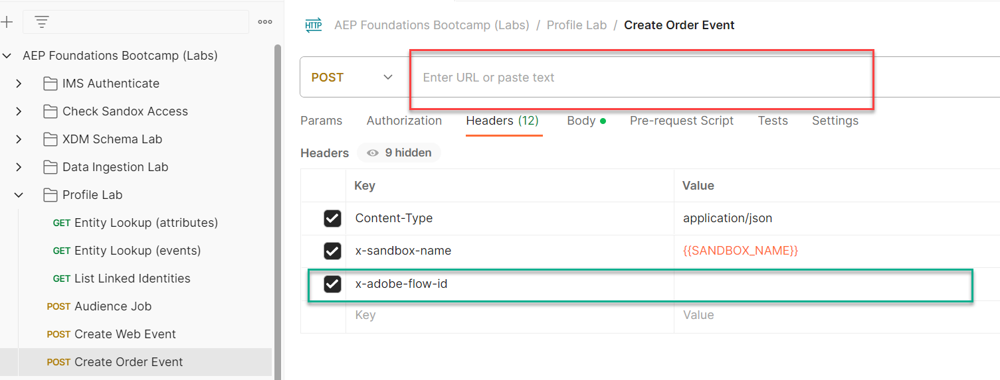

# 허브로 주문 이벤트 보내기

>[!IMPORTANT]
>
>이 실습을 시작하기 전에 [Postman 설정](../../postman-setup/postman-installation.md)을 완료합니다. [획득 사용 사례](../use-case-1-acquisition/configure-destinations/setup-streaming-destination.md)에서 만든 [webhook.site](https://webhook.site/) 및 **스트리밍 DEP Webhook** 대상에 액세스해야 합니다.

## Hub와 Edge으로 스트리밍

사용 사례 #1에서 이벤트를 Edge에 보냈습니다.  이벤트에서 스트리밍하되, Edge으로 전송할 필요는 없는 백엔드 시스템이 있을 수 있는 사용 사례가 있습니다.  이 랩에서는 Order 이벤트를 Hub로 스트리밍하여 이 작업을 수행하는 방법을 보여 줍니다.

## 주문 세그먼트 만들기(없는 경우)

왼쪽 레일에서 대상 을 클릭한 다음 오른쪽 상단에서 대상 만들기 버튼을 클릭합니다.


Order Placed 이벤트 유형 카드를 찾아 캔버스로 드래그합니다.


## 이벤트 규칙 업데이트

이벤트 규칙을 다음과 같이 변경합니다(이벤트를 확장하여 확인해야 할 수 있음).

1. 마지막
1. 15
1. 분
1. 스트리밍 평가 변경

**이벤트 스트리밍 주문(15분 이내)**(으)로 저장


## 대상에 활성화

닫혀 있는 경우 방금 만든 대상자를 엽니다.

대상에 활성화 를 클릭합니다


![주문 대상에 대해 [정품 인증]을 클릭합니다](assets/send-order-event-to-hub-click-activate-to-destination.png)

### 대상

이전에 만든 스트리밍 대상(스트리밍 DEP 웹후크) 선택


### 매핑

매핑을 그대로 두고 다음 을 클릭합니다

![매핑을 변경하지 않고 [다음]을 클릭합니다](assets/send-order-event-to-hub-leave-mapping-click-next.png)

마침을 클릭합니다.

## Postman 열기

컴퓨터에서 postman을 시작하고 다음 API 호출로 이동합니다.

1. **Postman 왼쪽 사이드바** —> `Collections`
1. **컬렉션** —> `AEP Foundations Bootcamps (labs)`
1. **폴더** —> 프로필 랩
1. **API 요청** —> `Create Order Event`


## API 요청 수정

샘플 API 요청을 만들려면 API 요청 본문에 다음 부분을 채워야 합니다.

다음 값을 취합하여 시작합니다.

## 계정 스트리밍 끝점 찾기

1. 왼쪽 레일에서 **소스**(으)로 이동한 다음 위쪽 탐색에서 **계정**&#x200B;을 클릭합니다
1. **dep: HTTP API \[raw]**&#x200B;를 검색하고, 행을 강조 표시하고 나중에 참조할 수 있는 위치에 **스트리밍 끝점**&#x200B;의 값을 복사하고 저장합니다.

 계정 및 해당 스트리밍 끝점 복사](assets/send-order-event-to-hub-http-api-raw-streaming-endpoint.png &quot;dep: HTTP API \[raw]&quot;)

## 데이터 흐름 ID 찾기

1. **dep: 주문(스트림)**&#x200B;에 대한 레코드를 찾아 데이터 흐름 링크를 클릭합니다.
1. 오른쪽 레일 복사본에서 **데이터 흐름 ID** 값을 나중에 참조할 수 있는 위치에 저장합니다.

>[!NOTE]
>
>행에서 빈 공간을 클릭합니다.  파란색 링크를 클릭하지 마십시오!


## 최종 API 요청 만들기

이전 단계에서 저장한 값을 아래 강조 표시된 위치에 복사합니다.

- **빨강** —> `Streaming Endpoint URL`
- **녹색** —> `Dataflow ID`

완료 시 최종 API 요청은 다음과 같아야 합니다

>[!CAUTION]
>
>아직 실행하지 마십시오!




## API 실행

1. **저장** 단추를 클릭하여 API 호출을 저장합니다.
1. **보내기** 단추를 클릭하여 요청을 실행합니다.

호출이 성공하면 다음 응답이 발생합니다.


## 유효성 검사

1. 프로필로 이동하여 프로필에서 이벤트가 수집되었는지 확인합니다.  초 단위로 표시됩니다.
   1. 주문에서 이메일을 사용하여 프로필 조회
1. 프로필이 세그먼트에 적합한지 확인합니다(몇 분 정도 소요될 수 있음). 초~분 단위로 표시됩니다.
   1. 주문 이벤트 스트리밍(15분 이내)
1. 대상이 웹후크에 &quot;실현됨&quot; 세그먼트를 알렸는지 확인하려면 웹후크를 확인하십시오.  5-10분 후에 나타납니다.
1. 15~30분 후, 다음과 같이 데이터 세트를 확인할 수도 있습니다.
   1. 아래 테이블 이름을 샌드박스의 이름으로 변경합니다.  이를 찾으려면 데이터 집합 목록으로 이동하여 &quot;`dest`&quot;에서 필터링하고 데이터 집합을 열고 오른쪽 레일에서 테이블 이름을 복사합니다.

```sql
SELECT * FROM profile_export_for_destination_merge_policy_xxx
WHERE extSourceSystemAudit.LASTREFERENCEDDATE >= CURRENT_DATE
AND identitymap['email'][0].ID in ('depche.mode@dep.com')
ORDER BY extSourceSystemAudit.LASTREFERENCEDDATE DESC
LIMIT 10
```
