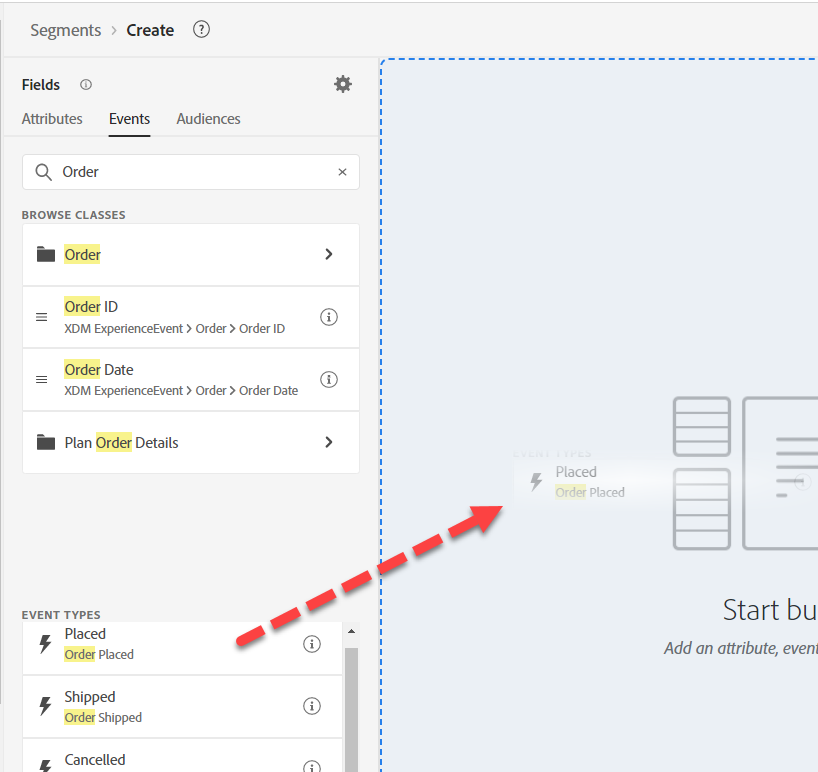
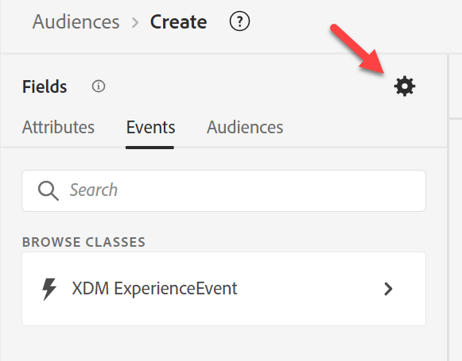

# 대상 #1 작성

## 실습 목표

iPhone 14에 대해 주문한 프로필만 찾는 대상자를 만듭니다

## 대상자 분류

첫 번째 대상자를 만드는 것부터 시작하십시오. 그것은 우리가 통합해야 할 많은 조각들로 구성되어 있다. 왼쪽 레일에서 대상 을 클릭한 다음 오른쪽 상단에서 대상 만들기 버튼을 클릭합니다.

이 사용 사례를 세분화하여 여러 대상자와 함께 해결하려고 합니다. 그 이유는 스트리밍으로 만들려고 하며 두 가지 사항이 이것을 방해하기 때문입니다.

1. 제외 조항 &quot;iPhone 14/Pixel 7에 대한 주문이 존재하지 않습니다.&quot;
1. 제외 절 &quot;활성 iPhone 14/Pixel 7 없음&quot;. 우리는 마지막에 이것의 파급효과에 대해 조사할 것이다.

## 1부 - 검색

대상의 첫 번째 부분은 &quot;iPhone 14에 대한 주문이 존재하지 않음&quot;을 찾는 것입니다. 우리가 AEP의 새로운 마케터이고 스키마를 디자인하지 않았다고 가정해 봅시다. 왼쪽 레일의 이벤트 탭에서 &quot;순서&quot;를 검색합니다

당신은 주문과 관련된 물건을 많이 받습니다

- 속성: 예: 주문 ID, 주문 날짜
- 폴더: 예: 주문, 계획 주문 상세내역
- 이벤트 유형: 주문, 배송 주문 등

>[!NOTE]
>
>* 주문 &quot;폴더&quot;에 &quot;i&quot;가 없습니다. 설명은 채워져 있지만 없지만, 작성자는 설명을 사용하려고 하거나 설명을 알고 싶을 수 있으므로 이는 마케터에게 혼란의 원인이 될 수 있습니다.
>* 이벤트 유형 은 많지 않은 한 필드이므로 이벤트 카드의 &quot;i&quot;는 유형이 무엇인지 반복하기만 합니다.
>* 값이 병합된 프로필의 2% 이상에 있는 경우에만 요약 데이터가 표시됩니다. 또한 문자열에서 필터링할 때 모든 자동 완성을 유도합니다.

Order Placed Event Type 카드를 사용하여 캔버스로 드래그합니다.

>[!TIP]
>
>**선택 사항:**
>
>모든 이벤트에는 이벤트 유형이 있습니다.  이벤트 유형 카드를 사용하는 대신 이벤트 유형을 필터링할 수 있습니다.
>
>주문 스키마 이벤트 유형을 확장했을 때까지를 다시 기억하십시오. 이제 드롭다운에 표시되는 값을 추가했습니다.  이러한 동일한 값이 이벤트 유형 카드로 표시됩니다
>
>원하는 경우 다음 중 하나를 사용할 수 있습니다.
>
>새 대상에서 XDM 경험 이벤트 로 이동하여 이벤트 유형 을 드래그합니다.
>
>
>
>이벤트 유형 카드를 사용한 필터링은 이벤트 유형 필드를 사용한 필터링과 동일합니다
>
>
>
>이벤트 유형 카드 사용의 이점:
>
>- 대상자에 있는 이벤트 유형의 이름을 표시하여 쉽고 빠르게 이해할 수 있습니다
>- 빠르고 단계가 적습니다.
>
>이벤트 유형 필드 사용의 이점:
>
>- 한 기준에 여러 유형을 포함하려는 경우 여러 이벤트 유형(예: &quot;주문 선택됨&quot; 또는 &quot;주문 전달됨&quot;)을 선택할 수 있습니다
>- 대/소문자 구분을 지원합니다

>[!NOTE]
>
>&quot;주문이 존재하지 않음&quot;에 대해 고려해야 할 몇 가지 옵션이 있습니다.  우리는 간단한 방법을 선택하고 있지만, 실제 세계에서 생각할 것들이 있습니다.
>
>- 주문했지만 출고 또는 출하됨
>- 주문했지만 취소됨
>- 복수 주문되었으나 취소된 주문

마케터는 교육을 통해 두 개 이상의 데이터 소스가 로드되었음을 알 수 있습니다.

- 주문(모든 채널에서 주문 시스템으로 캡처됨)
- 웹(사이트에서 주문한 주문을 포함하여 사람들이 클릭하는 것에 대한 클라이언트측 추적)
- eCommerce(사이트의 eCommerce 시스템에 의해 캡처됨)

어떤 소스를 사용해야 합니까? 모두 논리적으로 동일한 이벤트 &quot;주문&quot;을 나타냅니다. 하지만 그것들은 물리적으로 다른 시스템에 저장되어 있습니다. 사용할 항목을 어떻게 알 수 있습니까? 가장 좋은 방법은 각 스키마 객체 및 각 필드에 대한 설명을 보고 아는 것입니다.

>[!NOTE]
>
>이러한 결정을 내리는 데 도움이 되는 설명에는 다음과 같은 관련 정보가 있어야 합니다.
>
>1. 데이터는 어디에서 오나요?
>2. 어떤 것이 들어 있습니까, 포함되어 있지 않습니까?
>3. 지연은 무엇입니까?
>4. 어떤 시스템이 &quot;진실의 근원&quot;으로 지정되었습니까?
>5. 우리가 고려해야 할 뉘앙스가 있나요?

당사의 경우 주문된 주문을 사용하고 싶지만, 사용 사례에 따라 당사가 가져올 소스에 영향을 줄 수 있는 다음 요구 사항이 있을 수 있다는 점을 염두에 두십시오.

- 지난 30분 동안의 현장 구매
- 주문(취소되지 않음)
- 준비 후 1일 이내에 주문됨

>[!TIP]
>
>선택적 사고 연습에서는 오늘 사이트에 단일 주문을 했다고 가정해 보십시오(주문은 세 가지 시스템 모두에서 기록된다는 점을 기억하십시오).
>
>1. 오늘 주문한 주문의 이벤트 수는 몇 개입니까?
>2. 고객 관점에서 얼마나 많은 주문이 이루어졌습니까?
>3. 운송 방법 = 하룻밤(이 옵션을 선택했다고 가정함)으로 필터링할 경우 몇 개의 이벤트가 계산됩니까?
>4. 이 문제(대상 또는 데이터 모델)를 어떻게 해결해야 합니까?

분석을 수행한 후 `Orders Event of Event Type=”order. placed”`(으)로 이동합니다. 대상자가 속도의 절충으로 진실의 소스를 사용하고 있는지 확인하고 싶습니다(웹 데이터는 주문이 전송되기 전에 몇 가지 처리를 거치는 동안 각 클릭에 따라 스트리밍됨). 또한 앞으로는 모든 채널을 통해 취소 된 사용자를 제외하고 작업을 수행할 수 있습니다.

## 2부 - 대상 구축

전체 스키마 표시 켜기

시작한 것을 기반으로 합니다.  가져온 카드를 클릭한 다음 왼쪽 레일의 **검색에서 &quot;가져온&quot; 항목 지우기** 및 드릴다운하여 다음을 수행합니다.

XDM 경험 이벤트 -> 제품 목록 항목 폴더

>[!WARNING]
>
>마케터에게 일반적인 혼동은 여기서 제품 대신 디바이스를 사용하는 것입니다(iPhone에서 필터링되므로). 다시, 좋은 설명에 대한 또 다른 이유입니다.

iPhone이 있을 수 있는 필터링할 수 있는 항목을 찾고 있습니다. 세 가지 옵션이 있습니다.

- 이름
- 제품
- SKU

그들은 모두 좋은 후보자가 될 수 있지만 우리는 알지 못합니다.  각 항목에 대한 자세한 내용을 보려면 &quot;i&quot;를 클릭합니다.

>[!NOTE]
>
>모든 OOTB 필드에 대한 설명을 변경할 수 있습니다. 사용자의 혼동을 줄이기 위해 사용되지 않는 필드를 업데이트하거나 숨깁니다. 이러한 OOTB 설명은 업계/비즈니스에서 적절하지 않을 수 있습니다.
>
>좋은 설명에는 예시가 포함될 수도 있습니다
>
>- 이름 설명 = 이 제품 뷰의 사용자에게 표시되는 제품 표시 이름입니다. 예: iPhone 14, 픽셀 7
>- SKU 설명 = 공급업체가 정의한 제품에 대한 고유 식별자인 SKU(Stock Keeping Unit). 예: iP14, Pix7
>- 제품 설명 = 제품 자체의 XDM 식별자입니다. 예: 123, 456

&quot;데이터가 있는 필드만 표시&quot; 켜기

>[!NOTE]
>
>**관찰할 수 있는 스키마**
>
>필드에 데이터가 있는 유일한 항목입니다.  AEP에 구축된 앱이 효과적으로 쓸모없는 필드를 사용하지 않도록 제외하는 방법입니다.
>
>**전체 XDM 스키마**
>
>데이터가 로드되었는지 여부에 관계없이 유니온 스키마의 모든 필드입니다.

&quot;데이터가 있는 필드만 표시&quot;를 켜면 사용하려는 필드가 사라지는 것을 볼 수 있습니다.

XDM ExperienceEvent > 제품 목록 항목 > Dep > 모델로 드릴다운

모델이 그런 것 같지만 설명이 없습니다.

배치된 이벤트 카드로 드래그합니다.

iPhone 14 추가

배치된 이벤트 위에서 &quot;모든 시간&quot;을 &quot;오늘&quot;로 변경합니다.

>[!NOTE]
>
>일주일, 한 달, 1년 전 주문은 상관없으니 오늘은 필터링합니다.  또한 더 긴 전환 확인은 다음 섹션에서 다룹니다.  어느 시점에서 순서가 &quot;*owned*&quot;로 바뀌고 그에 대한 세그먼트를 만듭니다.

설명 입력

평가 방법을 **스트리밍**(으)로 변경

**대상자를 &quot;*주문 iPhone 14*&quot;으로 저장**

대상에 대한 파란색 단추 **대상 활성화**&#x200B;를 클릭합니다.

**스트리밍 DEP Webhook** 대상을 선택하고 다음을 클릭합니다.

![스트리밍 DEP 웹후크 대상을 선택하고 [다음]을 클릭합니다](assets/build-audience-1-select-streaming-dep-webhook-destination.png)

매핑을 변경하지 말고 다음 을 클릭한 후 마침 을 클릭합니다.

>[!NOTE]
>
>**컨테이너**
>
>제품 목록에서 이름 을 필터링하면 일부 컨테이너가 자동으로 추가되었습니다. 그 이유는 제품 목록 항목이 배열 데이터 유형이기 때문입니다. 배열에서 필터링하면 컨테이너가 만들어집니다(이 예제에서는 제품 목록 항목이라고 함).
>
>
>
>
>
>컨테이너는 이벤트 변수 또는 배열 요소를 참조하는 방법입니다. 이 블로그에서 이 요소의 파생에 대해 자세히 읽어볼 수 있지만, 단순성을 위해 배열의 단일 요소가 두 조건을 모두 충족하는지 아니면 조건이 두 요소에 분산될 수 있는지 지정할 수 있습니다.
>
>[https://experienceleaguecommunities.adobe.com/t5/adobe-experience-platform-blogs/how-exactly-do-containers-work-in-aep-segmentation-a-deeper-look/ba-p/458780](https://experienceleaguecommunities.adobe.com/t5/adobe-experience-platform-blogs/how-exactly-do-containers-work-in-aep-segmentation-a-deeper-look/ba-p/458780)

>[!WARNING]
>
>**시간 필터**
>
>요구 사항에 지정된 것은 없지만 이 대상자는 돌아가서 비즈니스에 대해 명확히 해야 하는 문제가 있습니다.
>
>요구 사항에 시간 필터가 없습니다. 이것은 누군가가 1년 혹은 5년 전에 주문을 했다면, 그들은 이것에 대한 자격이 있다는 것을 의미한다. 항상 새로운 버전이 나올 때 이 트랩에 빠지거나 항상 대상자를 업데이트해야 하는 경우가 없도록 메서드를 통합해 보십시오.
>
>추가한 시간 필터를 변경하면 Edge 세그먼트가 스트리밍 또는 일괄 처리가 되려면 얼마나 오래 걸릴 수 있습니까?

>[!CAUTION]
>
>**제품이 두 위치에 저장됩니까?**
>
>다른 경로 이름 지정 규칙 및 설명을 참고하십시오. 이전 대상과 비교
>
>- XDM 개인 프로필 > Dep > 활성 제품 > 제품 ID 속성 > 제품 이름
>  - 설명: 제품의 이름입니다.
>- XDM ExperienceEvent > 제품 목록 항목 > Dep > 모델
>  - 설명: 이 제품 보기에 대해 사용자에게 표시되는 제품의 표시 이름입니다.
>
>서로 다른 이유와 목적을 위해 동일한 값을 다른 위치에 저장하기 시작할 때 사용자에게 미치는 영향과 프로필에서 이러한 값을 병합하는 방법(필요한 경우 병합 정책에서 이 충돌을 해결하는 방법)을 고려해야 합니다.
>
>현재 설명을 보면 마케터가 사용할 항목을 알기 어렵습니다
