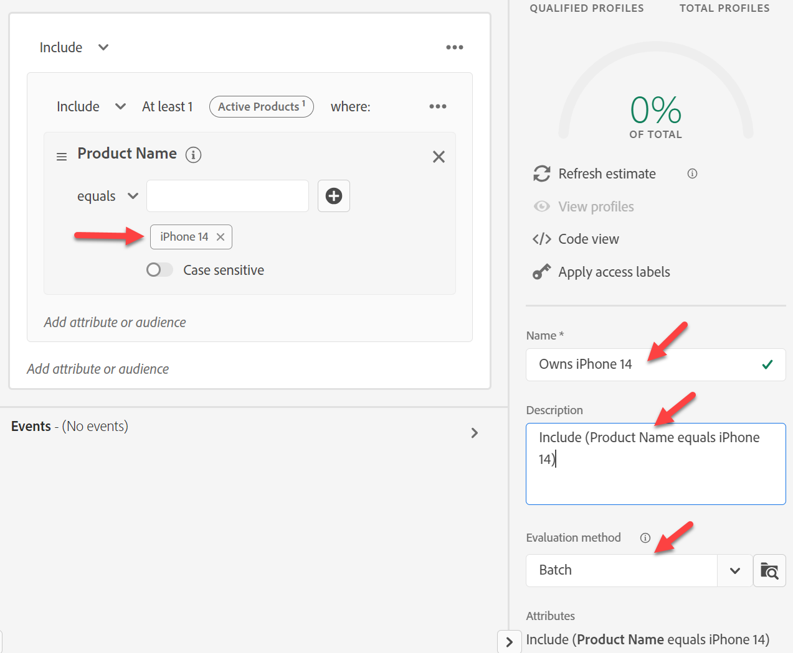
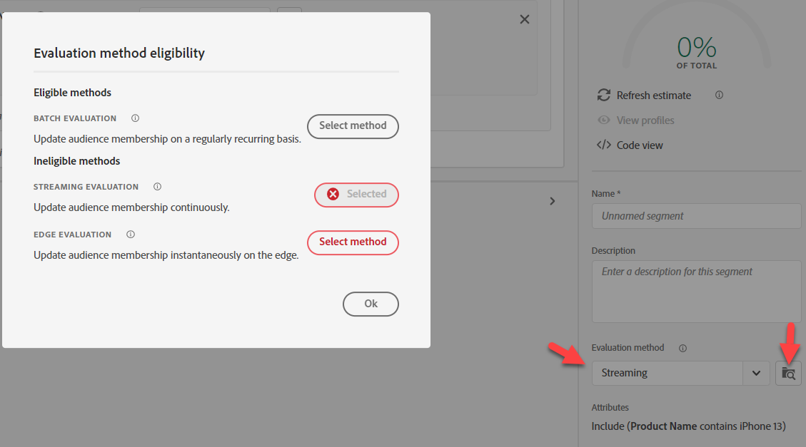

# 대상 #2 작성

## 실습 목표

iPhone 14인 활성 줄이 없는 모든 프로필을 찾는 대상을 만듭니다

## 분석 작업

이 대상은 &quot;활성 iPhone 14가 없는 사용자&quot;입니다.

- 누군가가 &quot;활성 iPhone 14&quot;를 가지고 있지 않다는 것을 어떻게 알 수 있습니까?  아이디어:
  - iPhone 14를 구입한 사용자 포함
  - iPhone 14에 대한 청구 데이터가 있는 사용자 포함
  - iPhone 14에서 전송된 웹 데이터가 있는 사용자 포함
  - 다른 사람은?

결국, 이것은 그들이 시장에 진출하고자 하는 사람에 대한 사업적 선택으로 귀결된다. 우리의 경우, 회사는 이것이 중요하다고 간주하여 Active Lines를 정의하는 스키마를 구축했습니다.

>[!NOTE]
>
>활성 라인 은 프로필에 저장된 배열이므로 계정 소유자와 장치의 각 개별 소유자를 선택합니다. 마케팅 팀이 이를 인식하고 있는지 확인합니다. 그렇지 않으면 다른 접근 방식을 원할 수 있습니다.

## 새 대상 만들기(iPhone 14 소유)

1. 왼쪽 레일의 속성 탭에서 아래로 제품 이름으로 이동하거나 검색합니다.
   - XDM 개별 프로필 —> \&lt;테넌트 이름> —> 활성 제품 —> 제품 ID 속성 —> 제품 이름
1. 제품 이름을 캔버스로 드래그

## 대상자 저장

1. iPhone 14(일괄 평가로 유지)를 입력합니다.
1. 설명 입력
1. 대상을 &quot;*iPhone 14* 소유&quot;로 저장
   - 픽셀 7에 대해 위의 동일한 단계를 수행하십시오(시간이 있는 경우).

>[!TIP]
>
>**Side Think, &quot;프로필에 같은 것을 저장하는 다른 필드가 아니라 이벤트를 필터링할 수 없는 경우&quot;**
>
>예, 그렇지만 대상을 복잡하게 만들고 몇 가지 문제를 도입하는 몇 가지 비즈니스 및 기술적 뉘앙스에 대해 논의해야 합니다.
>
>1. 구매 이벤트를 사용하는 경우:
>   1. 만약 그들이 우리에게서 구매하지 않았지만 유효하게 구매 가능한 줄이 있다면 어떨까요?
>   1. 만약 그들이 2년 전에 구매했다면, 내 규칙은 N년을 돌아봐야 하고 프로필에 이벤트 1년만 보관했다면?
>1. 청구 이벤트가 더 적합한 것 같습니다.
>   1. 그러나 이제 데이터는 한 달까지 되었습니다.
>   1. 마지막 청구 이벤트가 2년 전인 경우 고객이 아닌 사람도 여기에 포함될 수 있습니다
>   1. 이전 데이터를 제외하기 위해 한 달만 되돌아보는 경우 데이터 로드가 실패한 경우 카운트가 0으로 떨어질 수 있습니다
>   1. 청구 이벤트에 대한 디바이스를 캡처합니까? 아니요, 따라서 데이터 피드를 변경해야 합니다.
>
>결국 이 대상자를 위해 몇 가지 장단점을 두어야 할 것입니다. 마음이 이 규칙에 대해 이벤트 사용에 여전히 설정되어 있는 경우 다음 블로그 참조: https\://experienceleaguecommunities.adobe.com/t5/adobe-experience-platform-blogs/how-to-capture-latest-experience-event-in-adobe-experience/ba-p/430941

>[!NOTE]
>
>**Edge에 대한 병합 정책 사용**
>
>Edge 대상에 대해 병합 정책이 구성되어 있는지 확인합니다. 병합 정책으로 이동하여 \_xdm.context.profile의 기본 병합 정책을 편집합니다.  활성-Edge 병합 정책을 켜고 저장합니다.
>
>
>
>
>
>

## 대상 다시 빌드

마케팅이 오늘 들어와서 이 스트리밍을 구비해야 한다는 요구 사항을 제시했습니다. 안타깝게도 이 기능을 탑재한 방법은 일괄 처리입니다. 수정 사항:

1. &quot;*iPhone 14* 소유&quot; 대상을 열고 이름을 &quot;*iPhone 14 소유 일괄 처리*&quot;(으)로 변경합니다.

>[!WARNING]
>
>오늘은 UI에서 평가 방법을 변경할 수 없습니다. 이 대상자를 참조하는 모든 대상자도 삭제해야 합니다. 세그먼트 내에서 세그먼트를 사용하는 빌드 전략을 결정할 때 이 점을 염두에 두십시오.

2. 새 대상을 만듭니다. iPhone 14 대상 일괄 처리 소유&quot; 대상을 캔버스에 추가하고 규칙으로 변환을 클릭합니다.

을 클릭합니다.

&#x200B;3. 오른쪽 하단 모서리에서 설명, 이름 및 평가 방법을 스트리밍으로 업데이트한 다음, 평가 방법 옆에 있는 폴더 아이콘을 클릭합니다. 다음이 표시됩니다.

명확하지는 않지만 조회 스키마에서 제품 이름을 사용하고 있기 때문입니다

>[!NOTE]
>
>조회를 사용할 때마다 평가 방법은 강제로 일괄 처리됩니다.
>
>경로를 보고 &quot;속성&quot;이 있는 경우 아무 곳에나 알 수 있습니다
>
>

&#x200B;4. 이제 XDM 개인 프로필 스키마에서 가져온 제품 이름의 기존 값을 대체합니다.

다음 경로를 바꿉니다.

- XDM 개인 프로필 > Dep > 활성 제품 > 제품 ID 속성 > 제품 이름

새 경로 추가:

- XDM 개별 프로필 > Dep > 활성 제품 > 모델

&#x200B;5. 평가 방법을 스트리밍으로 변경하고 폴더 아이콘을 클릭합니다

&#x200B;6. 새로운 스트리밍 적격 대상에 대해 설명을 입력합니다.

- 대상을 &quot;*iPhone 14* 소유&quot; 대상으로 저장합니다.
- 대상에 대한 파란색 단추 **대상 활성화**&#x200B;를 클릭합니다.

&#x200B;7. **스트리밍 DEP Webhook** 대상을 선택하고 **다음**&#x200B;을 클릭합니다.

&#x200B;8. **다음** 및 **마침** 클릭

&#x200B;> [!NOTE]
>
>일괄 처리와 스트리밍 또는 Edge을 선택해야 하는 이유 고려 사항:
>
>최신 보호 기능: [https://experienceleague.adobe.com/docs/experience-platform/profile/guardrails.html?lang=ko](https://experienceleague.adobe.com/docs/experience-platform/profile/guardrails.html?lang=ko)

>[!TIP]
>
>**선택적 Challenge Lab**
>
>일찍 끝났나요?
>
>한 가족에서 &quot;Apple 장치 충성도&quot; 대상을 만듭니다.  플랜에 있는 모든 사용자의 장치 유형이 동일합니다(Apple).
