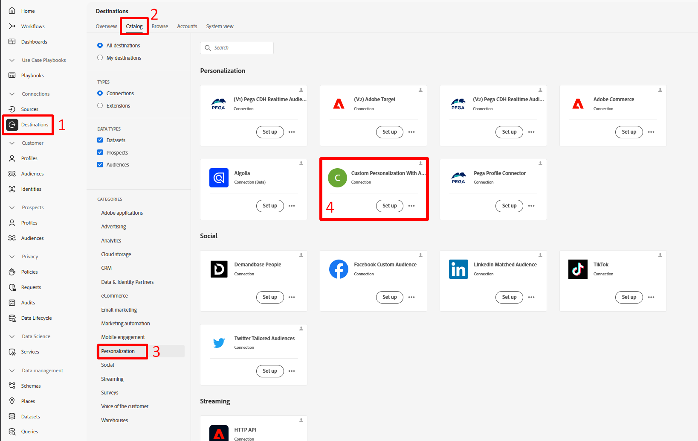

# 사용자 지정 Personalization 대상 설정

[사용자 지정 Personalization 대상](https://experienceleague.adobe.com/en/docs/experience-platform/destinations/catalog/personalization/custom-personalization)을 사용하면 타사에서 사용할 수 있도록 대상을 Edge에서 사용할 수 있으며, 일반적으로 Network Server API를 사용하여 개인 맞춤화에 사용할 수 있습니다.

이 랩에서는 프로필 속성을 Edge에 보낼 수 있도록 사용자 지정 Personalization 대상을 구성합니다.

## 대상 카탈로그 찾아보기

>[!NOTE]
>
>Adobe Target을 사용하여 개인화하려면 [Adobe Target 대상](https://experienceleague.adobe.com/en/docs/experience-platform/destinations/catalog/personalization/adobe-target-v2)을 사용합니다. 동작은 사용자 지정 Personalization과 동일합니다.

1. 왼쪽 레일에서 **대상**&#x200B;을 클릭합니다.
1. 상단 레일에서 **카탈로그** 클릭
1. 다음으로 **Personalization**&#x200B;의 범주를 선택하십시오.
1. 화면 중간에 **특성을 가진 사용자 지정 Personalization**&#x200B;이라는 대상이 표시됩니다. 해당 카드에서 **설정** 단추를 클릭합니다.

## 대상 구성

### 계정 설정

계정 이름을 `DEP Labs Custom PZN`로 지정한 다음 **대상에 연결 단추**&#x200B;를 클릭합니다.

### 대상 세부 정보 추가

다음 대상 세부 사항을 입력합니다.

1. 이름 -> **Edge 대상**
1. 통합 별칭 -> **edgeAlias**
1. 데이터 스트림 ID -> *이전에 만든 데이터 스트림 이름을 선택합니다*
1. 완료되면 **다음** 단추를 클릭하세요.

>[!CAUTION]
>
>[다음]을 클릭하면 **이름** 또는 **통합 별칭**&#x200B;을 변경할 수 없습니다.  이러한 사항은 나중에 Edge Network 응답에 표시됩니다

### 거버넌스 정책 선택

**온사이트 Personalization**&#x200B;을(를) 선택한 다음 **만들기** 단추를 클릭합니다.

>[!NOTE]
>
>이 단계는 선택 사항이지만, 만드는 모든 대상에는 프로필을 잘못 활성화하지 않도록 지정된 거버넌스 정책이 있는 것이 좋습니다

완료되면 이 화면이 사용자의 성공을 보여 줍니다!

## 대상 활성화

### 대상자 선택

행을 클릭하여 강조 표시한 다음 **다음** 단추를 클릭하여 방금 만든 대상을 선택합니다.

**모든 대상**&#x200B;을 선택하고 **다음**&#x200B;을 클릭합니다.

### 매핑

다음과 같이 **새 매핑**&#x200B;을(를) 추가합니다.

| Source 필드 | 대상 필드 |
| ---------------------- | ------------ |
| \_tenantName.plan.name | 플랜 이름 |

&#x200B;> [!NOTE]
>
>**\_tenantName**&#x200B;을(를) 테넌트 이름으로 바꾸십시오.

>[!NOTE]
>
>대상 필드를 사용하면 XDM 이름과 다를 수 있는 친숙한 이름을 제공할 수 있습니다

완료되면 화면이 아래 이미지와 같아야 합니다.  그런 다음 다음 **단추**&#x200B;를 클릭합니다

>[!NOTE]
>
>프로필 특성에는 중요한 데이터가 포함될 수 있으므로 특성이 Edge에 있으면 해당 특성을 검색하려면 모든 [Edge Network Server API](https://experienceleague.adobe.com/en/docs/experience-platform/edge-network-server-api/overview)호출이 인증된 컨텍스트에서 수행되어야 합니다.

### 리뷰

마지막 화면에서 구성의 세부 사항을 검토한 다음 마침 단추를 클릭할 수 있습니다.

>[!NOTE]
>
>[자동 적용](https://experienceleague.adobe.com/en/docs/experience-platform/data-governance/enforcement/auto-enforcement)에서 [데이터 사용 정책](https://experienceleague.adobe.com/en/docs/experience-platform/data-governance/policies/overview)을 확인할 지점입니다. 만든 규칙으로 마케팅 작업을 확인하고 오류가 발생합니다.
