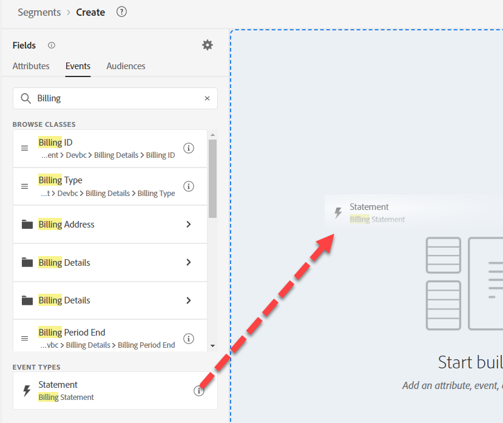
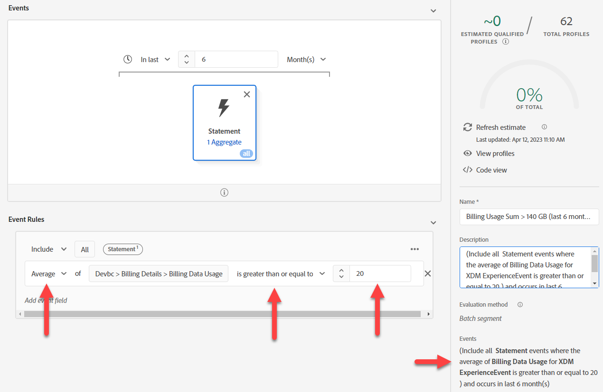

# 옵션 #1 - Audiences를 사용하여 집계

Audiences의 합계를 사용하면 Audience 규칙의 이벤트를 집계할 수 있습니다. 그러나 한 번에 하나의 집계만 수행할 수 있으므로 두 항목을 사용 사례에서 분리해야 합니다.

## Audience #1 - 지난 6개월 동안의 청구 데이터 사용량 > 140GB

이 대상자 빌드에서 지난 6개월 동안의 총 청구 데이터 사용량 은 140gb를 초과합니다. 이렇게 하려면 다음을 수행합니다.

1. 새 대상을 만듭니다.  청구서 이벤트 카드를 사용하십시오.

   

   >[!NOTE]
   >
   >좋은 이벤트 유형 구조를 사용하면 사용자가 쉽게 사용하고 이해할 수 있습니다.  스키마 전반에서 표준화된 접근 방식을 개발하는 데 시간을 투자하십시오.
   >
   >철자를 잘못 쓰는 데 도움이 됩니다.
   >
   >항상 이벤트 유형 필드에서 폴백하고 항목을 수동으로 입력할 수 있습니다.

2. 오른쪽 하단 규칙에서 타원을 클릭하고 합계를 선택합니다. 속성 선택 을 클릭하고 사용 을 입력합니다. 청구 데이터 사용량 필드를 선택합니다.

   

   

3. 같음 을 보다 큼 으로 변경하고 값을 140으로 변경합니다.

4. Any Time에서 In Last로 이벤트 카드 위의 시간을 변경하고, 값을 6, 일을 월 단위로 변경합니다

   

5. 설명을 입력하고 저장합니다.

6. 대상자에게 &quot;*청구 사용량 합계 > 140GB(지난 6개월)*&quot; 이름을 지정하십시오.

>[!NOTE]
>
>집계 대상은 배치로만 저장할 수 있습니다.

>[!NOTE]
>
>Audiences에서 합계를 사용하는 방법에는 두 가지가 있습니다.
>
>- Sum/Count/Min/Max/Average (위에서 수행한 것처럼)
>- 만 계산(각 이벤트를 1로 계산)
>
>로 계산됩니다.
>
>원하는 경우 두 가지를 함께 사용할 수 있습니다
>
>

## 대상 #2 - 6개월 평균 롤링 월별 데이터 사용량: 20GB 이상

1. 하이퍼링크를 클릭하지 말고 대상자 목록 UI에서 방금 만든 행이 강조 표시되도록 행을 선택합니다. 강조 표시되면 복사를 클릭합니다.

   

2. 사본을 클릭하고 편집합니다.  이벤트 카드를 클릭하고 Sum 을 Average 로 변경합니다. 보다 크거나 같음, 값을 20으로 변경합니다. 의사(pseudo) 코드를 설명에 복사합니다.

   

3. 대상자에게 &quot;*청구 사용량 평균 > 20GB(지난 6개월)*&quot; 이름을 지정하십시오.

## 대상 #3 - 최종 전화 플랜이 없습니다.

1. 새 대상 만들기
1. 속성에서 계획명을 검색합니다.
1. 계획명(계획명) 추가
1. &quot;Ultimate&quot;를 선택합니다.  다음과 같지 않음 변경

   >[!NOTE]
   >
   >사전 작업 기억나세요? 조회 차원의 필드를 사용합니다.
   >
   >XDM 개인 프로필 > Devbc > 플랜 세부 정보 > 플랜 ID 속성 > **플랜 이름(플랜 이름)**

   ![Ultimate을 선택하고 연산자를 [다음과 같지 않음]으로 변경](assets/option-1-using-audiences-to-aggregate-select-ultimate-does-not-equal.png)

5. 대상 —> Experience Platform 를 클릭합니다. 플랜 이름 옆에 청구 사용량 합계 > 140GB 및 청구 사용량 평균 >= 20GB를 드래그합니다.

   

6. 의사 코드 를 설명에 복사합니다.

7. 스트리밍이 될 수 있는지 확인합니다. **스트리밍할 수 없습니다**. 일부 변경:

   >[!NOTE]
   >
   >조회 데이터 세트를 사용하면 다중 엔티티 대상자가 만들어지고 이 대상자는 배치로 평가됩니다.  대상의 필드를 사용했습니다.
   >
   >XDM 개인 프로필 > Devbc > 플랜 세부 정보 > 플랜 ID 속성 > 플랜 이름(플랜 이름)

8. **플랜 이름(플랜 이름)**&#x200B;을(를) 다음으로 바꾸기: XDM 개인 프로필 > Devbc > 플랜 세부 정보 > **플랜 이름**

   

   >[!NOTE]
   >
   >LID 비정규화 단계에서 프로필에 계획 이름이 추가된다는 점을 상기하십시오. 이를 통해 대상에서 참조할 수 있습니다. 따라서 조회에 대한 연결이 제거되고 평가 방법 스트리밍을 만들 수 있습니다.
   >
   >여기서 장점은 이 논리를 대상 평가 대신 사전 데이터 수집으로 업스트림으로 이동했다는 것입니다.
   >
   >또한 이제 해당 계획명이 변경되는 경우 모든 프로파일을 업데이트해야 합니다.
   >
   >그러나 이제 실시간으로 대응할 수 있다는 이점이 있습니다.

9. 이제 스트리밍으로 저장할 수 있는지 확인합니다. 대상을 &quot;*청구 데이터 사용량이 많지만 Ultimate 요금제는 없음*&quot;으로 저장

>[!NOTE]
>
>이 평가 방법은 스트리밍이지만 두 개의 일괄 대상을 기반으로 대상 자격을 기반으로 합니다.

>[!NOTE]
>
>이 접근 방법도 작동하지만 이제 일괄 대상(24시간마다 한 번 실행됨)을 사용하는 스트리밍 대상(실시간)이 있습니다. 이 작업이 사용 사례와 데이터 로드에 적합한 경우 선택하는 것이 좋습니다(예: 청구 데이터가 매일 또는 매월 로드될 수 있지만 모든 사용 사례가 이와 같을 수는 없음). 그렇지 않은 경우, 일반적인 접근 방법은 AEP으로 보내기 전에 데이터를 집계하는 것입니다. 좀 더 실시간 접근이 필요하면 다른 옵션을 살펴보자.
