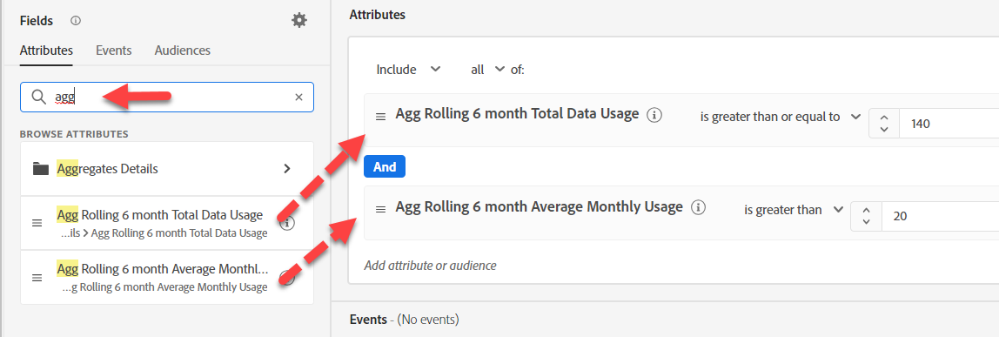
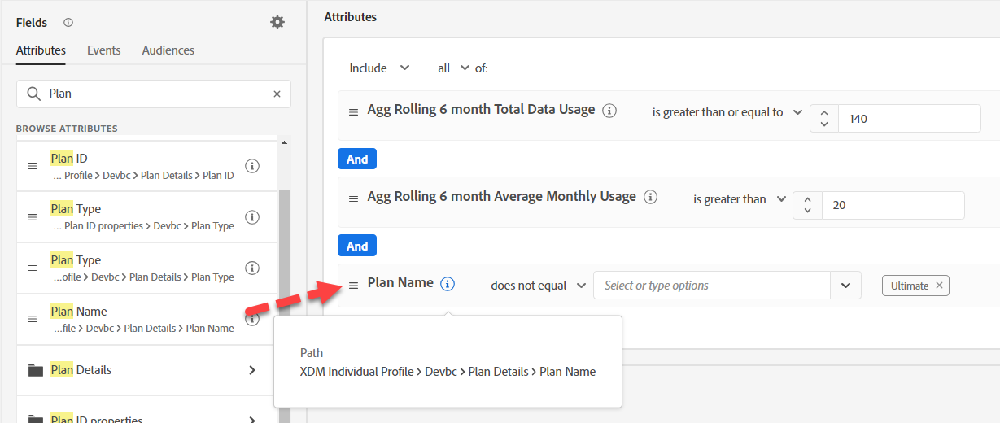

# 옵션 #2 - 사전 집계 사용

대상의 집계 문제는 대상(스트리밍 도중)이 배치 대상인 대상 내에서 수행된 집계를 기반으로 만들어진다는 것입니다. Marketing은 보다 실시간 접근 방식이 필요하다고 판단했기 때문에 이를 디자인에 적용하기 위해 세 가지 작업을 수행했습니다.

- 에서 데이터를 스트리밍하기 전에 합계 계산

>[!NOTE]
>
>대부분의 스트리밍된 데이터가 단일 이벤트와 집계를 중심으로 디자인되므로 이는 매우 드문 일입니다

- 비정규화된 계획명 사용
- 데이터 스트리밍

## 대상자 만들기

청구 데이터 사용량이 많지만 현재 최종 전화 요금제가 없는 모든 프로필의 대상자를 만듭니다.

1. 새 대상 만들기
1. 이벤트가 아닌 속성 탭에서 &quot;Agg&quot;를 검색하고 두 개의 합계를 캔버스로 드래그합니다. 각각에 대해 적절한 연산자 및 값을 설정합니다.

3. 프로필에서 플랜 이름을 검색하고 추가합니다(XDM 개인 프로필 > Devbc > 플랜 세부 정보 > 플랜 이름). &quot;Ultimate&quot;와 같지 않음 선택

4. 설명을 입력합니다.  평가 방법이 스트리밍인지 확인합니다.

5. 대상을 &quot;*청구 데이터 사용량이 많지만 Agg(Ultimate 플랜)는 없음*&quot;으로 저장

>[!NOTE]
>
>집계 논리를 업스트림 스트리밍 ETL 레이어로 전환했음을 기억하십시오.
>
>이 선택은 마케터가 논리와 스트리밍 대상을 제어하는 배치 대상 을 가지지만 정의와 제어를 엔지니어링이 포함되어야 하는 ETL 계층으로 푸시하는 것 사이의 트레이드오프입니다.

>[!TIP]
>
>**선택적 Challenge Lab**
>
>일찍 끝났나요?
>
>우리는 VIP들이 구매했을 때 특별한 메시지를 가지고 실시간으로 연락을 드리고 싶습니다.  &quot;VIP&quot; 대상을 만듭니다.  VIP은 지난 달에 1,000달러 이상을 구매한 사람입니다.
