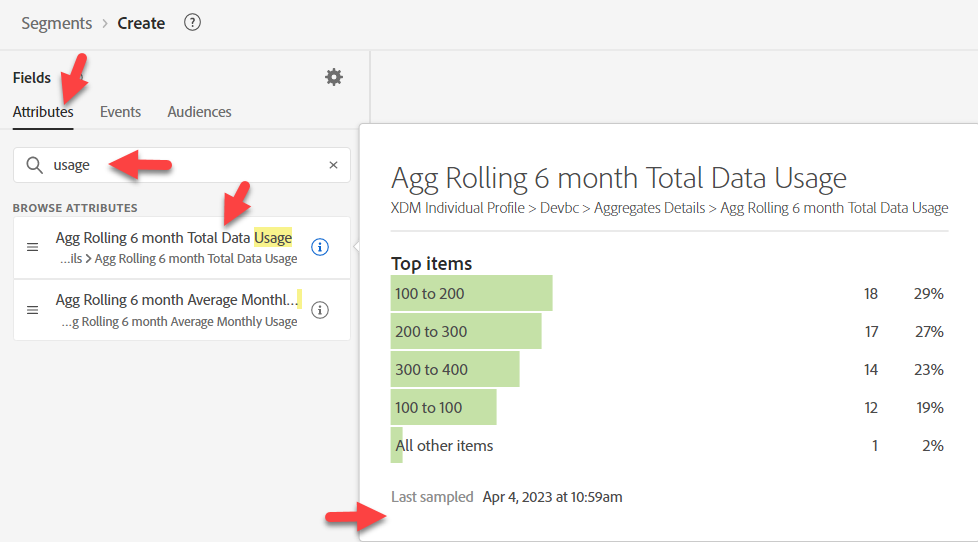

# 사전 작업

이 사용 사례의 경우 수행해야 할 사전 작업이 많지 않습니다. 우리는 기본적으로 우리가 찾고 있는 두 가지, 1) 사용, 2) 계획이 있습니다.  그들이 어디에 있는지 찾아라.

## 청구 데이터 사용

1. 새 대상 만들기
1. 속성에서 &quot;usage&quot;를 검색합니다. &quot;i&quot;를 클릭하여 설명을 검토합니다(없음).

   

1. 이벤트에서 &quot;사용량&quot;을 검색합니다.  &quot;i&quot;를 클릭하여 설명을 검토합니다(없음).

>[!NOTE]
>
>이 두 가지 모두 설명이 없으므로 마케터는 몇 가지 가정을 하고 잘못된 추측을 할 수 있습니다.
>
>설명은 중요합니다.  설명이 없으면 마케터는 어떻게 다음 사항을 알 수 있습니까?
>
>- 어떤 것을 사용해야 합니까?
>- 데이터 지연
>- 특정 사용 사례에 권장/권장?
>
>이 정보를 설명으로 제공함으로써 우리는 그들을 더 잘 안내할 수 있다.

>[!NOTE]
>
>&quot;청구&quot;를 검색해 보십시오.  프로필 속성으로 표시되지 않습니다.  &quot;청구 데이터 사용&quot; 필드와 함께 이벤트 유형 카드로 표시됩니다.
>
>마케터에도 이름 지정 규칙이 있습니다.  검색한 내용에 따라 또는 검색 중인지 여부에 따라 이벤트 또는 프로필로 검색되는지 여부에 따라 검색한 내용과 최종적으로 사용하는 내용에 영향을 줍니다.

## 플랜

속성에서 &quot;플랜&quot;을 검색합니다.  선택할 수 있는 항목이 많습니다.  &quot;플랜 이름&quot;으로 범위를 좁힙니다.  두 가지 플랜 이름이 있습니다?!

계획을 검색할 때 

계획명(계획명)은 설명으로 봤을 때 필요한 것 같고, 다른 하나는 설명이 빠진 것 같습니다.
