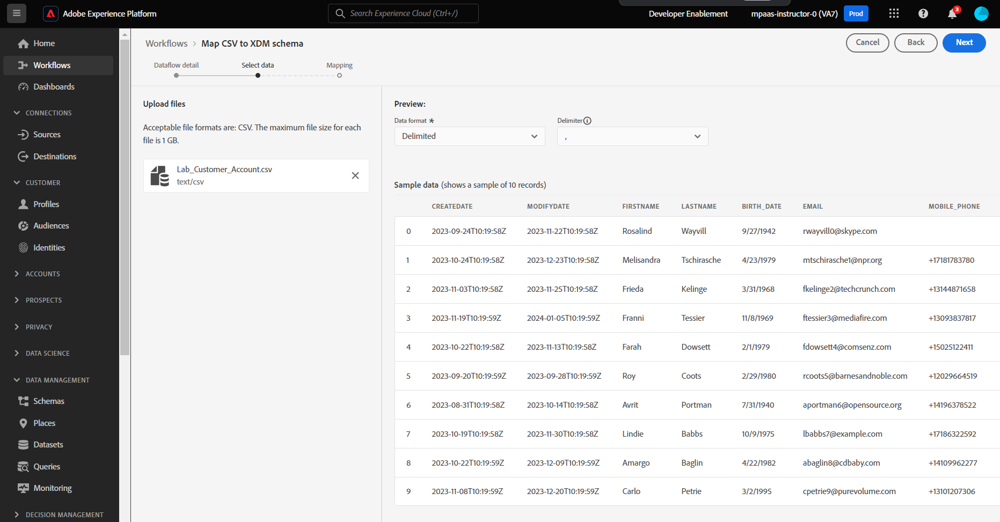

# 새 데이터 흐름 만들기

## 소스로 이동

1. Adobe Experience Platform UI에서 다음 위치로 이동합니다.\
   **소스** -> **카탈로그** -> **로컬 시스템**
1. **로컬 파일 업로드** 카드에 대한 **데이터 추가** 단추를 클릭합니다.

## 데이터 흐름 설정

1. 데이터 흐름 세부 정보 화면에서 **기존 데이터 세트**&#x200B;를 선택합니다.
1. 이전에 만든 데이터 집합을 **고객 계정 - \&lt;이니셜>** 이름으로 사용합니다.
1. **프로필 데이터 세트** 토글이 켜져 있는지 확인하십시오.
(이 설정을 켜지 않으면 프로필 저장소는 이 데이터 세트를 입력하는 새 데이터를 모니터링할 수 없으므로 이 데이터를 프로필로 수집하지 않습니다.)
1. **부분 수집 활성화** 토글이 켜져 있는지 확인합니다.
(이 기능을 켜지 않으면 레코드 중 하나에 오류가 있는 경우 전체 수집이 실패할 수 있습니다.)
1. 데이터 흐름 이름을 **고객 계정 일괄 처리 v2 - \&lt;이니셜>**(으)로 설정합니다.
1. 모든 경고 설정 **소스 데이터 흐름 시작/성공/실패**
1. 모든 것이 잘 보이는 경우 화면 오른쪽 상단의 **다음** 단추를 클릭하여 다음 단계로 진행합니다.

## 샘플 파일 업로드

1. UI에서 **Lab\_Customer\_Account.csv** 파일을 &#39;놓기 및/또는 업로드&#39;하십시오.  완료되면 화면은 아래와 같이 표시됩니다.

## 매핑 가져오기

모든 매핑을 다시 설정하는 대신 매핑 화면에서 이전에 만든 매핑을 가져올 수 있습니다.

1. **매핑 가져오기** 단추를 클릭합니다.
1. 이전에 만든 매핑이 있는 데이터 흐름을 선택하십시오.

>[!NOTE]
>
>매핑을 가져오면 다른 데이터 흐름의 매핑을 재사용하고 수행해야 하는 매핑 작업의 양을 줄일 수 있습니다
