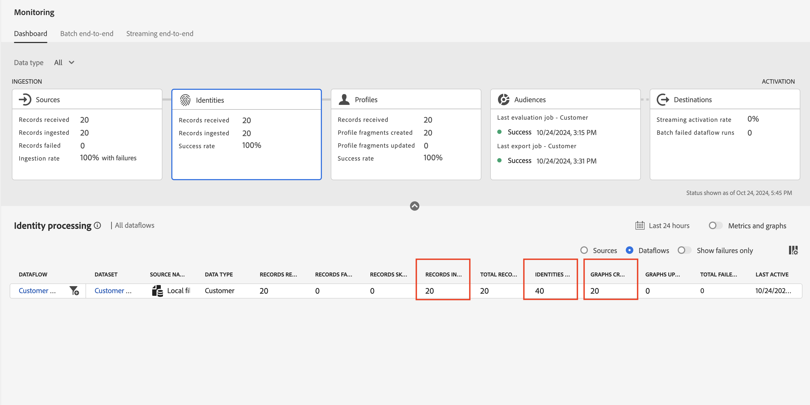

# 오류 해결

## 출생 날짜 및 월을 수정합니다.

1. **person.birthDayAndMonth** XDM 필드를 채우는 계산된 필드 옆의 화살표 아이콘을 클릭합니다

   

1. 아래의 계산된 필드 코드를 사용하여 식을 업데이트하고 **미리 보기**&#x200B;를 클릭합니다.

   ```none
   concat(date_part("mm", date(birth_Date, "M/d/yyyy")).toString(),"-", date_part("dd", date(birth_Date, "M/d/yyyy")).toString())
   ```

   >[!NOTE]
   >
   >데이터는 2자리 월과 2자리 일로 표시되어야 합니다(즉, 4월 27일은 04-27일로 표시됨). `mm` 및 `dd` 매개 변수는 0개의 패딩을 추가합니다.

1. 모든 항목이 정상인 경우 **계산된 필드를 저장**

1. 그런 다음 **마침**&#x200B;을 클릭하여 데이터 흐름 수집을 실행합니다.


## 수집 유효성 검사

몇 분 후에 데이터 흐름이 실행되면 성공이 표시됩니다!


## 모니터링 화면

1. **데이터 관리** 섹션 아래의 **모니터링** 아이콘에서 왼쪽 레일을 클릭하여 모니터링 화면으로 이동합니다.
1. **소스** 카드를 클릭한 다음 아래쪽 막대로 스크롤하여 데이터 흐름 실행에 대한 세부 정보를 확인합니다. 다음을 참고하십시오.
   - **받은 레코드:**&#x200B;처리를 위해 원본에서 20개의 레코드를 받았습니다.
   - **수집된 레코드:**&#x200B;매핑 및 데이터 처리 후 20개의 레코드가 데이터 레이크로 수집되었습니다.
   - **레코드 실패:** 여기에 0이 표시됩니다. 이는 INGEST 및 DCVS 오류의 총 수를 나타냅니다. MAPPER 경고는 제외됩니다.
   - **수집 비율:** 수집된 레코드와 수신된 레코드의 비율입니다. 받은 레코드 중 100%가 처리되었습니다.


>[!NOTE]
>
>부분 데이터 수집을 사용하면 특정 데이터 흐름 실행에 대해 **수집된 비율**&#x200B;을(를) 데이터 흐름 세부 정보의 일부로 설정한 임계값까지 \&lt;100%로 설정할 수 있습니다. 또한 데이터가 수집되지 않은 데이터 흐름 실행에 대해 100% 성공이 보고됩니다.

>[!NOTE]
>
>기록은 손실될 수 없습니다.
>
>**받은 레코드** = **수집한 레코드** + **실패한 레코드**
>
>**수집 비율 = 수집된 레코드 / 수신된 레코드**
>
>**부분 수집 임계값 = 레코드 실패/레코드 수신**


## ID

**ID** 카드를 클릭한 다음 맨 아래 막대로 스크롤하여 데이터 흐름 실행에 대한 세부 정보를 확인합니다. ID 서비스에서 다음 사항에 주의하십시오

- **받은 레코드:** *ID 저장소*&#x200B;에서 새 배치를 모니터링하면서 레코드 20개를 받았습니다. 즉, 데이터 세트가 프로필로 표시되었습니다.
- **수집된 레코드:**&#x200B;개의 레코드 20개가 수집되었습니다(즉, ID 정보에 대해 처리됨).
- **생략된 레코드:** 현재 새 ID 관계를 가진 레코드나 단일 ID 레코드가 없으므로 없음.
- **성공률(카드에서만 사용 가능):** 수집된 레코드에 대한 수신된 레코드의 비율입니다.
- **추가된 ID:** 40개 ID(CustomerID는 각각 20개, 이메일 주소는 20개)가 실시간 고객 프로필의 전체 ID 그래프에 추가되었습니다.
- **그래프 생성됨:** 처리된 레코드(즉, 각 데이터 행에서 발견된 관계)를 기반으로 20개의 고유한 그래프가 생성되었습니다.
- **그래프 업데이트됨:** ID가 그래프에 추가되었는지 여부를 알 수 있습니다.




## 프로필

**프로필** 카드를 클릭한 다음 아래쪽 막대로 스크롤하여 데이터 흐름 실행에 대한 세부 정보를 확인합니다. 프로필 서비스에서 다음 사항에 유의하십시오.

- **받은 레코드:** 처리를 위해 프로필 저장소에서 20개의 레코드를 받았습니다.
- **레코드 실패:** 실패한 레코드가 없습니다. 하지만 실패했다면 프로필 문제에 대한 수집이었다는 것을 알 수 있습니다.
- **만들어진 프로필 조각:** 20개의 프로필 조각이 만들어졌습니다.
- **프로필 조각 업데이트됨:** 전체 프로필 조각 20개가 터치됨
- **성공률:** 100%입니다. 수신된 레코드에 실패한 레코드 비율입니다.

>[!NOTE]
>
>프로필에 대해 **생략된 레코드** 지표를 사용할 수 없습니다.


>[!NOTE]
>
>대상 카드가 있으며 이 실습에서 조사한 것과 유사한 지표가 있습니다. 이러한 지표는 대상자 또는 데이터 세트를 활성화한 후에만 적용됩니다.
