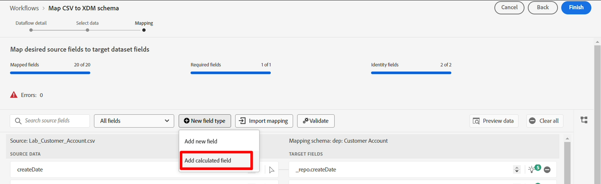
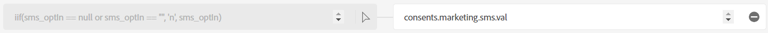

# 계산된 필드

## 개요

sms\_optIn 필드는 고객 계정 스키마의 필수 필드입니다. 스트리밍 소스의 sms\_optIn 필드에서 *null* 값을 보낼 수 있으므로 이를 해결하려면 계산된 필드가 필요합니다. 그렇지 않으면 이러한 레코드를 수집에서 건너뜁니다.


## 계산된 필드 만들기

1. **새 필드 형식** 아이콘을 클릭하여 계산된 필드를 만든 다음 **계산된 필드 추가**&#x200B;를 선택합니다. 누락된 모든 값에 대해 동의는 제공되지 않은 것으로 간주되며 **&quot;n&quot;**(으)로 표시됩니다. 계산된 필드를 통한 변환이 이 새 매핑에 대한 입력이므로 계산된 필드는 왼쪽 열에 나타납니다.

   


1. 계산된 필드 만들기 대화 상자에서 다음 식을 추가한 다음 **미리 보기**&#x200B;를 클릭합니다

   ```none
   iif(sms_optIn == null or sms_optIn == "", 'n', sms_optIn)
   ```

   


1. 검정색 상자의 오른쪽 상단 모서리에 표현식의 유효성을 나타내는 녹색 확인 표시가 표시되고 데이터 미리 보기에는 **&quot;n&quot;** 또는 **&quot;y&quot;**&#x200B;만 값으로 표시됩니다. 모든 항목이 정상인 경우 **저장**&#x200B;을 클릭하세요.


## 대상에 매핑

매핑 화면에 매핑되지 않은 대상 필드 경로가 있는 새 필드가 추가됩니다.


1. 새로 만든 계산된 필드에 대한 **대상 필드 매핑**&#x200B;을 클릭합니다.
1. 이제 오른쪽 창에 대상 스키마 패널이 열려 있습니다. 검색 상자에 **sms** 입력
1. **val** 필드 선택

   


   최종 매핑은 다음과 같아야 합니다.

   


1. 매핑의 유효성을 검사하여 정상적으로 보이는지 확인


>[!NOTE]
>
>유효한 SMS 값이 없는 모든 행은 수집 중에 거부됩니다. 부분 수집이 활성화되지 않은 경우 이 행의 수집 실패로 인해 전체 배치 또는 파일 수집이 실패합니다. 부분 수집이 활성화된 경우 누락된 값이 있는 필수 필드가 있는 행은 거부되지만 다른 행은 수집됩니다.


## 생일 처리

출생일, 생월, 연도를 별도의 필드로 구분해서 다운스트림 활동에서 일부 활용되지 않도록 해야 하는 요건이 있다. 이 문제를 해결하려면 계산된 필드를 두 개 만들어야 합니다.

### 생일과 월일에 대한 매핑 만들기

1. 새 계산된 필드를 추가하여 프로필 생년월일을 캡처합니다.
1. 계산된 필드에 다음 코드를 사용합니다.

   >[!NOTE]
   >
   >위의 코드만 복사하는 대신, 코드 조각을 별도로 실행하여 여러 행이 허용되지 않으므로 한 줄에 더 복잡한 계산된 필드를 만들도록 구성된 방법을 확인하여 발생한 상황을 이해하십시오. 다음을 시도해 보십시오.
   >
   >1. `date(birth_Date,"M/d/yyyy")`
   >2. `date_part("day", date(birth_Date,"M/d/yyyy")).toString()`
   >3. `date_part("month", date(birth_Date,"M/d/yyyy")).toString()`
   >4. `concat(date_part("month", date(birth_Date,"M/d/yyyy")).toString(),`
   >   `"-", date_part("day", date(birth_Date,"M/d/yyyy")).toString())`


1. 미리보기 를 클릭하면 다음 결과가 표시됩니다. 모든 항목이 정상인 경우 **저장**&#x200B;을 클릭하세요.

   


1. 계산된 필드를 **person.birthDayAndMonth**&#x200B;에 매핑

1. 매핑 유효성 검사


### 출생 연도에 대한 매핑 만들기

1. 아래 코드를 사용하여 프로필의 출생 연도를 캡처할 새 계산된 필드를 만듭니다

   ```none
   date_part("yyyy",date(birth_Date,"M/d/yyyy"))
   ```

1. 계산된 필드를 **person.birthYear**&#x200B;의 대상 위치에 매핑합니다

1. 매핑 유효성 검사

>[!NOTE]
>
>날짜는 **MM/DD/YYYY** 형식이지만 샘플의 **birth\_Date** 데이터는 일 및 월에 대해 한 자리 또는 두 자리 숫자로 표시되는지 확인하십시오. **date** 함수가 작동하려면 **M/d/yyyy**&#x200B;과(와) 같은 데이터의 입력 형식을 지정해야 월 및 일에 대해 1~2자리를 지정할 수 있습니다. 이 날짜 입력 형식 지정이 없으면 이러한 매핑의 유효성 검사가 실패합니다.
