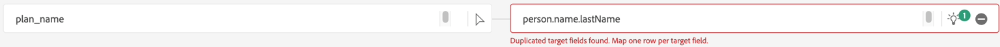

# 통과 매핑 수정

## 특정 매핑 삭제

소스 데이터 중 일부는 계산된 필드를 사용하여 처리해야 합니다.  이러한 문제를 해결하려면 매핑에서 삭제한 다음 매핑의 유효성을 다시 검사하십시오.

1. 매핑에서 다음 소스 데이터를 삭제합니다.
   - birth\_date
   - 소스
   - sms\_optIn
1. 유효성 검사 버튼을 클릭하여 매핑 유효성 재검사

>[!NOTE]
>
>유효성 검사를 클릭한 후에도 오류가 있을 수 있습니다

## 잘못된 매핑 예

AI/ML 권장 사항은 도움이 되지만 때로는 틀립니다.  권장 사항을 검사하면 수정해야 하는 이러한 유형의 오류를 발견할 수 있습니다

>[!NOTE]
>
>다음은 자체 샌드박스에서 볼 수 있는 잘못된 매핑의 몇 가지 예입니다. 다른 오류도 표시될 수 있습니다.

## 중복 매핑

이 시나리오에서는 AI/ML 추천자가 두 개의 다른 소스 필드를 동일한 대상 필드 **person.name.lastName**&#x200B;에 매핑했음을 알 수 있습니다.

## 잘못된 매핑

이 매핑은 올바르게 보이지만 더 자세히 검사하면 **email**&#x200B;이(가) **emailFormat**&#x200B;과(와) 다릅니다.

**email\_optIn**&#x200B;이(가) 잘못된 동의 개체에 잘못 매핑되는 경우입니다.

## 통과 매핑 고정

잘못된 대상 필드를 잘못 가리키는 통과 매핑을 수정하려면 다음 단계를 수행하십시오.

### 예

1. 잘못된 매핑으로 시작하고 대상 필드 상자를 클릭합니다. 예를 들어 아래 매핑에서 **person.name.lastName** 필드가 올바르게 매핑되지 않고 **planName**&#x200B;에 매핑됩니다.
1. 오른쪽에 열리는 대상 스키마 패널에서 적절한 대상 필드를 선택하고 **\_devbc.plan.name**&#x200B;을(를) 선택합니다
1. 이제 대상 필드 상자에서 대상 필드를 업데이트해야 합니다.
1. 이러한 오류를 수정한 후에는 **유효성 검사** 단추를 눌러 이러한 오류를 줄이고 새 오류를 도입하지 않도록 해야 합니다.

>[!WARNING]
>
>매핑 오류를 모두 해결할 때까지 다음 단계를 계속 진행하지 마십시오
