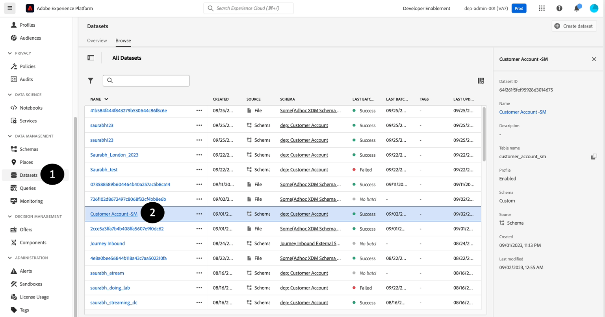

# 확인 및 유효성 검사

## 데이터 세트 미리 보기

1. **데이터 세트** 클릭
1. 만든 데이터 세트 이름을 **찾기**&#x200B;하고 **클릭**&#x200B;합니다.

   


1. 오른쪽 상단 모서리에서 **데이터 세트 미리 보기**&#x200B;를 클릭합니다.

   


1. 스키마 계층 구조를 보여 주는 왼쪽 창을 클릭하여 수집한 동일한 레코드를 **확인** 및 **확인**&#x200B;합니다.


>[!NOTE]
>
>**데이터 집합 미리 보기**&#x200B;는 이 데이터 집합에서 가장 최근에 성공한 일괄 처리를 표시합니다. 이전 배치를 볼 수 없습니다. 또한 배열 및 맵과 같은 복잡한 데이터는 현재 볼 수 없으며 빈 열로 표시됩니다. 보다 포괄적인 보기를 얻으려면 아래에 설명된 대로 SQL을 사용하여 데이터 세트를 탐색해야 합니다.


## 쿼리 데이터 세트

1. 미리 보기 **닫기**
1. 데이터 집합 화면에서 **테이블 이름**&#x200B;의 복사 아이콘을 클릭합니다. 아래 예제 화면에서 테이블 이름은 `customer_account_sm`입니다.

   


1. **쿼리** 섹션으로 이동

1. **쿼리 만들기**&#x200B;를 클릭합니다

   


1. **편집기**&#x200B;에서 다음 SQL 쿼리를 복사하여 붙여 넣으십시오. `<table_name>`을(를) 6단계에서 얻은 값으로 바꾸십시오.

   ```sql
   SELECT * FROM <table_name>
   ```


1. **재생** 단추를 누릅니다.

   


1. 결과 **미리 보기**

1. 데이터와 함께 XDM 스키마를 검색하려면 다음 SQL 쿼리도 실행합니다.

```sql
SELECT to_json(shippingAddress) FROM <table_name>
```

`postalCode` **노드**&#x200B;의 데이터에 액세스하려면 다음을 입력할 수 있습니다.

```sql
SELECT shippingAddress.postalCode FROM <table_name>
```

>[!SUCCESS]
>
>축하합니다!  실시간 고객 프로필의 샘플 세트를 정상적으로 수집 및 생성했습니다
