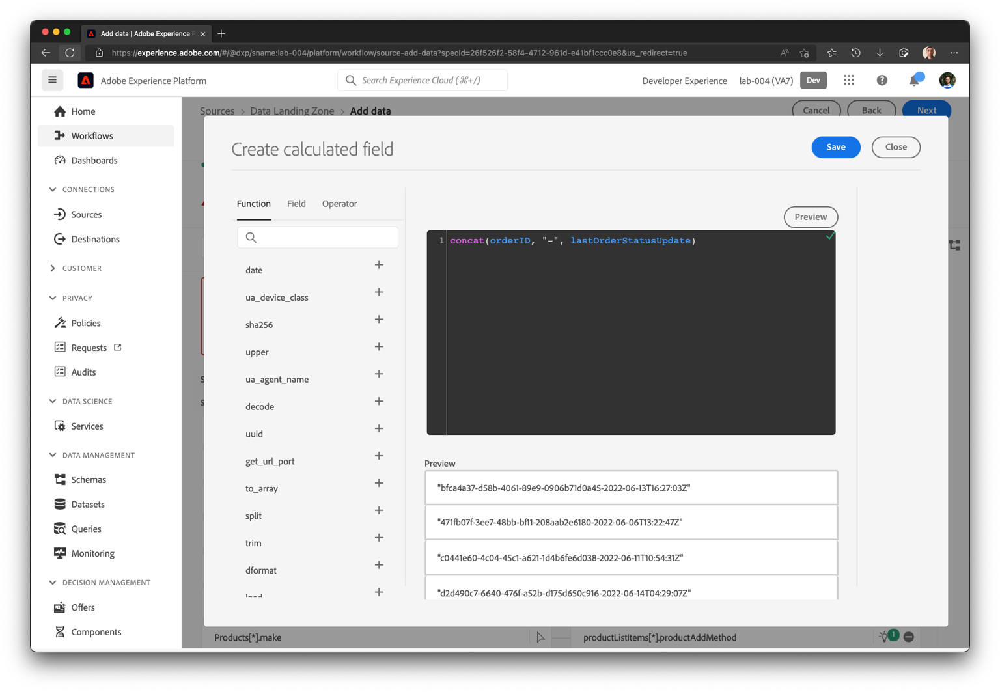

# 초기 매핑

이전 연습에서와 같이 매핑을 확인하고 경우에 따라 수정해야 합니다.

## ML 권장 사항 확인

1. 매핑 단계에서 ML 권장 사항은 대부분의 속성을 자동으로 매핑합니다. 그러나 몇 가지 오류도 표시됩니다. 초기 화면은 아래와 유사할 수 있습니다.

에 대한 매핑을 생성하지 않는 두 필드입니다.

>[!NOTE]
>
>경험 이벤트 데이터 세트를 처음 매핑하므로 경험 이벤트에 대해 **\_id** 및 **타임스탬프**&#x200B;을(를) 기본적으로 권장하거나 매핑하지 않습니다. 이러한 항목이 올바르게 매핑되었는지 수동으로 확인해야 합니다.

## \_id, 타임스탬프 및 순서를 매핑합니다.\_devbc.acqSource 필드

1. **\_id를 매핑하려면**&#x200B;에서 다음 계산된 필드 식을 쓰고 미리 보기를 클릭합니다

```none
concat(orderID, "-", lastOrderStatusUpdate)
```




1. 대상 스키마의 **타임스탬프** 필드가 다음 계산된 필드에 매핑되어 있는지 확인하십시오.

```none
lastOrderStatusUpdate
```


1. 계산된 필드 식 **&quot;inStore&quot;**&#x200B;을(를) **order.\_devbc.acqSource**&#x200B;에 매핑합니다.


## 중복 매핑 처리

매핑 화면에서 **order에 매핑된** orderStatus **과(와) 같은 중복 매핑이 있다고 불평하는 경우.\_devbc.acqSource,** &quot;-&quot; 아이콘을 클릭하여 매핑을 제거합니다.

> [!NOTE]
>
>여러 입력 필드를 동일한 출력 필드에 매핑할 수 없으므로 매핑이 모호해집니다. 그러나 단일 입력 필드를 XDM 스키마의 여러 출력 필드에 매핑할 수 있습니다.


