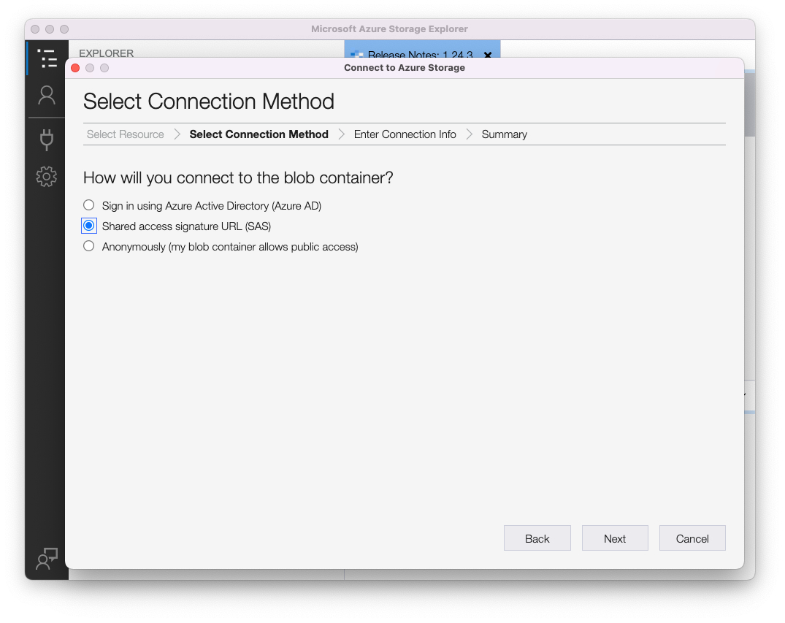
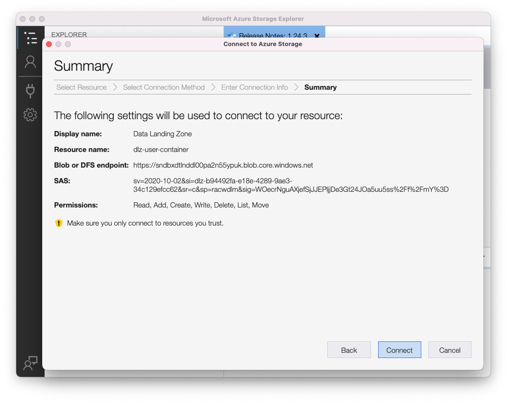

# 데이터 랜딩 영역 사용

## 필요 조건

Azure Storage Explorer를 다운로드하지 않은 경우 이 실습의 요구 사항이므로 지금 다운로드하십시오.  아래 링크에서 다운로드를 찾을 수 있습니다.

[Azure 스토리지 탐색기 다운로드](https://azure.microsoft.com/en-us/blog/microsoft-azure-data-lake-storage-adls-in-storage-explorer-public-preview/)

1. 애플리케이션 설치
1. 첫 번째 실행 시 최종 사용자 사용권 계약에 동의

## Experience Platform을 사용하여 Azure Storage Explorer 구성

1. Azure 저장소 탐색기를 열고 **리소스 선택 아이콘**&#x200B;을 클릭한 다음 **ADLS Gen 2 컨테이너 또는 디렉터리**&#x200B;를 선택합니다.

1. **SAS(공유 액세스 서명 URL)**&#x200B;을(를) 선택하고 **다음**&#x200B;을(를) 클릭합니다.

1. 표시 이름을 **데이터 랜딩 영역**(으)로 입력하십시오.

>[!NOTE]
>
>SAS URL을 제공할 때까지 이 단계에서 계속할 수 없습니다.  다음 단계에서 볼 수 있는 Experience Platform에서 이를 가져옵니다.

1. Adobe Experience Platform으로 이동하고 다음을 수행하여 데이터 랜딩 영역으로 이동합니다.

- **소스 -> 카탈로그**(으)로 이동
- 소스에서 **클라우드 저장소** 선택
- 다음으로 **데이터 랜딩 영역** 카드를 찾습니다.
- 데이터 랜딩 영역 카드를 클릭한 다음 오른쪽 레일에서 **자격 증명 보기**&#x200B;를 클릭합니다

1. 표시되는 모달에서 **SASUri**&#x200B;를 복사합니다.

Azure 저장소 탐색기로 돌아가서 이전 단계에서 비워 둔 **Blob 컨테이너 또는 디렉터리 SAS URL**&#x200B;에 **SASUri 값**&#x200B;을(를) 붙여 넣습니다.

1. 계속하려면 **다음**&#x200B;을 클릭하세요.

1. 요약 화면에서 **연결**&#x200B;을 클릭합니다.

이제 다음과 같은 화면이 표시됩니다

> [!TIP]
>
>축하합니다!  Azure 저장소 탐색기를 구성했습니다.
