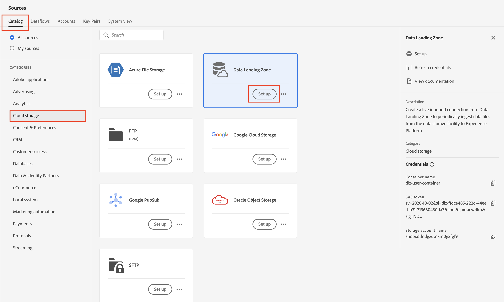

# 소스 설정

## 샘플 파일 업로드

랩 중에 사용할 수 있도록 샘플 데이터 파일을 Azure 저장소 탐색기를 통해 데이터 랜딩 영역에 업로드해야 합니다.  이렇게 하려면 다음을 수행합니다.

1. [샘플 파일](../../sample-files.md) 다운로드
1. **Lab\_Customer\_Account.csv** 파일을 이전 단계에서 저장한 데이터 랜딩 영역으로 끌어 놓거나 업로드하십시오.

업로드할 때 화면은 아래 스크린샷과 같아야 합니다.

>[!WARNING]
>
>파일을 *프로젝트* 폴더에 업로드하지 않도록 하세요. 여기에는 랩에서 사용하지 않는 미리 로드된 데이터가 포함되어 있습니다.

## 소스로 이동

1. Adobe Experience Platform으로 이동하여 다음 위치로 이동: **소스** -> **카탈로그** -> **클라우드 저장소**
1. 데이터 랜딩 영역에 대해 **설정** / **데이터 추가**&#x200B;를 클릭합니다.

>[!NOTE]
>
>해당 원본에 대해 하나 이상의 연결이 있는 경우 **데이터 추가**&#x200B;가 기본 작업으로 표시됩니다. 해당 소스에 대한 연결이 없으면 **Setup**&#x200B;이(가) 기본 작업으로 표시됩니다

## 파일 미리 보기

1. **Lab\_Customer\_Account.csv 선택**

1. 미리 보기 창에서 다음 속성을 확인하고 다음을 확인합니다.

- **sms\_optIn**&#x200B;은(는) 누락된 값이 여러 개 있는 동의 필드입니다( - 로 미리 보기에 표시됨).
- **account\_create\_date**&#x200B;에 적절한 날짜 형식이 없습니다. 여기에는 하나의 문자열에 날짜 및 시간 값과 함께 문자열 값이 있습니다.
- **account\_end\_date**&#x200B;의 날짜 형식이 잘못되었습니다.

파일 미리 보기에 여러 누락된 값이 표시된 

>[!NOTE]
>
>이 실습의 후반부에 있는 매핑 단계에서 누락된 값, 날짜 및 잘못된 형식의 필드를 처리해야 합니다

1. 화면 오른쪽 상단의 **다음**&#x200B;을 클릭하여 다음 단계를 계속합니다

## 데이터 흐름 설정

1. 데이터 흐름 세부 정보 화면에서 **새 데이터 세트**&#x200B;를 선택합니다.
1. 출력 데이터 세트의 이름을 **고객 계정 - \&lt;이니셜>**(으)로 지정합니다.
1. 드롭다운 목록에서 **dep: 고객 계정** 스키마를 선택합니다.
1. **프로필 데이터 집합** 토글 상자를 켭니다.
(이 기능을 켜지 않으면 프로필 저장소는 이 데이터 세트에 입력되는 새 데이터를 모니터링할 수 없으므로 이 데이터를 프로필로 수집하지 않습니다.)
1. **부분 수집 사용**&#x200B;을 켭니다.
(이 기능을 켜지 않으면 레코드 중 하나에 오류가 있으면 수집이 실패할 수 있습니다.)
1. 데이터 흐름 이름을 **고객 계정 일괄 처리 수집 - \&lt;이니셜>**(으)로 설정합니다.
1. 모든 경고 설정 **소스 데이터 흐름 시작/성공/실패**

>[!CAUTION]
>
> 프로필 및 부분 수집 모두에 대해 **활성화** 데이터 세트가 있는지 확인하십시오.

화면 오른쪽 상단의 **다음**&#x200B;을 클릭하여 다음 단계를 계속합니다.

>[!NOTE]
>
>**부분 수집 사용**&#x200B;은(는) 전체 데이터 흐름이 실패로 선언되기 전에 실패할 수 있는 총 레코드 수의 비율로 오류 수(**INGEST** 및 **DCVS**)를 지정합니다.
