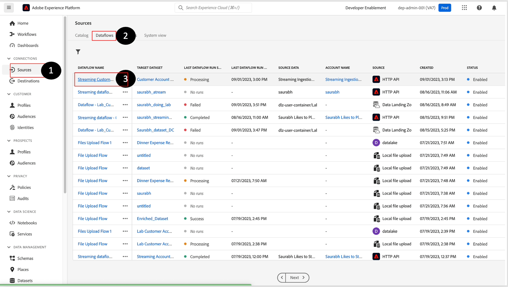

# 오류 모니터링 및 디버깅

>[!NOTE]
>
>스트리밍 수집 모니터링은 데이터 흐름 수준에서 수행되며, 이는 UI 내에서 데이터 레이크를 보고 있음을 의미합니다.  즉, 약 60분마다 일괄 처리(스트리밍 파이프라인에서 처리되는 마이크로 일괄 처리)가 표시됩니다.  따라서 실시간 고객 프로필에 데이터가 표시되지 않으면 최대 60분 동안 문제를 진단해야 합니다.

## 모니터링 대시보드 보기

1. **모니터링->종단 간 스트리밍**(으)로 이동하여 **데이터 흐름**&#x200B;을 찾습니다.

1. 일괄 처리 수집 워크플로우와 관련된 파이프라인 지표를 보려면 **대시보드** 탭을 미리 볼 수 있습니다.

>[!NOTE]
>
>이 모니터링 화면에서는 다양한 데이터 흐름 실행의 상태를 볼 수 있습니다.  상단 패널에서 사용할 수 있는 다양한 지표를 확인합니다.  이러한 지표는 Experience Platform 내의 데이터 파이프라인 상태를 이해하는 데 매우 유용할 수 있습니다

## 디버깅 오류

1. 지침을 따르지 않아 데이터 흐름에 오류가 발생한 경우 다음과 같이 표시됩니다.

1. 실패 를 클릭하면 다음 화면이 표시됩니다.

>[!NOTE]
>
>마이크로 배치가 성공하면 데이터 레이크에 레코드를 쓰는 데 시간이 필요하므로 15분 이상 걸릴 수 있습니다.

1. 오류 메시지를 분석하고 **소스/대상 필드**&#x200B;을(를) 식별한 다음 코드를 찾습니다.

- **XXXX 수집** - 데이터 손상 또는 서식 문제(예: 정규 표현식 형식을 따르지 않음)로 인해 심각한 오류가 발생합니다.
- **DCVS XXXX** - 이 오류는 `required` 필드에 표시됩니다. 값이 없거나 잘못 매핑된 경우(열거형 목록 내에 없는 경우) 이러한 행은 건너뜁니다.
- **MAPPER XXXX** - 경고이며 건너뛴 행이 없습니다. 그러나 값이 &quot;무효화&quot;되었을 수 있으므로 다운스트림 활동에 영향을 주지 않는지 확인해야 합니다.

1. 오류를 복구하려면 **소스->데이터 흐름->데이터 흐름 이름->데이터 흐름 업데이트**(으)로 이동하여 매핑을 수정해야 합니다.

&#x200B;> [!NOTE]
>
>먼저 JSON 샘플 파일을 삭제하고 다시 추가하여 다시 업로드해야 매퍼가 유효성 검사를 위해 새 복사본으로 새로 고쳐집니다.

