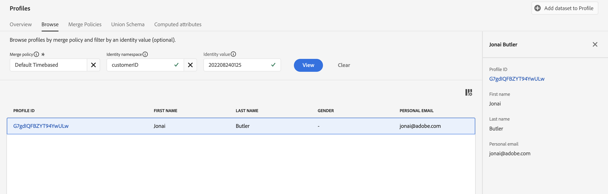

# 수집된 프로필 확인

## 스트리밍 유효성 검사

Adobe Experience Platform 내에서 스트리밍 데이터의 유효성을 검사하려면 몇 가지 다른 단계가 필요합니다.  스트리밍 데이터는 데이터 세트의 구성에 따라 여러 데이터베이스에 쓸 수 있습니다.

| 스토리지 | 지연 | 설명 |
| -------------- | -------------------------------------------------------------------------- | ---------------------------------------------------------------------- |
| 데이터 레이크 | \~최대 60분 | 모든 스트리밍 데이터의 최종 휴식 공간 |
| 프로필 저장소 | 평균 \~1분 최대 \~15분 | 프로필에 대해 기본 데이터 세트가 활성화될 때만 데이터를 처리합니다. |
| ID 저장소 | 평균 \~1분 새로운 ID 관계에 대해 \~10분 마이크로 배치 | 프로필에 대해 기본 데이터 세트가 활성화될 때만 데이터를 처리합니다. |

유효성을 검사하려는 내용에 따라 위에서 볼 수 있듯이 몇 가지 다른 위치로 이동해야 할 수 있습니다.  이 시나리오에서는 (프로필에 대한 데이터 세트를 활성화한 대로) 프로필에 데이터를 기록했으므로 프로필 스토어에서 프로필이 있는지 확인합니다.

## 프로필 조회

1. UI에서 **프로필 -> 찾아보기**&#x200B;로 이동합니다.
1. ID 네임스페이스 및 ID 값 입력 상자에 다음 값을 입력합니다.
   - **ID 네임스페이스** -> `customerID`
   - **ID 값** -> `202208240125`
1. **보기** 단추를 클릭하여 프로필을 조회합니다.
1. 반환된 행에서 **프로필 ID** 링크를 클릭하여 프로필을 봅니다

프로필을 살펴보고 스트리밍한 내용과 일치하는지 확인하십시오. 멋지지?

>[!NOTE]
>
>새로운 ID 관계 결합에 대해 \~10분 정도의 지연 시간이 있는 경우 이메일 네임스페이스를 사용하여 프로필을 조회하려고 시도했다면 응답이 표시되지 않았을 것입니다.
>
>대신 customerID 네임스페이스(기본 ID)를 사용하면 프로필을 즉시 조회할 수 있습니다.
>
>프로필은 기본 ID 😄에 대해서만 알고 있습니다.
