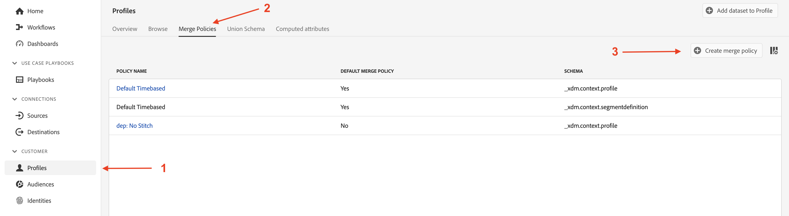

# 병합 정책

## 뭔데?

프로필을 검색할 때마다 프로필 뷰어에서 병합 정책 이 표시됩니다(방금 어떤 작업을 수행했는지 알지 못했을 수 있음)

병합 정책은 다음 두 가지 작업을 수행합니다.

1. 프로필 저장소 내에서 조각을 취합하는 방법에 대한 지침을 제공합니다(예: ID 결합). 다음 두 가지 옵션이 있습니다.
   - ID 그래프(즉, Identity Service) 사용
   - ID 그래프를 사용하지 마십시오(즉, 유사하게 저장된 프로필 조각을 찾기 위해 제공된 ID만 사용)
1. 필드가 여러 데이터 세트(예: 병합 메서드)에서 제공될 수 있는 경우 XDM 개별 프로필 클래스 기반 데이터 세트 내에서 필드 충돌을 해결하는 방법을 프로필 서비스에 알려줍니다. 다음 두 가지 옵션이 있습니다.
   - 타임스탬프 우선 순위 - 모든 데이터 세트에서 가장 최근 레코드를 사실 세트로 사용하고 다른 모든 레코드가 최근 레코드에서 가장 오래된 순서대로 공백을 채우도록 합니다
   - 데이터 세트 우선 순위 - 프로필을 구성하는 데 사용할 수 있는 XDM 개별 프로필 데이터 세트와 그러한 데이터 세트를 취합할 순서를 선택하십시오

> [!NOTE]
>
>데이터 세트 우선 순위의 병합 방법을 선택하면 프로필 구성에 사용할 수 있는 XDM 개별 프로필 및 XDM 경험 이벤트 데이터 세트를 선택할 수 있습니다.
>
>타임스탬프 우선 순위 병합 방법은 항상 모든 데이터 세트를 사용합니다

>[!WARNING]
>
>세분화 및 프로필이 작동하려면 모든 샌드박스에 **기본** 병합 정책으로 표시된 병합 정책이 하나 이상 필요합니다

>[!NOTE]
>
>데이터 세트 우선 순위를 사용하는 사용자 지정 병합 정책을 사용할 필요가 없도록 여러 번 디자인합니다.
>
>- 여러 데이터 세트가 동일한 필드를 기록하지 않고 다음과 같이 고유한 이름을 지정합니다.
>  - 이름 - CRM
>  - 이름 - 충성도
>  - 이름 - 웹 양식
>- 이를 통해 마케터는 시스템이 이해할 수 없는 규칙 세트를 기준으로 데이터 소스를 선택하고 진행 상황을 이해하지 못한 채 한 소스에서 프로필 필드를 선택하고 다른 소스에서 다른 필드를 선택하는 대신 사용할 데이터 소스+필드를 선택할 수 있습니다.
>- 데이터 모델의 경우 필드 충돌을 해결할 필요가 없으므로 사용자 지정 병합 정책이 필요하지 않습니다

병합 정책 이 ID 그래프와 작동하는 방식을 최대한 이해하기 위해 ID 결합에 ID 그래프를 활용하지 않는 ID 그래프를 만듭니다.

## 결합 안 함 병합 정책 만들기

프로필 형성에서 ID 그래프를 사용할 수 없는 병합 정책을 만듭니다.

## 생성하기

1. 왼쪽 레일에서 **프로필** 클릭
1. 위쪽 탐색에서 **병합 정책**&#x200B;을 클릭합니다.
1. 화면 오른쪽 끝에 있는 **병합 정책 만들기**&#x200B;를 클릭합니다.

## 구성

이제 병합 정책 설정을 구성해야 합니다.  다음 정보를 입력합니다.

| 설정 | 값 |
| --------------------------- | --------------- |
| 이름 | ID 결합 없음 |
| ID 결합 | 없음 |
| 기본 병합 정책 | 비활성화됨 |
| Active-On-Edge 병합 정책 | 비활성화됨 |

완료되면 **다음**&#x200B;을 클릭하세요.

## 프로필 데이터 세트 선택

1. 병합 방법에 대해 **타임스탬프 순서 지정**&#x200B;을 선택합니다.
1. **다음** 클릭

## 경험 이벤트 데이터 세트 선택

병합 방법에 대해 순서가 지정된 타임스탬프 를 선택하면 모든 XDM 개별 프로필 및 Experience 이벤트 클래스 기반 데이터 세트가 프로필 형성에 참여한다는 것을 프로필 서비스에 알리는 것을 잊지 마십시오.

따라서 이 단계에서는 수행할 작업이 없으므로 **다음**&#x200B;을 클릭하면 됩니다.

## 리뷰

마지막 단계에서는 선택한 설정의 미리보기 및 작동 중인 병합 정책을 보여 주는 샘플 프로필을 볼 수 있습니다.

병합 정책을 만들려면 **완료** 단추를 클릭하십시오.

## 작동 중인 메서드 병합

아래 스크린샷과 같은 프로필의 ID 그래프인 Depeche 모드를 기억하십시오. 프로필 서비스의 작동 방식을 이해하려면 어셈블리 프로세스 중에 이 ID 그래프를 사용하는 것을 무시하는 것이 좋습니다.

## 이메일을 사용하여 비교

계속하고 아래 단계에 따라 프로필 뷰어를 엽니다.

1. 왼쪽 레일에서 **프로필**&#x200B;을 클릭한 다음 위쪽 탐색에서 **찾아보기**&#x200B;를 선택합니다.
1. **전자 메일**&#x200B;의 ID 네임스페이스 선택
1. **depeche.mode\@dep.com**&#x200B;의 ID 값을 입력하십시오.
1. **보기** 단추를 클릭하여 프로필을 조회합니다.
1. 프로필의 세부 정보를 보려면 프로필에 대한 **링크**&#x200B;를 클릭하십시오.

Depeche 모드 프로필을 다시 검색하지만 이번에는 **ID 결합 없음** 병합 정책을 사용합니다.

1. 왼쪽 레일에서 **프로필**&#x200B;을 마우스 오른쪽 단추로 클릭한 다음 **새 탭에서 열기**&#x200B;를 선택합니다.
1. 위쪽 탐색에서 **찾아보기**&#x200B;를 선택합니다
1. **ID 결합 없음**&#x200B;의 병합 정책을 선택합니다.
1. **전자 메일**&#x200B;의 ID 네임스페이스 선택
1. **depeche.mode\@dep.com**&#x200B;의 ID 값을 입력하십시오.
1. **보기** 단추를 클릭하여 프로필을 조회합니다.
1. 프로필의 세부 정보를 보려면 프로필에 대한 **링크**&#x200B;를 클릭하십시오.

두 프로필 보기를 비교하면 두 보기가 매우 다르다는 것을 알 수 있습니다. **ID 결합 없음** 병합 정책을 사용하는 버전에서 일부 특성 및 ID가 누락되었습니다.

각 프로필의 이벤트를 보면 **ID 결합 없음** 병합 정책을 사용하는 프로필에는 하나의 이벤트만 포함되고 다른 버전에는 모든 이벤트가 포함된 것을 알 수 있습니다.

프로필의 ID 결합 없음 버전에 대한 단일 이벤트는 해당 이벤트가 &quot;personalEmail.address&quot;의 기본 ID를 사용하여 저장되기 때문입니다.

>[!NOTE]
>
>ID 그래프 프로필을 사용하지 않는 병합 방법을 사용하는 경우, 제공된 ID만 사용하여 유사하게 저장된 프로필 조각을 찾습니다.

## customerID를 사용하여 비교

그래프의 다른 ID 중 일부를 사용하여 디바이스 모드 프로필의 다양한 조각을 볼 수 있습니다.  ID 결합 없음 병합 정책으로 동일한 프로필을 다시 검색하지만 이번에는 아래에 제공된 customerID 네임스페이스 및 값을 사용하여 검색하십시오.

| ID 네임스페이스 | 값 |
| ------------------ | --------- |
| customerID | 266242885 |

**본인 확인 질문**

질문: 속성에 대해 주목해야 할 사항이 있습니까? 하나도 없는데 왜?

답변: 이메일을 기본 ID로 사용하여 속성을 로드했습니다.

질문: 이벤트에 대해 아시는 것이 있습니까?

답변: 기본 ID로 customerID가 있는 이벤트만 표시됩니다

## GAID를 사용하여 비교

ID 결합 없음 병합 정책으로 동일한 프로필을 다시 검색하지만 이번에는 아래에 제공된 GAID 네임스페이스 및 값을 사용하여 시도하십시오.

| 네임스페이스 | 값 |
| --------- | ----------- |
| GAID | 266242-9013 |

**본인 확인 질문**

질문: 프로필을 찾을 수 없습니다! 무슨 일입니까? 프로필을 찾을 수 없는 이유는 무엇입니까? 답변: 해당 GAID 값을 기본 ID로 사용하여 저장된 프로필 조각이 없습니다

## 프로필 + ID

빠른 시놉시스

- 프로필 저장소에는 기본 ID를 사용하여 저장된 프로필 조각이 포함됩니다
- ID 그래프는 2개 이상의 사용자 기반 ID 간의 관계를 포함합니다

ID 그래프를 프로필 스토어와 함께 사용하면 ID 그래프에서 각 ID 값을 기본 ID로 처리하는 올바른 프로필 조각을 찾는 방법에 대한 지침을 제공하는 것으로 생각할 수 있습니다.

ID 그래프가 없으면 프로필 저장소는 단일 식별자(즉, 기본 ID)를 사용해서만 프로필 조각을 검색할 수 있습니다

> [!TIP]
>
>**추가 시간이 있으며 시험해 보고 싶습니다...:**
>
>- 2개의 ID가 있는 것으로 알고 있는 UI에서 다른 프로필을 검색합니다
>- 일부 이벤트는 한 조각에 대해 저장되지만 다른 조각에 대해서는 저장되지 않는 방법을 알아봅니다
>- 일부 프로필 속성이 한 조각에 대해 저장되지만 다른 조각에 대해서는 저장되지 않는 방법을 확인하십시오
>- 이미 조회한 프로필로 이동한 다음 **ID 결합 없음** 병합 정책을 사용하여 다시 조회합니다.  차이점 참고
