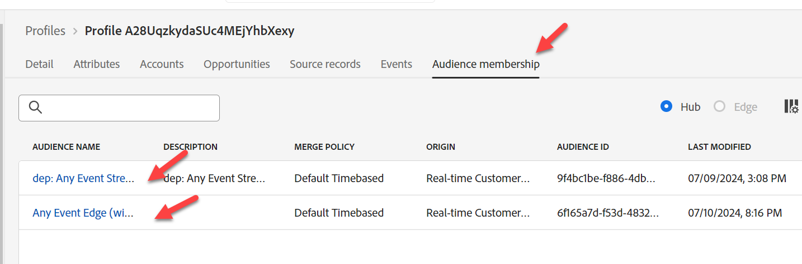

# Edge 이벤트 보내기

모든 것이 구성되었으므로 이벤트를 Edge에 보내어 모든 것이 작동하는지 확인하십시오.

이렇게 하려면 Postman을 사용하여 웹 이벤트를 만든 데이터 스트림으로 보냅니다.

웹에서 Edge으로 들어오는 페이지 보기를 시뮬레이션하도록 **OAuth 토큰 없이** 이벤트를 보냅니다.  이 실습을 수행하려면 컴퓨터에서 Postman이 열려 있어야 합니다.

>[!NOTE]
>
>인증된 토큰을 전달하지 않으므로 속성을 다시 가져올 수 없습니다.

## 랩 기대

1. Edge을 히트할 경험 이벤트
1. 이벤트 전달 서비스를 사용하기 위한 데이터 스트림 구성
1. 이벤트를 웹후크로 보내기 위한 이벤트 전달
1. AEP 서비스를 사용하기 위한 데이터 스트림 구성
   1. 실행할 Edge 대상
   1. 허브에 이벤트 보내기
1. Edge 대상을 포함하는 Postman 응답(하지만 속성은 없음)
1. 이벤트를 받고 이벤트 프로필 조각을 추가할 프로필 스토어
1. 관계를 추가할 ID 저장소
1. 데이터를 받고 데이터 레이크에 저장할 데이터 세트

## 호출로 이동

1. **Postman 왼쪽 사이드바** -> 컬렉션
1. **컬렉션** -> AEP Foundations 부트캠프(Labs)
1. **폴더** -> 프로필 랩
1. **API 요청** -> 웹 이벤트 Edge 만들기(인증 없음)

## API 요청 수정

API 요청을 실행하려면 먼저 요청에 몇 가지 추가 정보를 추가해야 합니다. 다음 값을 취합하여 시작합니다.

## 데이터 스트림 ID 수집

1. 왼쪽 레일에서 **데이터스트림**(데이터 수집 제목 아래)을 클릭합니다.
1. 데이터 스트림을 선택하고 **데이터 스트림 ID** 값을 복사합니다.

## Postman 쿼리 매개 변수 업데이트

1. 요청 자체에서 **매개 변수**&#x200B;을 클릭합니다.
1. 이전 단계의 데이터 스트림 ID로 **Value**&#x200B;을(를) 업데이트합니다.
1. 업데이트를 저장하려면 **저장** 단추를 클릭하십시오.

이메일을 이메일로 변경

## API 실행

**보내기** 단추를 클릭하여 요청을 실행합니다.

응답에서 돌아올 것을 보아야 할 것은 이 핵심입니다.

- 200 OK 응답은 Edge Network이 데이터를 성공적으로 보내고 수락했음을 의미합니다

>[!NOTE]
>
>스트리밍 및 배치 세그먼트는 먼저 허브에서 평가될 때까지 표시되지 않습니다

## 이벤트 전달 유효성 확인

webhook.site에는 Postman 요청을 통해 보낸 것과 동일한 페이로드 본문이 즉시 표시됩니다.

>[!NOTE]
>
>Edge 설정에서 사용한 데이터 스트림을 설정할 때 페이로드가 요청한 지역 조회 정보를 추가했음을 확인합니다

## 프로필 조회

Adobe Experience Platform에서 방금 Edge Network으로 보낸 이벤트에서 방금 전송한 프로필을 찾습니다. 프로파일 -> 찾아보기로 이동하여 다음 정보를 사용하여 조회를 수행합니다.

- 병합 정책 -> 기본 시간 기반
- ID 네임스페이스 -> 이메일
- ID 값 -> edge-email\@dep.com
  - 참고: 위의 *Postman 쿼리 매개 변수 업데이트* 단계에서 사용한 전자 메일과 일치하도록 이 항목을 변경하십시오

1. **보기**&#x200B;를 클릭하여 프로필 조회
1. 프로필을 열려면 **프로필 ID**&#x200B;를 클릭하십시오.

   

1. 위쪽 탐색에서 **이벤트**&#x200B;를 클릭하면 방금 보낸 이벤트를 볼 수 있습니다

   

1. 위쪽 탐색에서 Audience Membership 탭을 검토하여 프로필이 Audiences에 적합한지 확인합니다. 다음이 표시됩니다.

- 모든 이벤트 Edge(15분 이내)
- dep: 모든 이벤트 스트리밍(시간 내)

## 수표를 해석하는 방법

1. Postman에서 200개의 응답 확인(적절한 형식의 페이로드)
1. 웹후크에 이벤트가 있는지 확인합니다(이벤트 전달이 올바르게 구성됨).
1. 프로필에 이벤트가 있는지 확인합니다(허브에 올바르게 구성된 AEP 서비스, 이벤트를 수신하고 처리함).
1. 몇 분 후 프로필에 두 개의 ID(ID 그래프가 허브에 연결됨)가 있는지 확인합니다.
1. 프로필이 대상(올바르게 정의된 대상)에 적합한지 확인
1. 데이터 레이크에 이벤트가 있는지 확인합니다.
