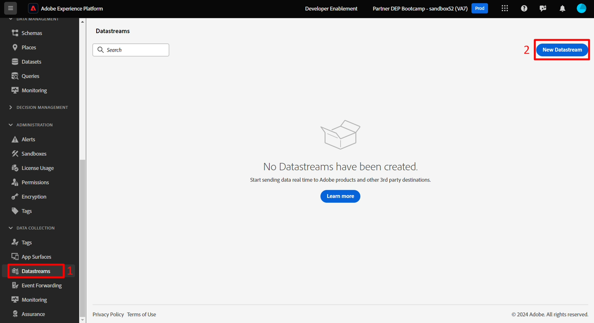

# 데이터 스트림 만들기

데이터 스트림은 이를 활용할 서비스를 정의합니다.

- Edge에 데이터를 전송할 때 사용할 데이터 스트림을 지정합니다
- 그런 다음 이러한 데이터 스트림으로 전송된 데이터는 구성된 서비스에 따라 조치를 취할 수 있습니다
  - 이벤트 전달
  - Adobe Experience Platform

## 새 데이터 스트림 만들기

1. **데이터 수집** 아래의 왼쪽 레일에서 **데이터스트림**&#x200B;을 클릭합니다.
1. 그런 다음 **새 데이터 스트림**&#x200B;을 클릭하여 데이터 스트림을 만듭니다.

새 데이터스트림 단추가 강조 표시된 

## 데이터스트림 구성

다음 정보로 데이터 스트림을 구성합니다.

1. 이름 -> **데이터스트림 SB + \&lt;샌드박스 이름>(예: 데이터스트림 SB01)**
1. 이벤트 스키마 -> **dep: 웹**
1. **지리적 위치 및 네트워크 조회**&#x200B;에서 모든 옵션 **켜기** 전환
1. 완료되면 **저장** 단추를 클릭하십시오.

>[!WARNING]
>
>저장 및 매핑 추가를 클릭하지 마십시오.  실수로 취소하시면 됩니다

데이터스트림을 저장하면 다음 화면이 표시됩니다.

## 이벤트 전달 서비스 추가

이 데이터 스트림에서 받은 데이터에 대해 이벤트 전달을 사용할 수 있습니다.

1. **서비스 추가** 클릭

   

1. 다음 항목을 구성합니다.

   - 서비스 -> 이벤트 전달
   - 속성 -> 이전 단계에서 생성한 속성을 선택합니다.  이름은 다음과 같이 지정해야 합니다. 이벤트 전달 속성 SB + \&lt;샌드박스 번호>
   - 환경 -> 개발

1. 완료되면 **저장** 클릭

## Adobe Experience Platform 서비스 추가

이렇게 하면 허브에 데이터를 보내고 이 데이터 스트림에서 받은 데이터에 대해 데이터 세트에 연결할 수 있습니다.

1. **서비스 추가** 클릭

   ![Adobe Experience Platform 서비스를 추가하기 위해 [서비스 추가] 단추가 강조 표시된 데이터스트림 세부 정보 페이지](assets/create-datastream-add-second-service-button.png "새 서비스 추가")

1. 다음 항목을 구성합니다.

   - 서비스 -> Adobe Experience Platform
   - 이벤트 데이터 세트 -> dep: 웹
   - 프로필 데이터 세트 -> dep: 고객 계정
   - 확인란 -> Edge 세그멘테이션 선택
   - 확인란 -> Personalization 대상 선택

   

1. 완료되면 **저장**&#x200B;을 클릭하세요.

1. 두 개의 서비스가 있는 경우 최종 화면은 아래와 같습니다. 로컬 컴퓨터에 **데이터 스트림 ID**&#x200B;를 **복사** 및 **저장**(나중에 Postman에서 사용)

