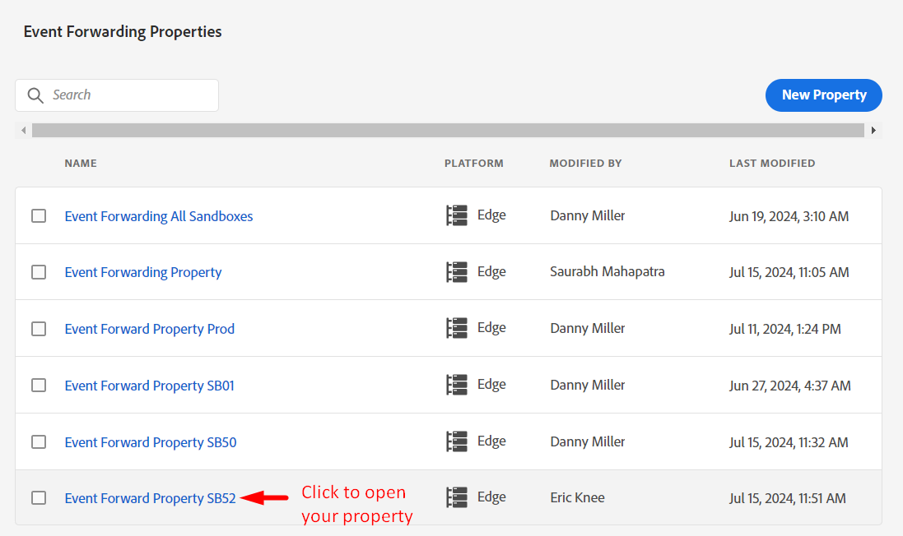
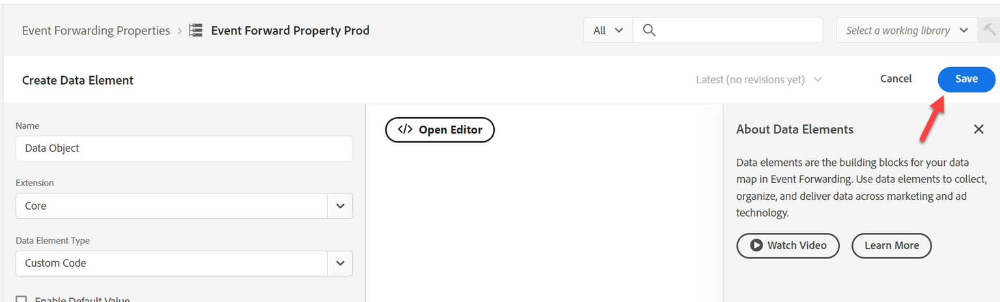
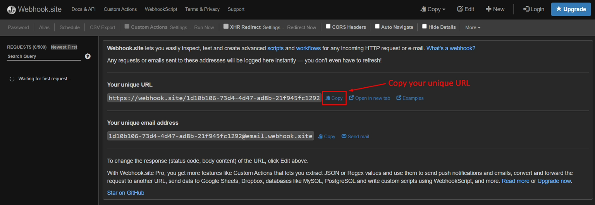

# 속성 만들기

일반적으로 경험 이벤트를 서드파티에 전달하려고 합니다(그럴 필요는 없지만). 일반적으로 특정 상황에서 서드파티에게 알리기 위해 이벤트 사본이 실시간으로 필요할 때(예: Google, Meta 또는 TikTok에 구매 알림) 사용됩니다.

>[!NOTE]
>
>미리 알림: 속성에는 전달할 내용과 위치를 결정하는 데 필요한 모든 확장, 데이터 요소 및 규칙이 포함되어 있습니다

1. 왼쪽 레일에서 이벤트 전달 을 클릭합니다.
2. 그런 다음 New Property 클릭


3. `Event Forward Property SB + [sandbox number]` 수식을 사용하여 속성 이름을 업데이트합니다. 최종 이름은 다음과 같습니다. **이벤트 전달 속성 SB01**

4. 완료되면 **저장** 클릭


## 확장 설치

1. 방금 만든 이벤트 전달 속성을 클릭합니다.




2. 아래와 같은 화면이 표시됩니다.  **확장**&#x200B;을 클릭합니다.

확장 탭이 강조 표시된 


3. 다음을 수행하여 확장 Adobe Cloud Connector를 설치합니다.

4. 위쪽 탐색에서 **Catalog** 클릭
5. **Adobe Cloud Connector** 카드를 클릭합니다.
6. 오른쪽 레일에서 **설치** 단추를 클릭합니다.


설치를 클릭하면 아래와 같이 속성에 대해 설치된 확장 아래에 확장이 표시됩니다


## 데이터 요소 만들기

>[!NOTE]
>
>데이터 요소는 들어오는 이벤트를 참조하며 필요한 경우 여러 개별 구성 요소로 구문 분석할 수 있습니다

1. 왼쪽 레일에서 **데이터 요소**&#x200B;를 클릭합니다


2. **새 데이터 요소 만들기** 단추를 클릭합니다.


3. 다음 정보로 새 데이터 요소를 구성합니다.

| 요소 유형 | 구성할 값 |
| ----------------- | ------------------ |
| 이름 | 데이터 개체 |
| 확장 | 코어 |
| 데이터 요소 유형 | 사용자 지정 코드 |


4. **편집기 열기** 단추를 클릭하여 다음 사용자 지정 코드를 추가합니다.

![사용자 지정 코드에 대해 [편집기 열기] 단추가 강조 표시된 데이터 요소 설정](assets/create-property-open-custom-code-editor.png "편집기 열기")


5. 다음과 같이 편집기에 사용자 지정 코드를 추가하고 저장합니다

```none
var xdm = arc?.event || '';
return xdm;
```


>[!NOTE]
>
>페이로드에 대한 번역을 수행하지 않고 전체 xdm 개체를 캡처하는 것입니다.  필요한 경우 XDM 개체 내의 각 개별 부분(예: 페이지 이름, 구매 금액)을 필드당 하나의 데이터 요소로 구문 분석할 수 있습니다.  이렇게 하는 이유는 구조가 다른 구조로 변화된 경우 일 수 있다


6. **저장** 단추를 클릭하여 데이터 요소를 저장합니다.




완료되면 데이터 요소가 추가되었음을 확인하는 다음 화면이 표시됩니다.


## 규칙 만들기

>[!NOTE]
>
>규칙에는 다음이 포함됩니다.
>
>1. 전달할 항목에 대한 조건
>2. 페이로드를 변형하고 페이로드를 전송할 위치를 정의할 수 있는 작업


1. 왼쪽 레일에서 **규칙**&#x200B;을 클릭합니다.


2. **새 규칙 만들기**&#x200B;를 클릭합니다.


3. `"EF Rule SB" + [your sandbox number]` 수식(예: EF 규칙 SB01)을 사용하여 규칙 이름을 업데이트합니다. 아래와 같이 브라우저 창의 오른쪽 상단에서 샌드박스 번호를 찾을 수 있습니다.


4. 완료되면 **저장** 클릭

>[!NOTE]
>
>규칙 이름이 `"EF Rule SB" + [sandbox number]`의 수식 패턴을 따르는지 확인하십시오.


5. (+) 기호를 클릭하여 새 작업을 추가하여 규칙에 작업 추가


## Webhook URL 가져오기(작업에 사용)

>[!NOTE]
>
>이 실습에서는 데이터를 보내는 대상에 도달했는지 확인할 수 있도록 여기에 웹후크를 사용합니다. 실제 시나리오에서는 대신 해당 대상에 로그인하고 해당 도구를 사용하여 무엇이 도착했는지 확인합니다.


1. 브라우저의 새 탭에서 다음 링크를 엽니다. -> [https://webhook.site](https://webhook.site/)
2. 표시되는 고유 URL을 복사하여 안전한 곳에 저장하십시오.




3. 다음 정보를 사용하여 작업을 구성합니다.

| 설정 | 값 |
| ----------- | ------------------------------------------------------------------------------------------------------------------------------------------------------------------- |
| 확장 | Adobe 클라우드 커넥터 |
| 작업 유형 | 가져오기 호출 만들기 |
| 방법 | 게시 |
| URL | 스트리밍 대상을 설정할 때 사용한 것과 동일한 웹후크 URL을 사용합니다. 브라우저에서 새 탭을 열고 대상 -> 찾아보기로 이동하여 찾을 수 있습니다 |
| 본문 | Raw |
| 본문 데이터 | \{ &quot;data&quot;: \{ &quot;event&quot;: &quot;\{\{Data Object\}\}&quot; } } |

>[!NOTE]
>
>여기서 참조한 \{\{Data Object\}\}은(는) 이전에 만든 데이터 요소입니다. 다운스트림 시스템의 요구 사항은 데이터 객체에서 이벤트를 이벤트 객체로 래핑하려는 것이었습니다. 여기에 서식을 지정할 수 있습니다.
>
>\{\{Data Object\}\}을(를) 여러 필드(예: 페이지 이름, 구매 등)로 분할한 경우, 각 필드를 원하는 위치에 배치하는 JSON 구조를 변형하여 대상 일치를 보다 세밀하게 제어할 수 있습니다.


확인 작업을 마치면 화면의 모양이 아래와 유사한지 확인한 다음 **변경 내용 유지**&#x200B;를 클릭합니다.


4. 작업이 완료되면 규칙에 작업이 추가된 것을 볼 수 있습니다. 계속하려면 **저장**&#x200B;을 클릭하세요.


>[!WARNING]
>
>경험 이벤트를 보낼 때 프로필이 아닌 이벤트와 대상 자격(Edge 대상자라도 포함)을 포함하는 해당 속성을 보냅니다.
>
>이것은 속도 목적으로 발생합니다.


## 변경 사항 게시

1. 왼쪽 레일에서 **게시 흐름**&#x200B;을 클릭합니다.


2. **라이브러리 추가** 단추를 클릭합니다.


3. 다음 정보로 라이브러리를 구성합니다.

- 이름 -> **EF 라이브러리**
- 환경 -> **개발**
- **변경된 모든 리소스 추가**&#x200B;를 클릭합니다.


완료되면 화면은 아래 스크린샷과 유사해야 합니다.  모든 것이 정상인 경우 **Save &amp; Build to Development** 단추를 클릭하십시오.

![이름, 개발 환경 및 [개발 환경에 저장 및 빌드] 단추가 있는 라이브러리 구성](assets/create-property-configure-library-save-and-build.png)


4. 그런 다음 개발 빌드가 사용할 준비가 되었음을 나타내는 녹색으로 표시됩니다


