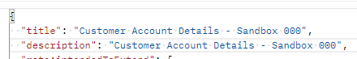
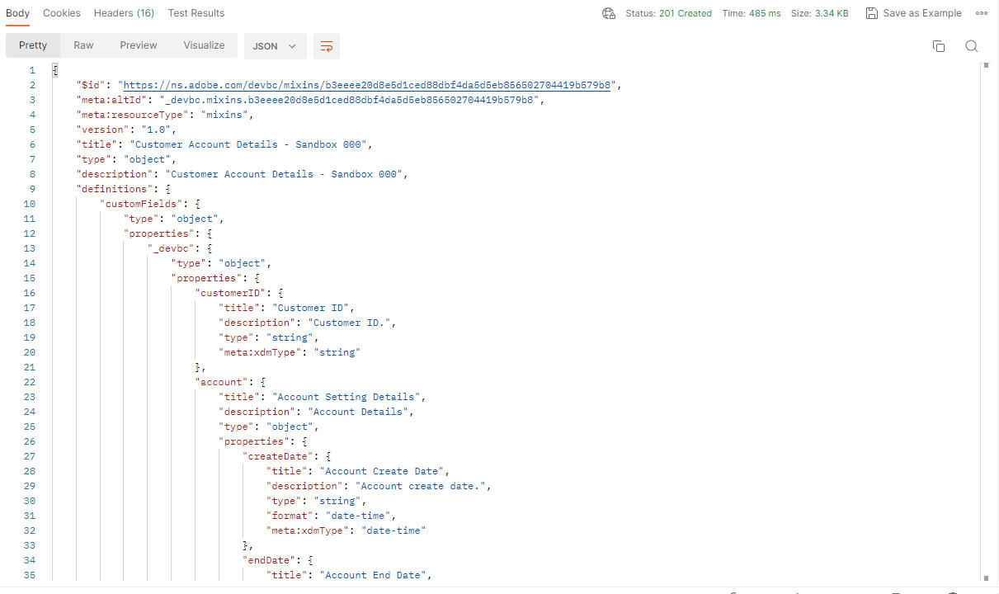

# 사용자 정의 필드 그룹 만들기

## 필드 그룹 구조

필드 그룹은 항상 다음 필드로 구성됩니다. 다음 단계의 요청에 표시됩니다.

| 필수 값 | 설명 |
| --------------------------- | ---------------------------------------------------------------------------------------------------------------------------------------------------------------------------------------------- |
| 제목 | 스키마 레지스트리 내에서 만들려는 필드 그룹의 이름입니다. 이름은 고유해야 합니다. |
| 설명 | 필드 그룹의 목적에 대한 간단한 설명 |
| 유형 | 항상 오브젝트 |
| meta\:intendedToExtend | 필드 그룹과 함께 사용할 수 있는 클래스를 정의합니다. 클래스는 항상 `$id` 값에서 참조됩니다. |
| allOf | 필드 그룹에 포함할 수 있는 리소스에 대해 설명합니다. 사용자 정의 필드의 경우 경로는 항상 `#/definitions/customFields`입니다. |
| definitions.customFields... | 사용자 정의 필드 그룹을 만드는 데 필요한 기본 JSON 스키마 구조입니다. 위의 `allOf`과(와) 일치해야 합니다. |
| \&lt;TENANT\_NAME> | 테넌트 이름(즉, 고유한 이름)은 프로비저닝 프로세스 중에 생성됩니다. 이렇게 하면 사용자 지정된 내용이 기존 또는 향후의 Adobe 스키마 레지스트리 변경 내용과 충돌하지 않게 됩니다 |

## 고객 계정 세부 정보 필드 그룹 만들기

1. `XDM Schema Lab -> Create Schema` 폴더에서 요청 `Step 2 - Create Customer Account Details Field Group` API 호출 클릭

실행하기 전에 요청 본문을 검토하십시오. 필드 그룹 구조 섹션에 언급된 필수 필드는 다음과 같이 표시됩니다.

>[!NOTE]
>
>`allOf` 바로 위에 있는 이미지에서 &quot;/definitions/customFields&quot; 경로를 참조하는 방법을 확인합니다.  사용자 지정 생성 개체를 찾을 위치를 XDM 시스템에 알려주기 때문에 스키마에 정의된 구조(왼쪽 이미지)와 일치해야 합니다.
>
>

또한 매핑 시트의 각 특정 필드가 XDM JSON 구조 내에서 어떻게 실질화되는지 확인합니다.

2. 다음 형식을 사용하여 필드 그룹의 `title` 및 `description`을(를) 업데이트합니다. `Customer Account Details - Sandbox <your number here>`

   

3. `Send` 단추를 클릭하여 실행하십시오.  아래 스크린샷과 유사한 응답이 표시됩니다.

4. 새로 만든 고객 계정 세부 정보 필드 그룹의 `$id` 값을 복사합니다.

>[!WARNING]
>
>`$id`을(를) 어딘가에 저장할 때까지 계속하지 마십시오.  고객 계정 스키마를 만들려면 나중에 필요합니다
>
>
