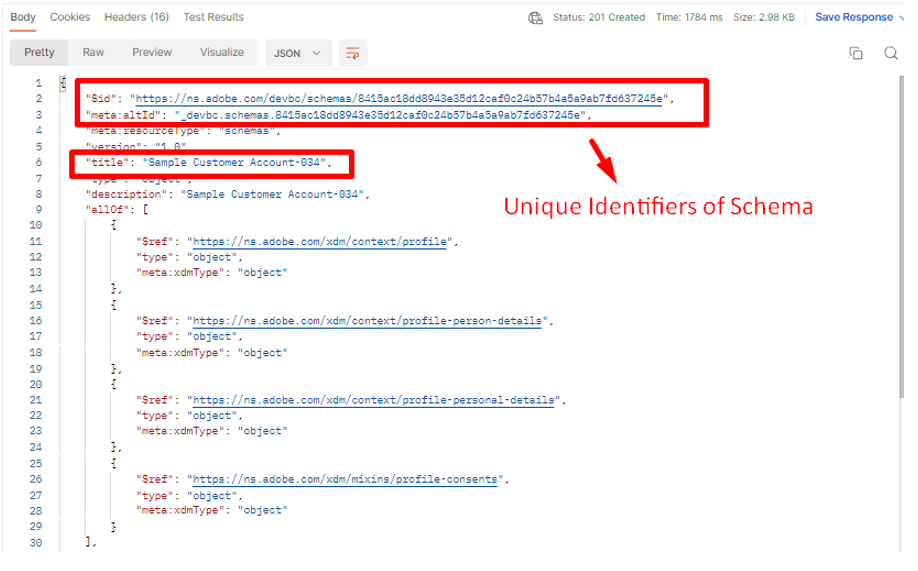

# 스키마 만들기

## API 본문 수정

>[!CAUTION]
>
>**아직 통화를 실행하지 않음**

1. `XDM Schema Lab -> Create Schema` 폴더에서 `Step 4 - Create Customer Account Schema` API 호출을 클릭합니다.

   

2. 호출 본문을 열고 스키마 정의 방법 구조를 봅니다. 스키마는 항상 하나의 (1) 클래스와 하나 이상의 필드 그룹으로만 구성된다는 점을 기억하십시오.

3. 스키마 본문의 `title` 및 `description` 필드를 다음과 같이 채웁니다.

   - 제목 -> `Sample Customer Schema - <your sandbox number>`
   - 설명 -> `Sample Customer Schema - <your sandbox number>`

4. `$ref` 필드를 완료한 이전 실습 섹션에서 저장한 `$ids`(으)로 채웁니다. [사용자 지정 필드 그룹 만들기](./create-custom-field-groups.md) 및 [프로필 클래스 가져오기](./get-profile-class.md). 다음 각 항목에 대한 $id가 있습니다.

   - 클래스 -> XDM 개별 프로필
   - 필드 그룹 -> 인구 통계 세부 정보
   - 필드 그룹 -> 개인 연락처 세부 정보
   - 필드 그룹 -> 동의 및 환경 설정 세부 정보
   - 필드 그룹(사용자 정의) -> 고객 계정 세부 정보

   

5. 최종 본문을 검토하고 이와 유사한지 확인합니다.

>[!NOTE]
>
>`$refs`의 순서는 중요하지 않으며 본문 내에서 `title` 및 `description`의 위치도 중요하지 않습니다.

## API 실행

1. 계속하기 전에 API 요청에 대한 수정 사항을 저장하십시오.
1. `Send` 단추를 클릭하여 API를 실행하십시오.

스키마를 만들기 위한 응답을 성공적으로 수행하면 `201 Created` 상태가 되고 아래 이미지와 같아야 합니다

>[!WARNING]
>
>성공하면 요청을 다시 실행하지 마십시오.

## 스키마 $id를 찾아 저장합니다

1. API 요청을 실행한 후 응답에서 `$id` 및 `$meta:altId`을(를) 복사합니다.
1. 나중에 다시 사용할 수 있도록 값을 어딘가에 저장하십시오

>[!WARNING]
>
>`$id` 및 `$meta:altId`을(를) 어딘가에 저장할 때까지 계속하지 마십시오.  이는 향후 실습 단계에서 필요합니다.

>[!SUCCESS]
>
>**축하합니다! API**&#x200B;만 사용하여 스키마를 만들었습니다.
