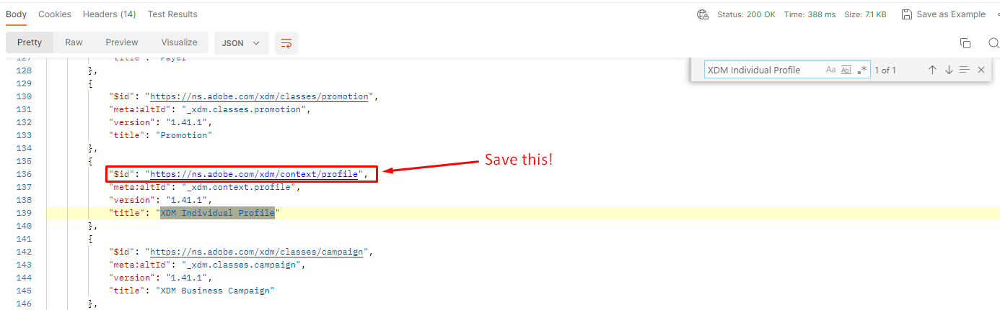

# 프로필 클래스 가져오기

## 3단계 실행 - 프로필 클래스 가져오기

1. `XDM API Lab -> Create Schema` 폴더에서 `Step 3 - Get Profile Class` 요청을 클릭합니다.
1. `Send` 단추를 클릭하여 실행

>[!NOTE]
>
>GET 요청에서 `global` 경로: .../schemregistry/**global**/classes를 확인합니다. `global`을(를) 사용하면 Adobe 표준 XDM 개체만 반환하려는 스키마 레지스트리에 표시됩니다.

## 클래스 $id를 찾아 저장합니다.

API 요청을 실행한 후 다음 단계를 수행하여 XDM 개별 프로필 클래스에 대한 `$id`을(를) 찾아 저장합니다.

1. 응답에서 `XDM Individual Profile` 클래스 검색
1. `XDM Individual Profile` 클래스에 대한 `$id`을(를) 복사하고 나중에 참조할 수 있는 위치에 저장합니다.

>[!WARNING]
>
>`$id`을(를) 어딘가에 저장할 때까지 계속하지 마십시오.  고객 계정 스키마를 만들려면 나중에 필요합니다
