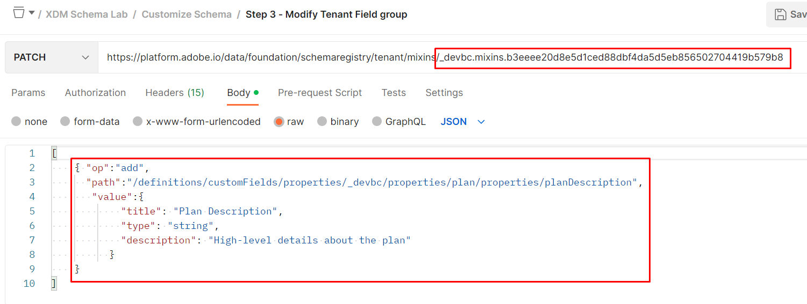

# 스키마 수정 - JSON 패치

## 개요

스키마를 빌드한 후에는 `planDescription`(이)라는 `plan` 개체에 추가 필드를 추가해야 합니다. 이 문제는 스키마를 만들 때 추가하는 것을 잊어버렸거나 몇 달 후 제출된 요청이기 때문에 발생할 수 있습니다. 이 작업을 수행하려면 스키마를 새 필드로 업데이트하는 `PATCH` 작업을 실행합니다.

아래 링크에서 JSON PATCH에 대해 자세히 알아보십시오. 이 실습의 경우 작동 방식에 대한 일반적인 이해를 갖추고 있다고 가정해 보겠습니다.

- [https://jsonpatch.com/](https://jsonpatch.com/)
- [Experience League API 기본 사항](https://experienceleague.adobe.com/docs/experience-platform/landing/platform-apis/api-fundamentals.html?lang=en#json-patch)


>[!NOTE]
>
>다음 사항을 기억하십시오.
>
>- 스키마는 하나의 클래스와 하나 이상의 필드 그룹으로 구성됩니다
>- 스키마에 필드를 추가하기 전에 필드 그룹에 새 필드를 추가해야 합니다. 이 제한 사항은 해당 필드 그룹을 사용하는 모든 스키마에서 필드를 재사용할 수 있도록 합니다.


스키마에 새 필드를 추가하려면 다음 작업을 순서대로 수행해야 합니다. 이 프로세스는 다음 랩 단계에서 수행하는 것입니다.

- 새 속성을 추가할 필드 그룹을 식별합니다
- 필드 그룹을 업데이트하기 위해 JSON PATCH 호출을 구성합니다.
- JSON PATCH 호출을 실행하여 (스키마가 상속하는) 필드 그룹을 업데이트합니다.


## 업데이트할 필드 그룹을 찾아 식별합니다

1. `XDM Schema Lab -> Customize Schema` 폴더에 있는 `Step 1 - Get Tenant Field groups` API 호출 선택
1. `Send` 단추를 클릭하여 요청을 실행합니다.

   

   >[!NOTE]
   >
   >사용자 지정 필드 그룹 내에서 `plan` 개체를 만들었습니다. XDM 스키마 레지스트리에서 사용자 지정 생성 개체를 &quot;테넌트&quot;라고 하므로 `/schemaregistry/tenant/mixins/` 경로를 사용하는 API 호출입니다.


1. 응답에서 이전에 제목이 `Customer Account Details - Sandbox <your number here> `인 사용자 정의 필드 그룹의 스키마 ID를 검색합니다.

1. `$meta:altId`을(를) 복사하고 다음 단계에서 필요한 대로 안전한 곳에 저장하십시오.


>[!CAUTION]
>
>복사할 올바른 필드 그룹을 선택하십시오! 이름이 비슷한 필드 그룹 `dep: Customer Account Details`을(를) 사용하지 마십시오

>[!WARNING]
>
>향후 실습 단계를 위해 `$meta:altId`이(가) 필요하므로 계속하기 전에 어딘가에 저장하십시오.


## $meta\:altId로 필드 그룹 조회

1. `XDM Schema Lab -> Customize Schema` 폴더에서 `Step 2 - Fetch path for the object to be modified` API 호출 선택
1. 요청의 URL에서 `<replace me>`을(를) 아래와 같이 이전 섹션 단계에서 호출 끝까지 저장한 `$meta:altId`(으)로 바꿉니다
1. 요청에 대한 편집 내용을 저장합니다.
1. `Send` 단추를 클릭하여 요청을 실행합니다.


응답을 검토하고 아래 강조 표시된 각 속성을 사용하여 **계획** 개체에 대한 JSON 포인터 경로가 생성되었는지 확인합니다.


완전히 구성된 경로는 아래에 표시되는 것과 같습니다.  이 경로를 복사하고 참조를 위해 어딘가에 저장

```none
/definitions/customFields/properties/_devbc/properties/plan/properties
```

>[!NOTE]
>
>위의 테넌트 이름(\_devbc)을 고유한 이름으로 업데이트해야 합니다


## 필드 그룹 PATCH

### JSON PATCH API 본문 샘플

```none
[
    {
        "op": "",
        "path": "",
        "value": {
            "title": "",
            "type": "",
            "description": ""
        }
    }
]
```

- **op(작업)** -> PATCH에서 수행해야 하는 작업에 대한 지침을 제공합니다.
- **경로** -> 만들거나 업데이트하거나 삭제할 경로(즉, 새 필드의 위치에 대한 JSON 포인터)입니다.
- **값** -> 선택적 필드이며 기존 필드를 만들거나 바꿀 때만 사용됩니다.


### API 요청 실행

1. `XDM Schema Lab -> Customize Schema` 폴더에서 `Step 3 - Modify Tenant Field group` API 호출 클릭

   


2. 다음 정보로 요청 본문을 업데이트합니다

   - **op** ->` add`
   - **경로** -> `path from previous step +`` the new field name`
   - **값** ->
     - **제목** -> `Plan Description`
     - **유형** -> `string`
     - **설명** -> `High-level details about the plan`

   완료되면 API 요청은 다음과 같이 표시됩니다

   

   >[!WARNING]
   >
   >경로에 새 필드 이름 **planDescription,**&#x200B;을(를) 포함해야 합니다.


3. `Save`의 모든 기능이 정상인 경우 통화

4. `Execute` PATCH 수행을 위한 호출

다음과 같이 필드 그룹에 `200 OK` 응답과 `planDescription` 필드가 표시됩니다.


>[!SUCCESS]
>
>축하합니다! JSON PATCH을 사용하여 필드 그룹/스키마를 업데이트했습니다


## UI에서 변경 사항 보기

UI를 통해 스키마를 검색하고 새로 추가된 필드를 봅니다.

 수정
