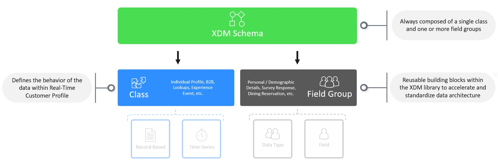
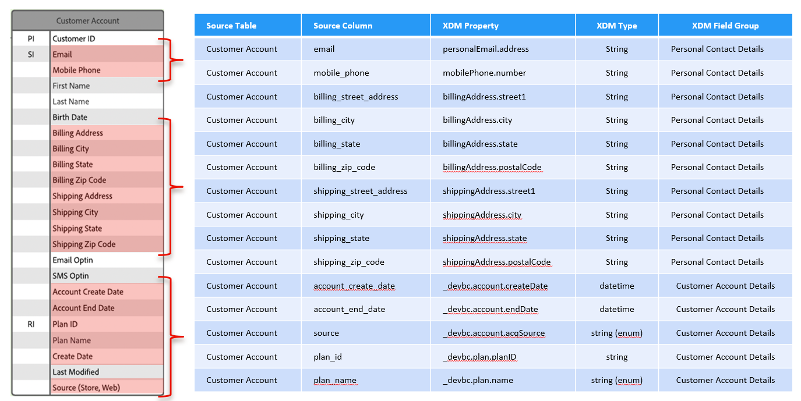

# 스키마 작성

## 스키마 어셈블리

XDM의 일부인 모든 스키마는 동일한 방식으로 구성됩니다.  스키마는 항상 하나의 클래스와 하나 이상의 필드 그룹으로만 구성됩니다. 또한 스키마의 클래스는 Experience Platform 내의 다른 시스템이 데이터를 해석하는 방법(예: 레코드 기반 또는 시계열)을 나타냅니다.

## 귀하의 목표

이 실습에서는 이전에 작성하신 매핑 시트를 활용하여 Connection 5G 고객 계정 스키마를 구축하게 됩니다. 랩의 이 부분을 완료하면 다음과 유사한 스키마가 표시됩니다.

