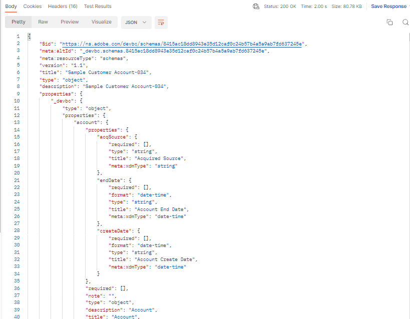

# 스키마 보기

## UI를 통해 보기

1. 브라우저를 열고 `Schema -> Browse` 섹션으로 다시 이동합니다.

   >[!NOTE]
   >
   >방금 UI를 만들었으며 스키마 레지스트리를 다시 쿼리해야 하므로 UI를 새로 고쳐 표시합니다

2. 스키마 `Sample Customer Schema - <your sandbox number>` 검색

3. 필수 클래스와 관련 필드 그룹이 스키마에 추가됩니다

## API를 통해 보기

1. `Step 5 - Get Customer Account Schema` API를 클릭하여 선택합니다.
1. 요청의 URL에서 `<replace me>`을(를) 아래와 같이 이전 섹션(스키마 만들기)에서 호출 끝까지 저장한 `$meta:altId`(으)로 바꿉니다
1. 요청에 대한 편집 내용을 저장합니다.
1. `Send` 단추를 클릭하여 요청을 실행합니다.

`$meta:altId`을(를) 추가한 후의 최종 요청 예

`200 OK` 응답을 받은 경우 XDM JSON 구조의 렌즈를 통해 만든 스키마를 검색할 수 있어야 합니다

전체 샘플 고객 계정 스키마 JSON을 보여 주는 
