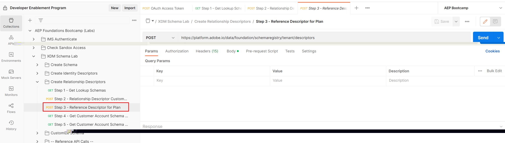

# 계획 참조 ID 만들기

1. `XDM Schema Lab -> Create Relationship Descriptors` 폴더에서 `Step 3 - Reference Descriptor for Plan` API 요청 클릭

>[!CAUTION]
>
>아직 요청을 실행하지 마십시오.




&#x200B;2. API 호출 본문에서 다음 속성을 업데이트합니다.

- `xdm:sourceSchema` 속성의 값을 [스키마 만들기](../build-schema/create-schema.md) 단계에서 저장한 `Customer Account` 스키마의 `$id`(으)로 업데이트하십시오.
- `Customer Account` 스키마에서 `xdm:sourceProperty`의 값을 `planID` 필드의 경로로 업데이트합니다.

>[!NOTE]
>
>`dep: Lookup Plan` 스키마에서 `planId` 필드의 점 표기법 값을 사용하고 `.`을(를) `/`(으)로 바꿉니다.
>
>선행 `/` 또는 😄을(를) 잊지 마십시오.

예만

```json
{
  "@type": "xdm:descriptorReferenceIdentity",
  "xdm:sourceSchema": "https://ns.adobe.com/devbc/schemas/8415ac18dd8943e35d12caf0c24b57b4a5a9ab7fd637245e",
  "xdm:sourceVersion": 1,
  "xdm:sourceProperty": "/_devbc/plan/planID",
  "xdm:identityNamespace": "planID"
}
```

>[!NOTE]
>
>위의 테넌트 이름(\_devbc)을 고유한 이름으로 업데이트해야 합니다


&#x200B;3. `Save` 단추를 계속 사용하기 전에 요청을 저장하십시오.

&#x200B;4. `Send` 단추를 클릭하여 API를 실행하십시오.

이제 아래와 같은 `201 Created` 응답이 표시됩니다.


>[!NOTE]
>
>참조 ID 설명자는 항상 조회 스키마(예: sourceSchema)에서 정의됩니다

>[!NOTE]
>
>참조 ID 설명자는 스키마 UI에서 관계를 만들 때 백엔드에 자동으로 만들어집니다. **API를 사용하여 스키마를 만들 때만 명시적으로 만들어야 합니다**

>[!TIP]
>
>멋지다! `dep: Lookup Plan` 스키마를 `Customer Account` 스키마와 연결하는 데 필요한 모든 설명자를 만들었고 일괄 처리 세분화 중 참조되도록 설정했습니다
