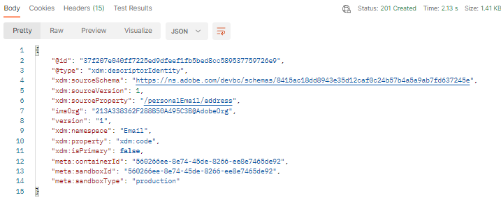

# 다른 ID 만들기

1. `XDM Schema Lab -> Create Identity Descriptors` 폴더에서 `Step 2 - Create Email Address Identity for Customer Account Schema` API 호출 클릭

   >[!CAUTION]
   >
   >아직 요청을 실행하지 마십시오.

   


1. [스키마 만들기](../build-schema/create-schema.md) 랩 단계에서 저장한 `$id`을(를) 사용하여 요청 본문의 `xdm:sourceSchema` 값을 업데이트합니다.

1. 요청 본문의 `xdm:isPrimary` 값을 `false`(으)로 업데이트

   예만

   ```json
   {
     "@type": "xdm:descriptorIdentity",
     "xdm:sourceSchema": "https://ns.adobe.com/devbc/schemas/8415ac18dd8943e35d12caf0c24b57b4a5a9ab7fd637245e",
     "xdm:sourceVersion": 1,
     "xdm:sourceProperty": "/personalEmail/address",
     "xdm:namespace": "Email",
     "xdm:property": "xdm:code",
     "xdm:isPrimary": false
   }
   ```

   >[!NOTE]
   >
   >위의 테넌트 이름(\_devbc)을 고유한 이름으로 업데이트해야 합니다


1. `Save` 단추를 계속 사용하기 전에 요청을 저장하십시오.

1. `Send` 단추를 클릭하여 API를 실행하십시오. 이제 아래와 같은 `201 Created` 응답이 표시됩니다.


