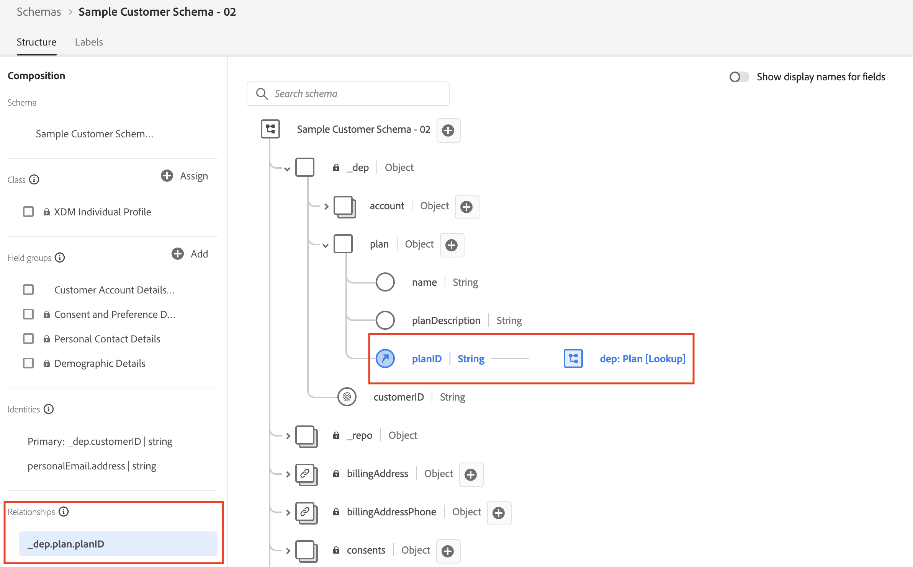

# 요약

아래 비디오에서는 API 호출을 통해 스키마, ID 및 관계 설명자를 빌드한 방법을 다시 시작하고 JSON 패치를 사용하여 스키마를 수정하는 방법을 보여 줍니다.

>[!VIDEO](https://video.tv.adobe.com/v/3459564/?quality=12&learn=on)

&#x200B;> [!TIP]
>
>먼저 축하합니다! API를 통해 빌드하는 것은 쉽지 않지만, 작동 방식을 이해하면 시스템 전반을 이해하는 데 도움이 됩니다. 쿠도스!

## 고객 계정 스키마를 만들었습니다.

Adobe에서 만든 필드 그룹과 사용자 지정 필드 그룹(즉, 테넌트)을 모두 `$ref`하여 스키마를 만들었습니다.  또한 스키마가 나타내야 하는 클래스를 `$ref`합니다(예: XDM 개인 프로필).

## JSON 패치에는 고객 계정 스키마가 있습니다.

JSON Patch 메서드를 사용하여 고객 계정 스키마를 수정하여 계획 개체에 새 필드를 추가했습니다. 스키마 자체를 패치하지 않고 [사용자 지정 필드 그룹 만들기](build-schema/create-custom-field-groups.md)에서 정의한 `Customer Account Details`이라는 `$ref` 사용자 지정 필드 그룹을 패치했습니다.

## 표시된 ID 필드

이 단계에서는 고객 계정 스키마 내의 `_devbc.customerID` 및 `personalEmail.address` 필드 모두에 대해 `Identity Descriptors`을(를) 만들기 위해 동일한 `POST` 호출 중 두 개를 수행했습니다.

1. `_devbc.customerID` 필드가 **기본** ID로 설정되었습니다.
1. `personalEmail.address` 필드가 **기본 필드로 설정되지 않음**

## 조회 관계를 만들었습니다.

마지막 단계는 Paper lab의 XDM ERD에서 고객 계정과 계획 스키마 간의 관계를 생성하는 것이었습니다.  이 경우 관계 설명자(즉, `Customer Account` 스키마를 `dep: Plan [Lookup]` 스키마와 연결하는 방법)와 고객 계정 스키마의 참조 ID 설명자를 모두 만들어야 했습니다.

>[!NOTE]
>
>`referenceIdentity` 설명자는 `Customer Account` 스키마의 필드가 ID 네임스페이스와 일치하는지 실시간 고객 프로필에 알려줍니다. 조회 스키마를 정의할 때 필드를 기본 ID로 표시하고 형식이 `non-person`인 네임스페이스를 할당해야 합니다.
