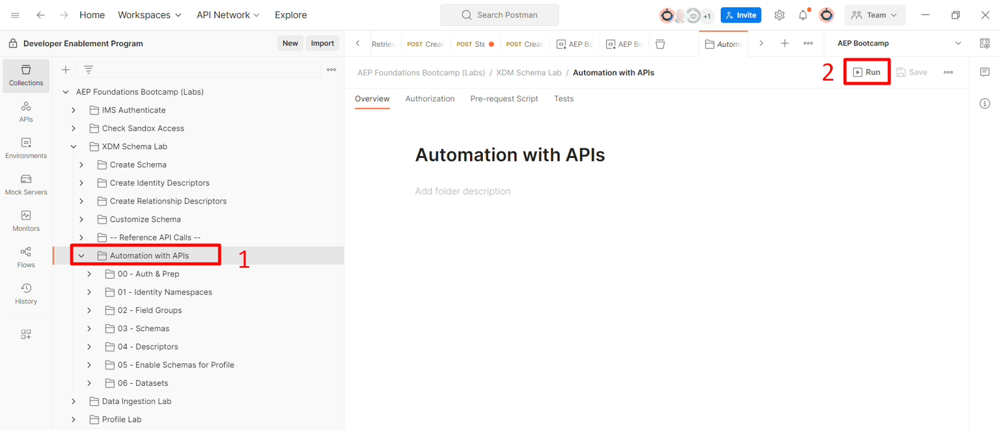
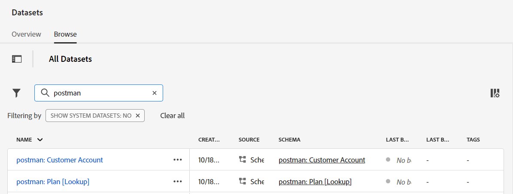

# API를 사용한 자동화

## 소개

API를 사용하여 배포를 자동화하는 방법을 확인하려면 다음 오브젝트를 생성하는 API 폴더를 실행합니다.

- 고객 계정 및 플랜 \[Lookup] 스키마
- 위의 스키마를 구성하는 필드 그룹
- 프로필에 필요한 ID 설명자
- 고객 계정과 계획 \[Lookup] 간의 관계를 만드는 데 필요한 관계 및 참조 설명자
- 각 스키마와 일치하는 데이터 세트 두 개가 생성됨

## 폴더 실행

1. Postman에서 **XDM 스키마 랩** 폴더 내의 **API 자동화** 폴더로 이동합니다.

   

1. **API를 사용한 자동화** 폴더를 클릭하고 작업 공간에서 **실행** 단추를 클릭합니다

   >[!NOTE]
   >
   >실행 버튼은 Postman 작업 영역의 오른쪽 상단에 있습니다

   

1. 폴더의 모든 API 호출을 표시하는 새 창이 나타납니다. **지연**&#x200B;을(를) **500ms**(으)로 설정한 다음 **실행** 단추를 클릭하십시오.

   

1. API 호출이 순서대로 실행되기 시작하는 것을 볼 수 있으며 완료되면 32개의 통과한 테스트가 표시됩니다.

   

1. Experience Platform UI로 이동하면 접두사가 **postman:**&#x200B;인 프로필에 대해 만들어지고 활성화된 두 개의 스키마와 두 개의 데이터 세트가 표시됩니다

>[!TIP]
>
>축하합니다!  ID 네임스페이스, 필드 그룹, 스키마, ID/관계 설명자의 배포를 자동화하고 프로필에 대한 스키마를 활성화했으며 스키마를 사용하여 데이터 세트를 생성할 수 있습니다
