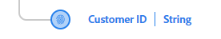
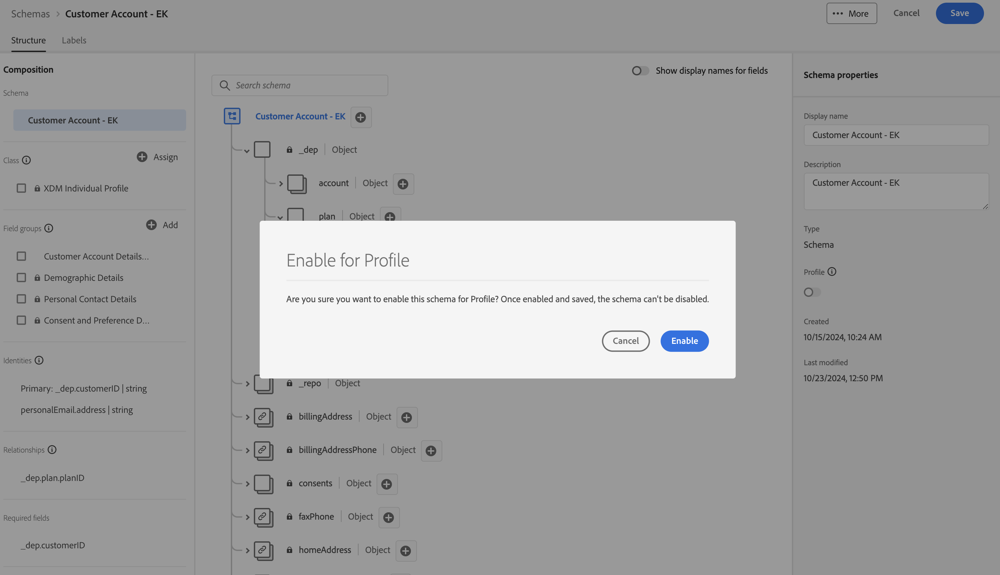

# 프로필에 대한 구성

## 개요

실시간 고객 프로필에 스키마를 활용하려면 먼저 스키마가 적절하게 구성되어 있는지 확인해야 합니다. 즉, LID 랩 중에 식별한 내용을 기본/개인 ID, 관계 ID 등으로 가져와 각 스키마에 해당 구성이 적용되는지 확인합니다. 모든 작업이 완료되면 스위치를 &quot;전환&quot;하고 프로필에 사용할 스키마를 활성화할 수 있습니다.

용지 연결 5G ERD의 XDM을 보면 고객 계정 스키마에 대한 다음 정보가 표시됩니다.  실시간 고객 프로필 내에서 스키마를 활용하기 위해 남은 작업입니다.

## 기본 ID 필드 표시

실시간 고객 프로필과 함께 사용할 경우 모든 스키마에는 기본 ID 필드가 필요합니다. 아래 단계에 따라 필드를 기본 ID로 표시하십시오.

1. 만든 **고객 계정** 스키마를 엽니다.
1. 스키마의 필드를 클릭하여 **\_\&lt;tenant-name>.customerID** 필드를 선택합니다.
1. 오른쪽 레일에서 **ID** 및 **기본 ID** 확인란을 모두 선택합니다.
1. 드롭다운에서 **customerID** 네임스페이스를 선택합니다.
1. 완료되면 오른쪽 레일에서 **적용** 단추를 클릭한 다음 변경 내용을 **저장**&#x200B;합니다.

>[!NOTE]
>
>아래와 같이 적용을 클릭한 후 필드에 지문이 표시되는지 확인
>
>
>
>

>[!NOTE]
>
>또한 왼쪽 레일에 다음 항목이 표시됩니다. ID(기본 또는 기본이 아님)가 여기에 표시되며 **기본** ID도 필수 필드로 표시됩니다.
>
>
>
>

## 개인 ID 필드 표시

실시간 고객 프로필 **과(와) 함께 사용할 모든 스키마는 선택적으로 다른 사용자 ID 필드를 포함**&#x200B;할 수 있습니다. 필드를 개인 ID로 표시하려면 이전에 만든 고객 계정 스키마에 대해 다음 작업을 수행하십시오.

1. **personalEmail.address** 필드 선택
1. 오른쪽 레일에 있는 **ID** 확인란을 선택하십시오.
1. 드롭다운에서 **전자 메일** ID 네임스페이스 선택
1. 변경 내용을 **적용 및 저장**

>[!NOTE]
>
>적용을 클릭한 후 필드에 지문이 표시되는지 확인

## 스키마 관계 만들기

ERD에 요약된 대로 계획 스키마를 고객 계정 스키마와 관련시키려면 관계를 정의해야 합니다. 아래 단계에 따라 고객 계정과 계획(조회) 스키마 간의 스키마 관계를 생성합니다.

### 관계 추가

1. 아래와 같이 계획 개체 내에서 **planID** 필드를 선택합니다
1. 오른쪽 레일에서 **관계 추가** 아이콘을 클릭합니다

### 관계 정의

1. 유형 선택 상자에서 **일대일** 옵션을 선택합니다.
1. 참조 스키마 선택 상자에서 이름이 **dep인 스키마를 선택합니다. 계획 \[조회]**(이 스키마는 미리 생성됨)
1. **적용** 및 **저장** 클릭

![dep에 대한 일대일 관계 정의: 플랜 [조회] 스키마](assets/configure-for-profile-define-one-to-one-relationship.png)

### 관계 확인

작업이 완료되면 아래 스크린샷에 표시된 대로 만든 관계가 표시됩니다.

## 프로필에 대한 스키마 구성

실시간 고객 프로필은 서로 다른 소스의 데이터를 병합하여 각 개별 고객에 대한 전체 보기를 구성합니다. 스키마에서 캡처한 데이터를 이 프로세스에 참여시키려면 프로필에서 사용할 스키마를 구성해야 합니다. 이렇게 하려면 다음 단계를 수행해야 합니다.

1. 새로 만든 **고객 계정 - \[이니셜]** 스키마를 엽니다.
1. 왼쪽 레일 내에서 스키마 제목을 클릭합니다
1. 오른쪽 레일에서 프로필 토글을 **켜짐** 전환하여 프로필에 대한 스키마를 구성합니다.
1. 표시되는 모달에서 **사용** 단추를 클릭합니다.
1. 완료되면 스키마를 **저장**&#x200B;하는 것을 잊지 마십시오!

>[!TIP]
>
>축하합니다!  실시간 고객 프로필에 사용할 스키마를 방금 만들었습니다.

## 프로필 유니온 스키마 검토

앞에서 언급했듯이 XDM + 실시간 고객 프로필은 개인과 개인의 행동에 대한 다양한 조각을 조합하는 기능입니다.  이를 고객의 &quot;유니온 뷰&quot;라고 합니다.  아래 단계에서는 실시간 고객 프로필에 대해 구성된 각 XDM 클래스에 대해 이 유니온이 어떻게 보이는지 미리 봅니다

1. 왼쪽 레일에서 **프로필**(으)로 이동
1. 상단 메뉴에서 **유니온 스키마** 탭을 선택합니다.
1. 드롭다운에서 **XDM 개별 프로필** 클래스를 선택합니다.

XDM 개별 프로필 클래스를 탐색한 다음 잠시 시간을 내어 XDM ExperienceEvent 또는 Plan 클래스와 같은 다른 클래스를 검토합니다.

>[!NOTE]
>
>표시된 스키마는 샌드박스에 있는 모든 프로필 지원 스키마에 대한 병합된 집계 보기입니다. 계층 XDM 구조 내의 유사한 필드는 함께 병합되지만 이름 및/또는 계층이 다른 필드는 전체 보기에 추가됩니다.

>[!NOTE]
>
>XDM 개별 프로필 기반 클래스만 이름이 비슷한 필드 간에 병합을 수행합니다.
