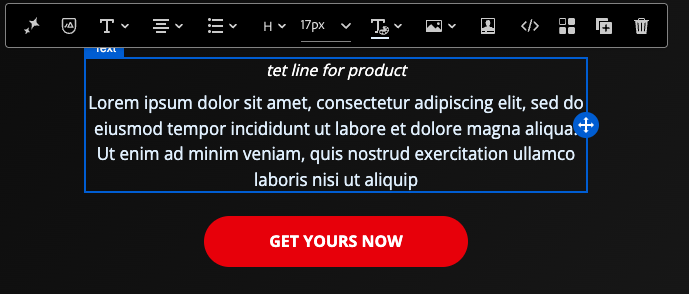
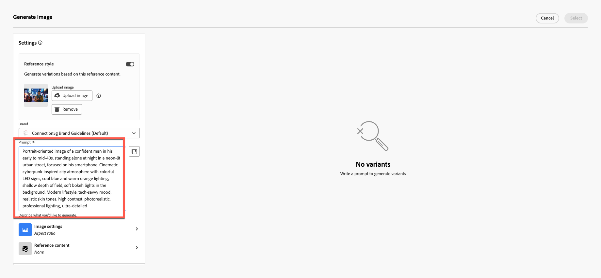
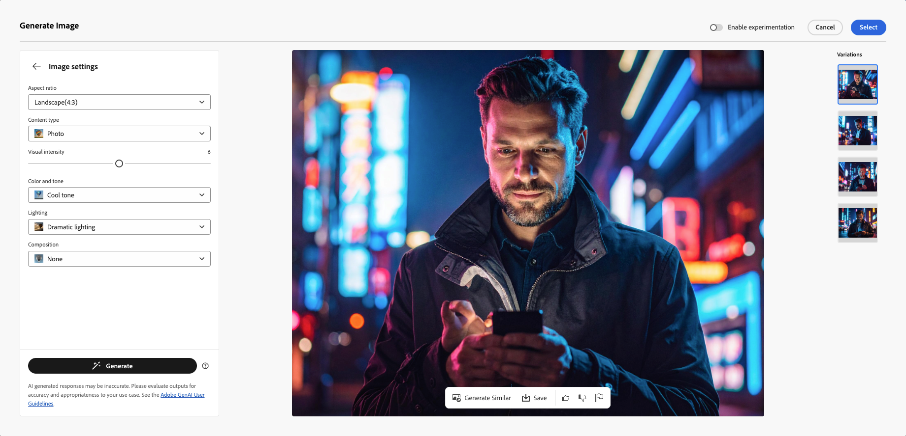
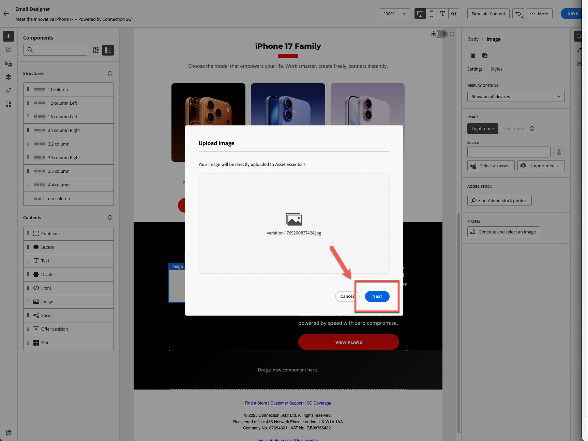
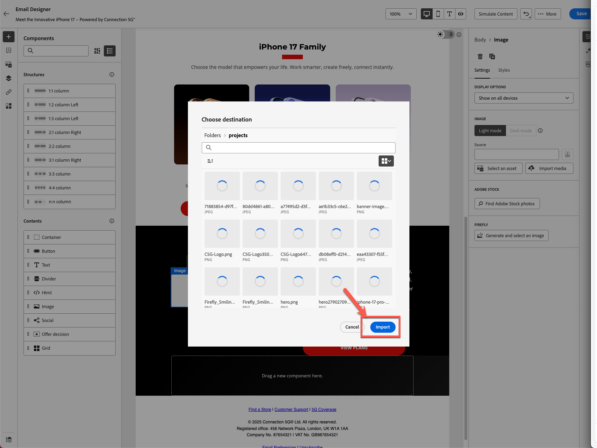

# AI 지원 및 콘텐츠 개인화

**목적:** Adobe Journey Optimizer의 AI Assistant를 사용하여 제목 줄을 생성하고, 이메일 텍스트를 세분화하고, 색조를 조정하고, 이메일 디자이너 내에서 직접 브랜드에 맞는 Firefly 이미지를 만드는 방법을 알아봅니다.

## 학습 목표

이 단원을 마치면 다음과 같은 작업을 수행할 수 있습니다.

1. AI Assistant를 사용하여 제목 줄과 사전 헤더를 생성합니다.
1. 영웅 텍스트, 설명, 색조 및 메시지를 세분화합니다.
1. AI 기반 언어 변경, 요약 및 색조 조정을 적용합니다.
1. 참조 스타일 및 브랜드 설정으로 Adobe Firefly을 사용하여 이미지를 생성합니다.
1. 자리 표시자를 이메일 디자인 내에서 생성된 이미지로 바꿉니다.

## 소개

AJO의 AI Assistant를 통해 보다 스마트하고 브랜드에 있는 콘텐츠를 빌드할 수 있습니다.
다음과 같은 작업을 수행할 수 있습니다.

- 제목 줄 생성
- 기존 텍스트 개선
- 톤 및 선명도 조정
- Firefly을 사용하여 브랜드 이미지 만들기
- 모든 것이 연결 5G 지침에 부합하는지 확인합니다.

이 연습에서는 AI Assistant를 사용하여 만든 이메일을 개선합니다.

>[!NOTE]
>
>AI 도우미는 **비결정적**&#x200B;입니다. 즉, 사용할 때마다 약간 다른 콘텐츠를 생성할 수 있습니다. 연습 중에 표시되는 내용은 이 안내서의 스크린샷이나 예와 정확히 일치하지 않을 수 있습니다. 괜찮습니다. 동일한 결과를 기대하기보다는 프로세스와 개념을 학습하는 데 집중하십시오.

## AI Assistant를 사용하여 이메일 제목 줄 만들기

1. [뒤로] 단추를 클릭하여 Campaign으로 돌아가거나 이전 모듈에서 만든 이메일을 편집합니다. 이전 단계에서 오른쪽의 **설정** 탭을 클릭할 수 있습니다.
2. 이메일 컨테이너 > 이메일 편집 버튼을 클릭합니다.
3. 콘텐츠 탭을 클릭한 다음 이메일 본문을 클릭합니다.
4. **제목 줄** 필드를 선택합니다.
5. **AI Assistant 아이콘**&#x200B;을 클릭합니다. (아래 참조)

   제목 줄 필드 도구 모음의 

6. 브랜드 가이드라인이 기본적으로 선택되어 있습니다.
7. 프롬프트를 입력합니다.

   >iPhone 17을 출시할 예정이며 제목 라인이 눈에 띄기를 원합니다

8. **생성**&#x200B;을 누릅니다.
9. 생성된 4개의 변형을 검토합니다.
10. 맞춤 점수가 가장 좋은 변형을 선택하고 **선택**&#x200B;을 클릭합니다.

>[!NOTE]
>
>결과는 랩 안내서와 완전히 다를 수 있으므로 걱정하지 않아도 됩니다. 올바른 제목이라고 생각되는 항목을 선택하고 랩을 계속합니다.

## 히어로 제목 및 설명 개선

1. &quot;이메일 본문 편집&quot; 버튼을 클릭하여 이메일을 엽니다.

   

2. **제품 캐치라인** 제목을 클릭합니다.
3. **텍스트 생성 및 선택**&#x200B;을 클릭하여 AI Assistant를 엽니다.

   

4. 드롭다운에서 **연결 5G 브랜드 지침**&#x200B;을 선택합니다.

   

5. 프롬프트:

   >*iPhone 17 출시에 대한 대담하고 눈길을 끄는 헤드라인을 작성하십시오. 10단어 미만으로 유지*

6. 텍스트 설정 을 클릭하여 톤 및 통신 전략을 변경합니다. 커뮤니케이션 전략을 **FOMO(누락의 우려)**, 언어를 **영어**, 음색을 **신나는**(으)로 변경하십시오. 다이얼을 축소하여 더 짧은 버전을 사용하십시오.

   

7. **생성** 단추 클릭
8. 최상의 버전을 검토하고 선택하십시오.
9. 텍스트가 길면 슬라이더를 사용하여 **&quot;짧은 텍스트&quot;**&#x200B;을(를) 만들고 텍스트를 다시 생성합니다.

   

10. 텍스트가 마음에 들면 **선택**&#x200B;을 클릭하세요.

## 설명 프롬프트

이번에는 AI가 문제를 찾는 데 어떻게 도움이 되는지 테스트합니다.

1. 아래에 템플릿으로 작성된 텍스트로서 의미가 없는 텍스트를 선택합니다.

   

2. 아래 표시된 대로 평가 버튼을 클릭합니다.

   

3. 아래 1~2단계에 표시된 대로 원래 콘텐츠가 브랜드와 함께 자동으로 선택됩니다. 계속하려면 **평가** 단추를 클릭하십시오.

   

4. 예상대로 브랜드 지침을 위반하는 많은 오류가 표시됩니다. AI를 사용하여 수정할 수 있지만 이 경우 기존 자료를 수정하지 않습니다. 대신 그대로 두고 브랜드 표준에 완전히 부합하는 새로운 콘텐츠를 처음부터 만듭니다.

   

5. 아래 프롬프트에서 AI를 사용하여 생성된 새 단락을 사용하십시오. 아래 프롬프트를 사용하여 설명 텍스트에 동일한 방법을 사용할 수 있습니다.

프롬프트:

>*새로운 iPhone 17에 대한 매력적인 제품 설명을 작성하십시오. 고급 카메라, 배터리 수명 및 성능과 같은 가장 인상적인 기능을 강조하십시오. 음색은 프리미엄, 신나고 이해하기 쉬운 색이어야 광범위한 관객이 사용할 수 있습니다. 3문장 미만으로 유지하세요.*

시간을 절약하기 위해 텍스트가 이미 생성되었습니다. 텍스트를 가져오려면 아래에서 복사하여 붙여넣으십시오.

>iPhone 17™은 멋진 사진을 찍을 수 있는 고급 카메라, 하루 종일 지속되는 배터리 수명, 뛰어난 성능을 제공합니다. 이 혁신적인 경험을 놓치지 마십시오.

이메일은 아래 표시된 예제와 같습니다.

## Firefly 생성 이미지 추가

지금까지 제목 줄 및 텍스트에서 AI Assistant를 테스트했습니다. 이미지는요?

AI 이미지 생성으로 이동하기 전에 빌드할 수 있는 경험 유형을 살펴보십시오.

프로필의 출생월이 있음을 이해합니다. 우리가 할 수 있는 경험 중 하나는 다른 변형으로 블록을 만드는 것입니다. Adobe Journey Optimizer을 사용하면 이 작업이 가능하며 Adobe Experience Platform을 기반으로 하는 가장 큰 이점 중 하나입니다. 우리는 다음 단원에서 실험을 다룰 예정이지만, 먼저 아래 블록을 준비한다.

1. **Image** 구성 요소를 iphone 17 Family 블록 아래의 왼쪽 열로 드래그합니다.

   

2. 외부를 클릭한 다음 이미지 자리 표시자를 선택합니다. 이미지를 클릭했는지 확인하십시오. 그렇지 않으면 Firefly 옵션이 표시되지 않습니다.

   

3. **Firefly**&#x200B;에서 **이미지 생성 및 선택**&#x200B;을 클릭합니다.

## 참조 이미지 업로드

1. **참조 스타일**&#x200B;을(를) 켭니다.
2. 브랜드 선택에 대해 **연결 5G 브랜드 지침**&#x200B;을(를) 선택하십시오.

   

3. 이미지 업로드 를 클릭합니다

   

4. toolkit 폴더에서 reference.jpg를 선택합니다

   

5. 이미지 프롬프트 추가
   `Portrait-oriented image of a confident man in his early to mid-40s, standing alone at night in a neon-lit urban street, focused on his smartphone. Cinematic cyberpunk-inspired city atmosphere with colorful LED signs, cool blue and warm orange lighting, shallow depth of field, soft bokeh lights in the background. Modern lifestyle, tech-savvy mood, realistic skin tones, high contrast, photorealistic, professional lighting, ultra-detailed`.

## 이미지 설정 선택

**이미지 설정** 선택:

1. 다음 설정을 선택합니다.
   - **비율:** 가로(4:3)
   - **콘텐츠 형식:** 사진
   - **색상 및 톤:** 멋진 톤
   - **조명:** 극적인 조명
1. **생성** 단추 누르기

## 생성된 이미지 선택 및 삽입

1. 생성된 모든 이미지를 확인하여 Firefly 결과를 검토합니다.

   

2. 선택한 이미지를 보려면 **선택**&#x200B;을 클릭하세요.

   

3. 업로드 모달을 입력하라는 메시지가 표시되면 **다음**&#x200B;을 클릭합니다.

   

4. **가져오기**&#x200B;를 클릭합니다.

## 블록 디자인 완료

시간이 있는 경우 현대적으로 보이도록 둥근 테두리 반경 10을 적용합니다.

반복 및 변형을 몇 번 수행하면 최종 설계가 완성됩니다. 최종 레이아웃은 예제와 유사합니다.

이 시점에서 AI를 사용하여 콘텐츠 생성을 가속화하고 향상할 수 있다는 자신감을 느껴야 합니다.

## 요약

AI Assistant를 사용하여 다음과 같은 작업을 수행했습니다.

- 제목 줄 생성
- 영웅 텍스트 세분화
- 단락 구문 변경
- 메시지 색조 변경
- 참조 스타일을 사용하여 브랜딩된 Firefly 이미지 만들기
- 이메일에 생성된 이미지 삽입

이제 다음 모듈(**Personalization 및 콘텐츠 실험**)을 사용할 준비가 되었습니다. 여기서 프로필 기반 변형 및 테스트를 빌드하게 됩니다.
