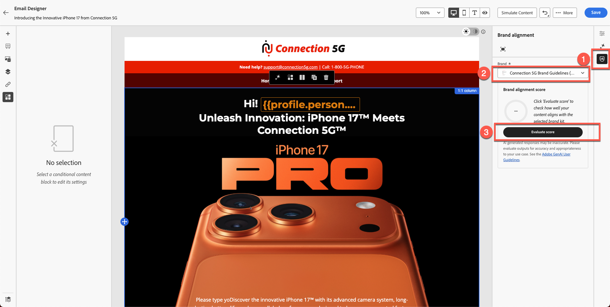

# 브랜드 정렬

**목적:** Adobe Journey Optimizer의 Brand Alignment 기능을 사용하여 전자 메일 콘텐츠를 평가하고, 지침 위반을 식별하고, AI 기반 권장 사항을 적용하여 브랜드 준수를 개선하는 방법을 알아봅니다.

## 학습 목표

이 단원을 마치면 다음과 같은 작업을 수행할 수 있습니다.

1. 브랜드 정렬 패널에 액세스하고 이를 해석합니다.
1. 브랜드 지침에 따라 이메일 콘텐츠를 평가합니다.
1. AI로 플래그가 지정된 문제를 식별합니다.
1. 브랜드 정렬을 개선하기 위해 제안을 적용합니다.
1. 점수를 다시 평가하여 개선 사항을 추적합니다.

## 소개

Adobe Journey Optimizer에는 **연결 5G**&#x200B;에 대해 게시된 브랜드 지침과 비교하여 콘텐츠를 확인하는 **AI 기반 브랜드 정렬 점수**&#x200B;가 포함되어 있습니다.

이렇게 하면 다음 사항이 보장됩니다.

- 브랜드와 일치하는 톤, 스타일 및 메시지
- 법적 요구 사항 충족
- 이미지는 시각적 규칙을 따릅니다
- 콘텐츠 작성자는 규모에 맞게 일관성을 유지합니다.

이 모듈에서는 AI를 사용하여 평가를 실행하고, 결과를 해석하고, 콘텐츠를 개선하는 방법을 설명합니다.

## 브랜드 정렬 패널 열기

1. 이전 모듈에서 만든 이메일을 엽니다.
2. 오른쪽 레일에서 **브랜드 정렬** 탭을 찾거나 사이드바에서 **% 아이콘**&#x200B;을 찾습니다.
3. 을 클릭하여 패널을 엽니다.

&#x200B;4. 올바른 브랜드가 적용되었는지 확인합니다.
   - **연결 5G**(기본값).
&#x200B;5. **점수 평가**&#x200B;를 클릭합니다.

**브랜드 점수 및 피드백 해석:** 잠시 후 콘텐츠에 대한 브랜드 준수 점수가 표시됩니다. 이 점수는 색상 표시기(녹색, 노란색, 빨간색) 및 평가 시간과 함께 등급(예: 높음, Medium 또는 낮음) 또는 백분율로 표시될 수 있습니다. 점수가 높으면 컨텐츠가 브랜드 가이드라인에 맞게 강력하게 조정되는 반면, 중간 또는 낮은 점수는 보통 또는 낮은 정렬을 나타냅니다.

각 지침 카테고리에 대해 패널에 제공된 자세한 피드백을 검토하십시오.

일반적으로 피드백은 지침 카테고리(예: 색조, 스타일, 이미지 등)별로 구성되어, 전달된 규칙과 주의가 필요한 규칙을 보여줍니다.

특정 메시지 또는 하이라이트를 기록해 두십시오. 예를 들어 패널은 특정 단어나 구가 지정된 색조와 일치하지 않거나 이미지가 시각적 표준을 충족하지 않는다고 말할 수 있습니다. 이것은 무엇을 개선해야 하는지에 대한 당신의 신호입니다.

>[!NOTE]
>
>점수는 아래 화면과 다릅니다. 브랜드 가이드라인과 AI를 사용하여 점수를 개선하는 것이 목표입니다.

## 정렬 점수 검토

평가 후 AJO에 다음이 표시됩니다.

- 브랜드 정렬 점수
- 등급(높음 / Medium / 낮음)
- 색상 표시기(녹색/노란색/빨간색)
- 타임스탬프
- 지침 카테고리(톤, 스타일, 이미지 등)

결과를 해석하여 이메일이 연결 5G 지침과 얼마나 잘 일치하는지 이해합니다.

## 자세한 피드백 검사

1. 지침 범주를 스크롤합니다.
1. 경고 또는 빨간색 표시기를 찾습니다.
1. 플래그가 지정된 각 지침을 클릭하여 자세한 AI 피드백을 엽니다.
1. 제안 사항 검토:
   - 톤 불일치
   - 잘못된 구문
   - 금지된 단어
   - 상표 사용 누락
   - 이미지 스타일 위반

## AI 권장 사항 적용

1. 이메일 내에서 플래그가 지정된 텍스트 블록 또는 이미지를 클릭합니다.
2. 아래 표시된 대로 이전 연습에서 붙여 넣은 단락을 사용합니다.

&#x200B;3. AI가 제공하는 제안 수정 사항을 사용하십시오. 아래 표시된 대로 아이콘을 클릭합니다.

제안된 수정 사항을 적용하기 위한 

&#x200B;4. 아래와 같이 **AI 수정** 단추를 클릭합니다.

&#x200B;5. 아래 그림과 같이 제안된 변경 사항이 녹색으로 강조 표시되고 제거된 텍스트가 취소선과 함께 빨간색으로 표시됩니다. 또한 점수가 업데이트되었습니다(이 경우 80%). 변경 내용을 적용하려면 **적용** 단추를 클릭하십시오.

&#x200B;6. 변경 사항은 새 텍스트와 함께 적용됩니다.
&#x200B;7. 강조 표시된 모든 영역을 검토하고 AI를 사용하거나 수동으로 편집하여 콘텐츠를 수정하기 위해 필요한 업데이트를 수행합니다. 계속하기 전에 필요한 모든 변경 사항이 완료되었는지 확인하십시오.
&#x200B;8. 변경 사항을 저장합니다.

## 브랜드 점수 재평가

1. 모든 위치를 변경하여 AI를 사용하거나 수동으로 콘텐츠를 수정합니다.
2. 브랜드 정렬 패널로 돌아갑니다.
3. **점수 다시 평가**&#x200B;를 클릭합니다.
4. 새 점수를 이전 점수와 비교합니다.

예:

- 원래 점수: **56%**
- 업데이트된 점수: **90%**

이는 업데이트가 이메일을 브랜드 표준과 성공적으로 일치시켰음을 나타냅니다.

&#x200B;5. **저장**&#x200B;을 클릭하여 전자 메일을 마무리하세요.

## 요약

이 단원에서는 다음 방법을 배웠습니다.

- 브랜드 정렬 점수를 사용하여 이메일 평가
- 카테고리 수준 피드백 해석
- 쓰기, 톤 및 레이아웃 문제 식별
- AI 권장 수정 적용
- 커뮤니케이션 전반에 걸쳐 브랜드 일관성 향상

이제 콘텐츠의 유효성이 확인되었으며 다음 모듈(**이메일 테스트**)에서 테스트할 준비가 되었습니다.
