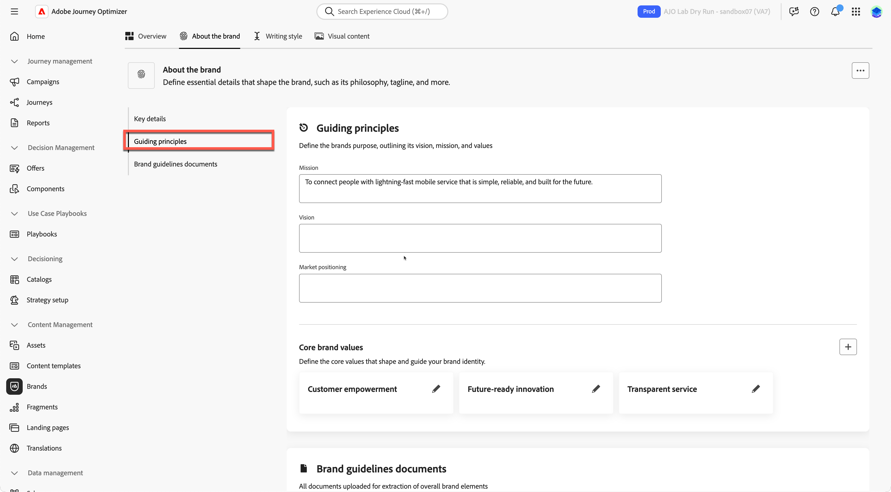
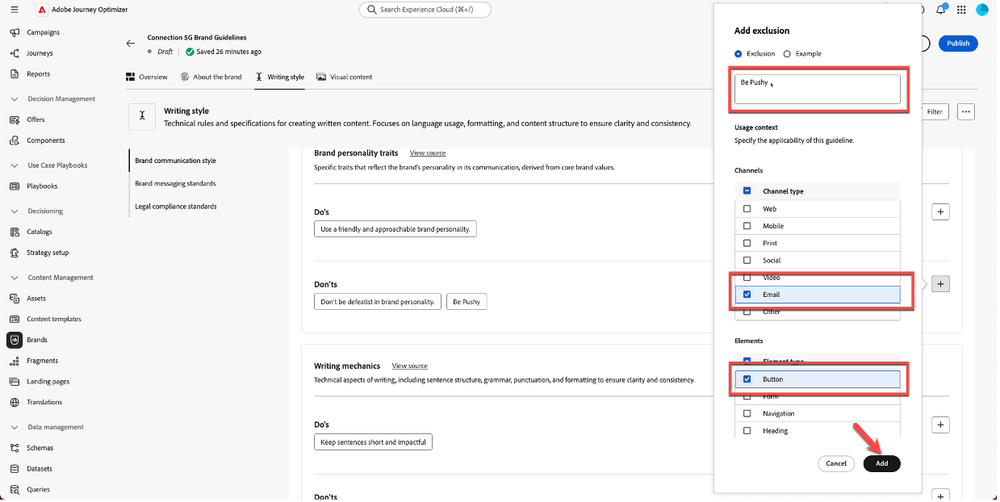

# 브랜드 관리

**목적:** 모든 콘텐츠와 AI 기능이 브랜드에 맞게 유지되도록 Adobe Journey Optimizer(AJO) 내에서 연결 5G 브랜드 지침을 구성, 세분화 및 게시합니다.

## 학습 목표

이 단원을 마치면 다음과 같은 작업을 수행할 수 있습니다.

- Adobe Journey Optimizer에서 새 브랜드를 만듭니다.
- PDF에서 브랜드 가이드라인 정보를 업로드하고 추출합니다.
- 브랜드 정보, 작성 스타일 및 시각적 컨텐츠 탭에서 브랜드 세부 사항을 검토하고 세분화합니다.
- 이메일 버튼 복사가 푸시되지 않도록 제외 규칙을 추가합니다.
- 템플릿, 조각, AI Assistant 및 브랜드 정렬에 사용할 수 있도록 브랜드를 게시합니다.

파일 다운로드 — [toolkit.zip](assets/toolkit.zip)

>[!NOTE]
>
>실습형 랩을 시작하기 전에 툴킷 파일을 다운로드해야 합니다(아래 toolkit.zip 참조). 파일의 압축을 풀고 연습에 필요한 이미지 및 지원 파일에 액세스합니다. 랩 전체에서 참조할 수 있으므로 이러한 에셋을 쉽게 액세스할 수 있는 위치에 보관합니다.

## 소개

이 모듈에서는 준비된 브랜드 가이드라인 PDF을 사용하여 AJO 내에 **Connection 5G** 브랜드를 구축합니다.

Adobe Journey Optimizer의 **브랜드** 기능을 사용하면 모든 마케팅 활동에서 일관된 정체성을 정의하고 유지할 수 있습니다. 로고와 색상에서 음성 및 메시지 스타일의 색조에 이르기까지 브랜드를 만들어 모든 이메일, 캠페인 및 콘텐츠 조각이 통일된 개성을 반영하도록 합니다.

강의의 패턴 1을 이 실습에 사용할 것입니다(AJO만 해당). 자산은 **Assets Essentials**&#x200B;을(를) 사용하여 저장됩니다.

연결 5G 브랜드 가이드라인 문서로 시작하여 업로드하고, AJO에서 주요 정보를 추출한 다음 결과를 세분화하고 게시합니다.

## 브랜드 지침 준비

1. 도구 키트 폴더에서 **연결 5G 브랜드 지침** PDF을 엽니다(먼저 압축 해제해야 함).

2. Connection 5G에 사용되는 컨텐츠를 이해하려면 다음 문서를 검토하십시오.
   - 목소리 톤
   - 색상 및 비주얼 스타일
   - 작성 스타일 및 메시지 예제
   - 이미지 지침
   - 법적 및 규정 준수 관련 정보

## AJO에서 새 브랜드 만들기

1. Adobe Journey Optimizer에서 왼쪽 탐색으로 이동하여 **브랜드**&#x200B;를 클릭합니다.
2. **브랜드 만들기**&#x200B;를 클릭합니다.

3. **이름** 필드에 `Connection 5G Brand Guidelines`을(를) 입력하십시오.
4. 업로드 영역에서 **Connection5g Brand Guidelines.pdf** 파일을 끌어서 놓습니다(또는 **파일 선택**&#x200B;을 클릭하고 컴퓨터에서 선택).

5. 추출을 시작하려면 **브랜드 만들기**&#x200B;를 클릭하세요.

AJO이 파일을 분석하는 동안 진행 화면이 표시됩니다. 문서 크기에 따라 몇 분 정도 소요될 수 있습니다.

6. 추출이 완료되면:
   - 맨 위에 녹색 확인 표시줄이 나타납니다.
   - 브랜드 구성 화면으로 자동 리디렉션됩니다.
   - 이제 콘텐츠 및 시각적 만들기 표준이 업로드된 브랜드 지침 파일을 기반으로 자동으로 채워집니다.

7. 브랜드 지침을 게시하려면 **게시** 단추를 클릭하십시오.

8. 확인하려면 &quot;게시&quot; 버튼을 눌러 확인합니다.

브랜드가 성공적으로 게시되었음을 나타내는 녹색 확인 표시줄이 페이지 하단에 나타납니다.

9. 기본 브랜드 페이지에서 [뒤로]를 클릭하면 이제 브랜드가 라이브임을 확인할 수 있습니다. 이 페이지에는 레이블이 **&quot;Live&quot;**&#x200B;인 녹색 점이 표시됩니다.

## 브랜드 탭 검토

이제 Connection 5G에 대해 채워진 세 가지 주요 탭을 검토하고 이해합니다.

### 브랜드 정보

이 탭은 브랜드의 정체성을 높은 수준으로 정의합니다. 일반적으로 다음과 같은 항목이 포함됩니다.

- 브랜드 이름
- 핵심 값
- 지침 원칙
- 브랜드 목적 및 약속
- 브랜드가 만들고 싶은 느낌

시스템의 다른 모든 것은 이 기반에서 구축되므로 이 탭이 연결 5G의 실제 DNA를 반영하는 것이 중요합니다.

추출된 필드를 탐색하고 원본 PDF과 일치하는지 확인하는 데 잠시 시간을 투자하십시오.

### 작성 스타일

**작성 스타일** 탭은 브랜드의 커뮤니케이션 방식을 정의합니다. 여기에는 다음이 포함됩니다.

- 톤 지침
- 할 일과 하지 않을 일
- 구문 및 주요 메시지 예
- 표어 및 슬로건
- 상표를 포함해야 하는 경우와 같은 법적 규칙

자연어로 규칙을 추가하고 세분화할 수 있으며, 이메일 또는 SMS와 같은 특정 채널에만 규칙을 적용할 수도 있습니다. 이를 통해 AI Assistant 및 콘텐츠 작성자가 작성하는 방법을 유연하지만 정확하게 제어할 수 있습니다.

### 시각적 콘텐츠

**시각적 컨텐츠** 탭에서는 브랜드의 모양을 간략하게 설명합니다. 여기에는 다음이 포함됩니다.

- 사진 표준
- 일러스트레이션 스타일
- 도상학 규칙
- 비주얼 도스 및 논츠

이를 통해 이미지부터 아이콘까지 모든 것이 연결 5G의 핵심 가치와 일관되고 일치하게 느껴집니다.

## 누락된 비전 및 시장 포지셔닝 추가

상기 추출된 콘텐츠에서 일부 가이드 원리는 불완전할 수 있다. 이제 PDF의 공식 용어를 사용하여 작성하십시오.

1. 방금 만든 브랜드 클릭

2. **브랜드 편집**&#x200B;을 클릭합니다. 확인 탭이 나타납니다. 확인하려면 **브랜드 편집**&#x200B;을 다시 클릭하십시오.

3. **브랜드 정보** 탭으로 이동합니다.

4. **안내 원칙**, **비전** 또는 유사한 수준의 설명에 대한 섹션을 찾습니다.

5. 다음 텍스트를 추가합니다.

**비전:**

>장소에 구애받지 않고 생활, 업무, 여가를 향상시킬 수 있는 믿을 수 있는 연결성으로 모든 개인에게 권한을 부여합니다.

**시장 포지셔닝:**

>커넥션 5G는 디지털 라이프스타일에 맞게 설계된 프리미엄 속도 모바일 서비스를 제공하며 탁월한 신뢰성, 간편성, 미래형 혁신성으로 돋보인다.

6. **저장**&#x200B;을 클릭합니다. **저장** 단추가 표시되지 않으면 먼저 **개요** 탭을 클릭한 다음 **저장**&#x200B;을 클릭합니다.

>[!TIP]
>
>이제 AJO에 브랜드의 목적, 비전 및 시장 포지셔닝이 명확하게 표시되는지 확인했습니다.

## 이메일 버튼 제외 규칙 추가

다음으로, 이메일 버튼이 푸시 방식으로 작성되지 않도록 하는 규칙을 추가하여 브랜드를 향상시킵니다.

1. **작성 스타일** 탭으로 이동합니다.

2. **브랜드 커뮤니케이션 스타일** 섹션에 있는지 확인하십시오.

작성 스타일 탭의 

3. **금지** 영역에서 **더하기** 아이콘을 클릭하여 새 규칙을 추가합니다.

새 규칙을 추가할 수 없는 영역 아래에 

4. 규칙을 다음과 같이 구성합니다.
   - **제외:** `Be pushy`

>[!NOTE]
>
>이는 Don&#39;t rule로 추가됩니다. 즉, 브랜드는 CTA를 푸시하지 않으려고 합니다

**채널:** 전자 메일

**요소:** 단추

5. **추가**&#x200B;를 클릭합니다.

6. 새 Don&#39;t 규칙이 목록에 `Be pushy`(으)로 표시되는지 확인합니다.

7. **저장**&#x200B;을 클릭합니다.

이 규칙은 AI Assistant 또는 작성자가 이메일 버튼 복사 작업을 하는 모든 곳에 적용되며, CTA를 연결 5G 톤과 일치시킵니다.

>[!NOTE]
>
>스크린샷과 정확히 일치하지 않는 다른 &#39;don&#39;t&#39; 규칙이 나열될 수 있습니다. 이는 예상되는 비헤이비어이므로 무시하십시오.

## 브랜드 지침 게시

구성에 만족하면 다음과 같이 하십시오.

1. **개요** 탭으로 돌아갑니다. **저장**&#x200B;을 클릭합니다.
2. 오른쪽 상단 모서리에서 **게시**&#x200B;를 클릭합니다.

3. 업데이트된 Brand Guidelines for Connection 5G를 게시하려고 함을 설명하는 확인 대화 상자가 나타납니다. 확인하려면 **게시**&#x200B;를 다시 클릭하세요.

4. 녹색 확인 표시줄이 나타날 때까지 기다립니다.
5. 브랜드 목록으로 돌아가려면 **뒤로**&#x200B;를 클릭하십시오.
6. **연결 5G 브랜드 지침**&#x200B;에 대한 새 카드가 &#39;라이브&#39; 및 &#39;사용 가능&#39; 상태로 표시되는지 확인하십시오.

이제 브랜드가 라이브되며 Adobe Journey Optimizer 전체에서 사용할 수 있습니다.

## 요약

이 단원에서는 다음 작업을 수행합니다.

- 연결 5G 브랜드 가이드라인 PDF을 검토했습니다.
- Adobe Journey Optimizer 내부에서 Connection 5G에 대한 새로운 브랜드를 만들었습니다.
- 브랜드 지침 파일을 업로드하고 AJO에서 주요 정보를 추출할 수 있도록 했습니다.
- 브랜드, 작성 스타일 및 시각적 컨텐츠 탭에 대한 내용을 검토하고 개선했습니다.
- 이메일 버튼이 푸시되지 않도록 특정 제외 규칙을 추가했습니다.
- AI 도우미, 브랜드 정렬, 템플릿 및 조각을 작동할 수 있도록 브랜드를 게시했습니다.

이제 완전히 구성되고 게시된 **Connection 5G** 브랜드 프로필이 있으며, 이 프로필은 나머지 실험실에서 모든 콘텐츠를 브랜드에 유지하는 데 사용됩니다.
