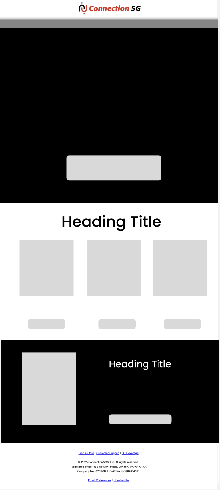
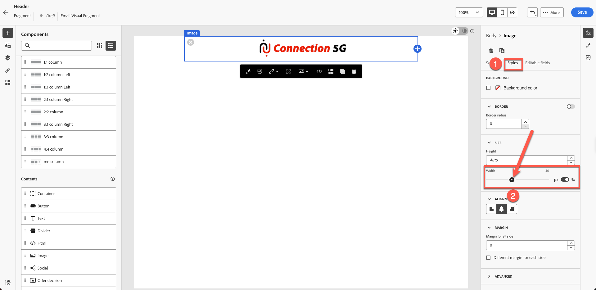
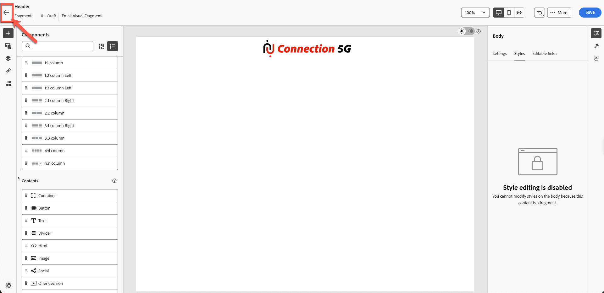

# 컨텐츠 조각 작성

## 템플릿 및 조각을 사용하여 콘텐츠 만들기

**목적:** Adobe Journey Optimizer에서 재사용 가능한 조각을 만든 다음 여정 내의 실제 전자 메일 내에 적용하는 방법을 알아봅니다.

## 학습 목표

이 단원을 마치면 다음과 같은 작업을 수행할 수 있습니다.

1. 이메일 디자인을 재사용 가능한 조각으로 분류합니다.
1. 머리글, 바닥글, 배너, 본문 및 CTA 조각을 만듭니다.

## 조각이 중요한 이유

조각을 사용하면 이메일, 캠페인 및 여정에서 재사용할 수 있는 일관된 브랜드 맞춤 콘텐츠를 만들 수 있습니다.

### 조각

재사용 가능한 빌딩 블록:

- 헤더
- 바닥글
- CTA
- 배너
- 법적 고지 사항

조각이 업데이트될 때마다 이를 사용하는 모든 이메일이 자동으로 업데이트됩니다.

## 이메일 만들기에 맞는 방법

- 거의 변경되지 않는 요소에 대해 **조각을 만듭니다**.
- 해당 조각을 사용하는 **템플릿을 빌드**&#x200B;합니다.
- 캠페인 전자 메일에서 **템플릿을 사용**&#x200B;하고 해당 콘텐츠를 사용자 지정합니다.

다음은 이 실습에서 생성할 최종 이메일입니다.

그러나 디자인 팀은 일반적으로 다음과 같은 템플릿을 제공합니다.

## 1단계: 콘텐츠 조각 만들기

아래 템플릿은 일반 디자인 템플릿이며 목표는 이 템플릿을 반복 가능한 콘텐츠 블록으로 구분하는 것입니다. Adobe 여정 최적화 도구에서는 이를 **조각**&#x200B;이라고 합니다.

첫 번째 단계는 만들어야 하는 조각의 수를 식별하는 것입니다. 이 템플릿에서는 아래 표시된 대로 5개의 조각을 사용하는 것이 적절합니다.

다음과 같이 5개의 조각이 필요한 템플릿을 확인했습니다.

- 머리글
- 배너
- CTA
- 본문
- 바닥글

>[!NOTE]
>
>이 연습에서는 시간을 절약하기 위해 헤더 조각을 하나만 만듭니다.

시작할 헤더 조각을 만듭니다. 그러나 에셋 환경이 공유되므로 조각을 만들기 전에 에셋 폴더를 설정합니다. 이렇게 하려면 먼저 고유한 폴더를 만듭니다.

1. 왼쪽 탐색에서 **콘텐츠 관리** 섹션을 찾아 **Assets**&#x200B;을 클릭합니다.

   왼쪽 탐색에 Assets 옵션이 있는 

2. Assets 관리 섹션 아래의 **Assets**&#x200B;을(를) 클릭합니다.

   

3. **&quot;폴더 만들기&quot;** 단추를 클릭하여 폴더를 만듭니다.

   

4. 이름과 성 같은 이름을 지정합니다. 예: Nish\_Pithia\_LabAssets(기억할 수 있는 항목)

   

5. **새 조각 만들기:** 콘텐츠 관리에서 **조각**&#x200B;을 클릭하고 새 조각을 만듭니다.

   새 조각을 만드는 콘텐츠 관리의 

   아래 표시된 대로 친숙한 이름을 지정하십시오. 다음과 같이 모든 세부 사항을 추가합니다.

   **이름:** 헤더

   템플릿의 **설명:** 조각 헤더

   **유형:** 시각적 조각 선택

   

6. 오른쪽 상단의 **만들기 단추**&#x200B;를 클릭합니다.

   

   빈 조각 생성자 화면이 열립니다.

7. 구조 아래의 1:1 열 을 클릭하고 아래와 같이 캔버스를 드래그합니다. (애니메이션 그래픽을 보려면 아래 이미지를 클릭하십시오.)

   

8. 그런 다음 방금 추가한 1:1 행에서 &quot;**image**&quot;을(를) 드래그합니다

   

9. 제공한 로고 이미지를 업로드합니다. **&quot;미디어 가져오기 단추&quot;**&#x200B;를 클릭합니다

   

10. **로고 업로드:** 이미지의 도구 키트 폴더에서 로고(*C5G-Logo.png*)를 업로드하고 다음을 클릭합니다.

&#x200B;11. 만든 **자산 폴더**&#x200B;를 선택한 다음 **가져오기**&#x200B;를 클릭합니다. 파일이 폴더에 저장됩니다.

&#x200B;12. 로고는 바르게 배치되었지만, 로고가 너무 커서 크기를 조정해야 합니다. 로고 크기를 조정하려면 속성을 업데이트합니다. **스타일 탭**&#x200B;을 클릭하고 아래와 같이 슬라이더를 드래그하여 너비를 40%로 설정합니다.

>[!NOTE]
>
>전환 단추가 켜져 있으면 40개의 숫자는 픽셀이 아닌 %를 나타냅니다. 절대 픽셀 완전 값을 원하는 경우 버튼을 px로 전환합니다.

&#x200B;13. **&quot;저장&quot;**&#x200B;을 클릭하면 조각이 저장됩니다. 확인 시 녹색 막대 알림이 표시됩니다.

조각을 저장한 후 

&#x200B;14. 저장된 조각이 초안 모드에 있습니다. 사용하기 전에 게시해야 합니다. **뒤로** 단추를 클릭합니다.

&#x200B;15. &quot;**게시**&quot; 단추를 클릭합니다. &quot;조각 게시 중. 시간이 걸릴 수 있습니다. 완료되면 알려 드리겠습니다.&quot; 확인 시. 조각을 템플릿 만들기에 사용할 준비가 되었습니다.

**&quot;Live&quot;**(으)로 상태가 변경되었습니다. 이 시점에서 다음 단계에서 사용되는 헤더 조각 빌드를 완료했습니다.

(으)로 변경됨

>[!NOTE]
>
>이 연습에서는 조각을 하나만 만들었습니다. 실제로, 설계자는 머리말, 바닥글 또는 기타 재사용 가능한 구성 요소와 같은 여러 조각을 생성하도록 선택할 수 있다.

## 요약

이 단원에서는 다음과 같은 작업을 성공적으로 수행합니다.

- 이메일을 재사용 가능한 헤더 조각으로 분류
- 헤더 콘텐츠 블록 생성됨

이제 다음 모듈(**콘텐츠 템플릿 작성**)로 이동하여 만든 조각을 사용하여 새 템플릿을 생성할 준비가 되었습니다.
